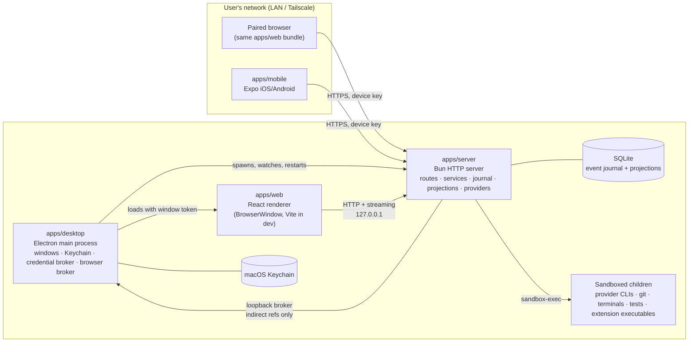
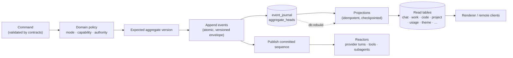

# Octant architecture

Octant is a local-first desktop workspace for Chat, Work, and Code across many AI
providers. The first shipping surface is Apple Silicon macOS; Linux and Windows
desktop are the same product under [decisions/0058-cross-platform-desktop.md](decisions/0058-cross-platform-desktop.md).
This document is the single architecture overview for the
repository. It describes the shape of the system as it exists in code; the
decision records under `docs/decisions/` explain why individual choices were
made.

## Overview and principles

Octant is one Electron application that hosts a Bun HTTP server, a React
renderer, and (optionally) remote clients that connect to that same server.
Everything the user cares about — Projects, threads, memory, event history,
credential references, layouts — stays on the host machine.

The design rests on a small set of invariants that every package obeys:

- **Local-first.** No Octant cloud account, relay, or telemetry is required.
  Remote access is host-to-device over the user's own network. Two host-initiated
  HTTPS calls exist in code: desktop update checks against a signed feed, and
  server marketplace fetches when the person searches, inspects, previews, or
  installs from the catalog. Both have a Settings off switch that means no
  request is made.
- **The server is the authority.** Every authority check (mode, Project,
  thread, provider, approval, remote principal) runs in `apps/server` before a
  side effect. The renderer and mobile app render what the server says is
  allowed; they never decide it.
- **The event journal is authoritative; projections are rebuildable.** Commands
  append versioned events to a SQLite journal. Read models are idempotent
  projections that can be dropped and rebuilt from the journal at any time.
- **Contracts are schema-only, domain is pure.** `@octant/contracts` holds
  Effect Schema definitions and nothing else. `@octant/domain` holds pure
  policy and state transitions with no I/O.
- **Dependencies point inward.** Apps consume packages; contracts and domain
  never import apps. Provider-specific payloads stop at the provider adapter.
- **Capabilities are honest and fail closed.** Every provider reports what it
  supports in every mode; an unsupported capability is disabled or refused,
  never silently emulated. No core capability may require a specific provider.
- **Install ≠ trust ≠ enable.** Extensions contribute nothing until each of
  those steps has been taken explicitly, and even then only within the mode,
  Project, thread, and provider policy that applies.

## Process topology



**Desktop (`apps/desktop`).** The Electron main process owns native windows,
menus, the macOS Keychain, project-root and plugin-folder pickers, the in-app
updater, and the lifecycle of the server child process. It reserves a loopback
port, spawns the server (`bun run start` from source, or the packaged
`dist/main.mjs` under `ELECTRON_RUN_AS_NODE`), passes `OCTANT_*` environment
(port, instance id, broker URLs and tokens, desktop bridge secret), and probes
storage readiness before showing a window. It also runs two loopback-only
brokers the server talks back to: the credential broker (Keychain access by
opaque reference) and the browser runtime broker.
Every app window confines top-level navigation, redirects, and opened windows to
the exact packaged renderer asset or configured Vite development origin. Native
IPC also requires that trusted renderer URL, and the packaged renderer ships a
strict Content Security Policy; external pages are opened through explicit
server- or host-authorized flows instead of replacing the app window.

**Server (`apps/server`).** A Bun HTTP server bound to `127.0.0.1` on the port
the desktop reserved. It registers route modules per feature (`chatRoutes`,
`workThreadRoutes`, `codeRoutes`, `projectRoutes`, `extensionRoutes`,
`remote/*`, …), resolves a **client principal** for every request — a
`local-window` principal carrying a window authority token, or a
`remote-device` principal carrying a paired device key — and runs all mutations
through services that append to the journal. Providers, tools, Git, terminals,
subagents, extensions, and recovery live here. A headless host runs the same
server through `@octant/cli` (`octant server run`, `octant web`).

**Renderer (`apps/web`).** One React application served to the desktop window
and to authenticated remote browsers alike. It talks to the server through
`@octant/client-runtime` and never holds authority of its own. In development
Vite serves it with hot reload; in a packaged build the server serves the
built assets.

**Mobile (`apps/mobile`).** An Expo iOS/Android remote-control client. Threads
are host-owned; the phone stores only device keys, a host registry, and session
material. It uses the same contracts and client runtime as the browser.

**Window authority.** Each desktop window receives a 256-bit opaque token with a
bounded lifetime. Routes bind reads and writes to the Projects that window is
bound to, so two windows on the same host cannot see across each other's
Project scope by accident. The packaged renderer sends that capability on its
shell requests. `POST /api/shell/bootstrap` registers the capability-bound
window, while `GET` only reads an existing registration and never accepts a
caller-selected `windowId`. An opaque `file://` origin or a missing Origin is
accepted only with the renderer identity bound at desktop window registration
and that exact window capability; the scheme alone is never authority. The
desktop injects that renderer proof only for the exact packaged frame (or the
configured development origin), not from renderer-controlled state. The
loopback transport validates the actual Host header before dispatch, and
closing or revoking the window removes its shell registration as well.

## Modes: Chat, Work, and Code

Modes are server-enforced domain policy, not renderer flags. Chat and Work can
be disabled in settings; Code is always available; disabling a mode never
deletes its data.

| Mode     | Binds to                                                                                                                            | Authority                                                                                                                                                                                                   |
| -------- | ----------------------------------------------------------------------------------------------------------------------------------- | ----------------------------------------------------------------------------------------------------------------------------------------------------------------------------------------------------------- |
| **Chat** | A virtual, memory-scoped Project, or no Project at all                                                                              | No filesystem or shell authority. Optional safe research tools; scratch space is isolated per thread.                                                                                                       |
| **Work** | Exactly one OS-confined project root                                                                                                | Confined reads and bounded, approval-gated writes inside that root; document adapters (docx, pptx, pdf, image); research with citations; server-authoritative board.                                        |
| **Code** | Exactly one directory, ideally a repository root; Code threads select a checkout (current checkout or a managed worktree) inside it | Starts approval-gated; Full access only when explicitly remembered for that Project. Plan mode is always read-only. Git, terminals, tests, PR observation, and managed subagents run inside the bound root. |

Work never silently becomes Code. When coding work is detected in a Work
thread, the server records a **promotion proposal**; only explicit user approval
creates a linked Code thread, and the new thread inherits no authority from the
Work thread.

Rebinding a Code Project supersedes the checkout its existing threads were
created against, and no later observation can produce those threads' checkout
ids again, so the server reports them as unavailable rather than waiting on a
reconnection nobody is attempting. Per `docs/decisions/0032`, that refusal names
a way out: the thread's fail-closed surface offers an explicit rebind that moves
it onto the checkout the Project binds now. The server authorizes and journals
the move, and it never happens on its own — a matching filesystem root is not
consent to change what authority a thread holds. A session grant of Full access
does not survive the move; the thread lands on its persisted posture. A thread
that owns a managed worktree is refused, because that checkout is the thread's
own tree rather than the Project's.

A child AgentRun receives a server-prepared workspace: Chat a research-only
virtual workspace, Work the current confined Project root and binding revision,
and Code an isolated managed worktree that is confirmed before admission.
Renderers supply only receipt ids — never absolute paths or a claimed
`verified` flag. Admission, restart, and replay refuse stale, expired,
foreign-thread, foreign-Project, parent-checkout, unavailable, or
wider-than-parent grants.

Threads form one real hierarchy (Project → thread → linked or child thread).
Work and Code have server-derived thread boards (Ready / In progress / Waiting /
Done); Chat has no board. Code lists active open and draft pull requests from
connected Projects in a manually refreshed workspace and joins exact
thread-owned PR status onto Code board cards. A Work or Code thread is Done
only when its user-confirmed delivery target is objectively satisfied;
ambiguous state resolves to Waiting.

A `#thread` mention points at another thread the sender can already Open. The
host resolves a bounded, read-only title, status, and transcript window at send
time. In Chat, an explicit mention also grants the source provider the bounded
`octant_thread_message` tool for that turn: it may send one of the user's
instructions to the mentioned Chat thread and receive its completed reply. The
target's own Chat turn, provider, Project, and authority remain authoritative;
an active target returns Waiting rather than being interrupted or duplicated.
Coordination is one hop and unavailable, unauthorized, or deleted targets fail
closed. Work and Code mentions remain read-only. In Work and Code, an `@file`
mention completes a path inside the thread's bound root; the host refuses a path
outside that root before reading it. Chat Projects have no filesystem authority,
so `@file` is absent there. Unknown `@` text stays ordinary text; `@plugin` /
`$skill` addressing is unchanged. Side Chat is a Chat-mode sidecar about
exactly one source thread: ordinary Chat with that thread's bounded context,
no inherited Work or Code authority, and no path that approves, steers, or
appends to the source.

Broader structured messaging between AgentRuns and threads, beyond mention
excerpts and beyond that Chat one-hop tool, is designed in
[decisions/0059-agent-to-agent-messaging.md](decisions/0059-agent-to-agent-messaging.md)
and
[security/agent-to-agent-messaging-threat-model.md](security/agent-to-agent-messaging-threat-model.md).
It is Proposed only: the host would admit, clamp, journal, and deliver; bodies
would taint the recipient as untrusted external content; messaging must never
bypass sandbox, approvals, or mode authority. Implementation waits on
acceptance of that record **and** sign-off of the companion threat model.

## Workspace shell

The window is mode-first: a persistent left sidebar with the Chat, Work, and
Code selector, mode-aware destinations, Projects and threads, and settings; an
integrated borderless top chrome; a central workspace; and an optional right
dock. Mode changes alter content, authority, default composition, and density,
never the navigation grammar. See [decisions/0015-workspace-shell-model.md](decisions/0015-workspace-shell-model.md).

Chat and Code keep the active mode's sidebar current with projection-only
navigation reads (`GET /api/chat/navigation`, `GET /api/code/navigation`). Code
bootstrap still observes waiting checkouts on the filesystem so a restart can
recover them; available and unavailable checkouts are not re-probed, and the
sidebar timer never walks the checkout tree. Inactive modes and hidden windows
pause those refreshes so background ticks do not contend with the next
interaction.

**Current shipped behavior.** The central workspace is one persistent recursive
split tree. A leaf holds exactly one surface — a thread, a draft, a Project
overview, a utility surface, or a mode welcome — with no tab strip; the sidebar
is the switcher. Several same-authority threads can be pinned or dropped into
that tree; pointer activity and keyboard input give exactly one pane a visible
accessible active state. Completed layout operations go through
server-authoritative workspace commands. One visible tree belongs to one
authority context (host, mode, Project, and bound root); a cross-Project,
cross-mode, or cross-host placement is refused or offered in a new window.
Thread utilities live in the Right Utility Dock outside the split tree. The
top-right control reveals the dock. An empty dock shows a compact launcher; an
open dock shows a tool strip. Direct tools are Side Chat, Browser, Files,
Canvas, artifact-gated Plan, conditional Delivery, Review, Terminal, Tests,
and iOS Simulator, as mode and capability allow. The dock follows the active
pane's thread and Project, restores that subject's open tools, and presents an
explicit unavailable state when the newly active pane cannot describe the
selected tool — never the previous pane's content. Hiding a Browser or Terminal
tool does not stop its server-owned lifecycle. The iOS Simulator dock tab
shows a thread-bound live frame from host-held screenshot evidence, with
honest setup, unavailable, booting, live, interrupted, and stale-after-restart
states; closing the tab does not shut down the destination. At narrow widths the dock
becomes an overlay drawer. Environment belongs to a thread as a compact header
summary with a transient disclosure whose open state is renderer-only. It may
summarize the active thread's server-authored child AgentRuns, including their
lifecycle, resolved model, and retained final result; full AgentRun control
stays in the Agents dock. Environment may show a compact read-only preview of
the host's bounded, process-local child conversation read: entries are
cursor-readable and byte- and count-bounded, with explicit complete, stale, and
unavailable states. Provider-native live transcripts remain unavailable unless
their normalized provider capability supplies an equivalent host-authorized
read; a host-retained final reply stays readable after completion. See
[decisions/0050-bounded-live-child-conversation.md](decisions/0050-bounded-live-child-conversation.md).
Work and Code have server-authoritative thread boards
(Ready / In progress / Waiting / Done) that cannot be dragged between columns;
Chat has no board. Code also has a Project-scoped Pull requests workspace that
lists active open and draft pull requests from authorized connected Code
Projects. The list is a cached read of an in-memory snapshot: opening it,
navigating, and ordinary board queries do not call GitHub. Only an explicit
Refresh all or per-Project refresh talks to the installed authenticated `gh`
CLI. Independent repository reads run concurrently, results reconcile in stable
Project order, and the refresh remains within preview bounds. The journal never stores that
cache. It stores only exact PR identities already produced by Code operations,
so a restart can show an identity as stale and unknown until the next explicit
refresh.

**GitHub issue browser.** The first-party GitHub plugin contributes a second
`sidebar.destination` (`github-issues`) that opens a host-scoped, read-only
issue browser. The sidebar row is shown only when the contribution is present,
its action is wired, and the authentication snapshot reports `issues-read`
available. Catalogue reads stay on the existing `githubCatalogue` union over
`/api/github/catalogue/reads`: `kind: "issues"` includes optional
server-composed search, and `kind: "issue"` returns a bounded detail. The
browser renders title, body, and comments as plain text; links stay inert full
URLs.

Create-from-issue is implemented. The composer `Create from…` Issues tab
attaches only `{ owner, name, number }` to the draft. At creation the server
reauthorizes `issues-read`, frames redacted issue text through
`apps/server/src/context/externalContentFraming.ts`, and appends
`thread.external-content-ingested@1`. Refusal fails creation visibly. The
resulting thread is ordinary Chat, Work, or Code with no GitHub write-back.
Disabled GitHub, missing capability, and unauthorized or rate-limited states
fail closed. See
[security/github-repository-onboarding-threat-model.md](security/github-repository-onboarding-threat-model.md).

Code also has a host-scoped Linear issues workspace contributed by the
bundled-off Linear plugin as `sidebar.destination` `linear-issues`, Code mode
only. The sidebar row is shown only when that contribution is effective, its
action is wired, and the Linear authentication snapshot reports `list-issues`
available. Browse goes through the Integration port (`list-issues`,
`get-issue`, `list-issue-filters`) over Linear GraphQL with bounded page size
and description bytes. Issue bodies are a live projection, not Octant source of
truth; credentials and raw API payloads never enter prompts or tool output.
Open in Linear is an external `linear.app` URL. Disabled, untrusted,
unauthorized, expired, or rate-limited Linear contributes no sidebar item,
catalogue rows, or thread context. Chat/Work browse and Linear writes are not
this surface.

Composer `Create from…` also exposes a Linear tab when the Settings-owned
connection reports `list-issues` available and the Linear plugin is effective.
Selecting a row attaches only `{ id }`. At creation the server reauthorizes
through the Integration port, frames redacted issue text
(`identifier`, status, description, comments, links) via
`externalContentFraming.ts`, and appends `thread.external-content-ingested@1`.
Refusal fails creation visibly. No Linear write-back path exists.

Context usage is a circular used-versus-available meter on
the active thread's composer; opening it shows an authoritative breakdown
popover without a further provider call, and Inspect context opens the
composition inspector for pin, exclude, and rebuild. Project memory lives on
every mode's Project Overview. Navigator is one host-owned conversation opened
as an app-wide popover from the bottom-left profile and Settings control, and
opening it never changes the active Project or thread. Zen is a separate
presentation aggregate inside the same window, not a split-tree tab and not a
fourth authority mode.

**Approved migration, not yet fully the renderer.** Proposed records
[0041](decisions/0041-panes-hold-one-surface.md) and
[0044](decisions/0044-the-dock-hosts-live-thread-owned-tools.md) are the agreed
interaction model for remaining renderer work. Environment is already a compact
header summary with a transient disclosure whose open state is not persisted
and may include a truthful child-run summary
([0045](decisions/0045-environment-summarizes-the-active-thread.md)).
The dock already hosts live thread-owned tool instances — Files, Browser,
Terminal, Canvas, Side chat, artifact-gated Plan, conditional Delivery,
thread-level Agents, and Review — rather than a generic Thread accordion.
Local checkout changes open in Review beside the thread; the full-window Code
diff is gone. Context usage already lives on the composer meter. Project memory
already lives in Project Overview. Navigator is already one host-wide chat
popover from the bottom-left profile and Settings control. Simulator placement
is already [0043](decisions/0043-simulator-follows-the-active-thread.md). 0015
remains the Accepted implemented shell until that remaining migration is
accepted.

## Persistence



- **Store.** One SQLite file under `OCTANT_DATA_DIR` (default
  `~/Library/Application Support/Octant`), created with owner-only permissions.
  A single narrow SQLite port has two adapters — `bun:sqlite` in production
  and `better-sqlite3` for the Node portability smoke — that pass the same
  conformance suite. Journal, migration, and projection code depend only on
  the port. Settings → Host exposes a read-only, server-authoritative data
  map of those locations (and per-Project facts) so a person can see what
  this host stores without opening a document. Categories the host cannot
  verify are `unknown`; the map never carries secret values.
- **Envelope.** Every event carries schema version, event id, aggregate id and
  version, global sequence, correlation and causation ids, actor, host id, and
  timestamp. Unknown or future events are quarantined rather than dropped.
- **Projections.** Each feature owns its projection and persistence schema
  (`persistence/*Projection.ts`, `*PersistenceSchema.ts`). Projections are
  checkpointed by sequence, detect lag, and can be rebuilt individually or
  wholesale (`db:status`, `db:verify`, `db:rebuild`).
- **Migrations.** Ordered, forward-only, checksum-verified, applied in
  transactions before the server reports ready. A changed checksum or an
  unknown newer migration fails closed; a store backup is taken before a
  migration runs. Restart integration tests prove replay per feature.
- **Untrusted-content taint.** Browser observations, tool results, and imported
  external content that already carry tainting provenance append
  `thread.external-content-ingested@1` with thread identity and bounded source
  labels. Raw bodies never enter the payload. The thread-lifetime taint
  projection rebuilds from the journal; session, turn, and restart boundaries
  never clear it. Irreversible or authority-bearing actions on a tainted thread
  still require fresh confirmation after replay.
- **Recovery.** Sequence-based reconnect replay for local and remote clients —
  a dropped stream catches up from the authoritative snapshot before it reopens,
  keeps retrying while the host is unreachable, and a remote session whose window
  closed during sleep is renewed from the device key rather than re-paired —
  crash-safe
  append, explicit terminal reasons for turns, tools, terminals, and subagents,
  preservation of partial provider output, and recovery of outstanding
  approvals and user-input requests after restart.
- **Data lifecycle.** Reset, remove-all, delete-remote-host, and thread
  retention/purge operations are explicit, reported per scope, and never run
  implicitly. Removing a paired host or Project deletes what it owns and
  reports what it retained. A retention window (host default, Project
  override, or thread override) never deletes on its own; only a confirmed
  purge erases a thread's bulk content, derived projections, and that
  thread's own journal events, then records a tombstone so a rebuild cannot
  resurrect the transcript. See `docs/decisions/0035`. The one self-applying
  exception is startup journal compaction, which removes a
  `code.checkout-observed@1` event only when the next event of the same
  checkout observes the identical state; it preserves every answer a
  projection, rebuild, subscription, or export can give and reports how many
  events it removed. See `docs/decisions/0039`. A thread the caller
  may already Open can be exported as an `octant.thread-bundle/1` JSON cut
  of the journal — transcript, evidence, and provenance, named with the
  instant it was taken. Secrets, raw provider payloads, and filesystem
  paths never appear; attachment bytes and other bulk content outside the
  journal are listed as omissions. See `docs/decisions/0036`. User-facing
  drafts of the privacy notice, sub-processor position, and data-residency
  statement live in `apps/docs/advanced/` and are marked pending legal
  review; they describe this behavior rather than changing it.
- **Unsent composer drafts.** Each Chat, Work, and Code thread keeps one unsent
  composer draft in ordinary renderer storage on the client that typed it.
  Drafts are not journaled, not included in diagnostics, and not sent to a
  provider until the user sends the message. Mentions that live in the typed
  text persist with the draft; staged attachments and extra composer
  selections do not, and the composer says so when a restored draft dropped
  them. Sending or clearing removes the draft; deleting or purging the thread
  removes it too.

## Providers

The provider layer is defined by `@octant/provider-sdk` and implemented in
`apps/server/src/providers`.

- **Driver interface.** A `ProviderDriver` exposes `probe` (readiness and
  capability report without side effects), `acquire` (a `ProviderConnection`
  for a workspace), and tool verification. A connection offers a normalized
  event stream plus `start`, `resume`, `send`, `interrupt`, `stop`,
  `answerApproval`, `answerUserInput`, and `answerTool`. Every driver passes
  the shared conformance harness (chat, child-agent, and context-facts
  suites) before it is selectable.
- **Registry.** Providers are multi-instance: each instance has a stable id,
  driver kind, configuration, readiness state, model list, capability report,
  and environment policy. A selected model is `{ hostId, providerInstanceId,
modelId }`, and the model picker is provider-first. Discovery can find
  installed runtimes but never auto-registers or installs them.
- **Driver families.** Direct HTTP drivers (OpenAI-compatible, Anthropic-
  compatible, Azure AI Foundry API-key, Ollama), image HTTP profiles
  (OpenAI Image and Gemini native image — never selectable as Chat, Work, or
  Code turn drivers), SDK/RPC drivers (Claude Agent SDK, Codex app-server,
  OpenCode, Pi and Oh My Pi), and ACP-based agent CLIs
  (Kilo Code, Devin, Mistral Vibe, Kimi Code, Grok Build). Image profiles are
  recorded in [decisions/0055-image-generation-provider-profiles.md](decisions/0055-image-generation-provider-profiles.md).
  Generation itself is a journaled job with OpenAI and Gemini adapters, a
  bounded generated-image attachment scope, and usage rows attributed as
  `image-generation`; see
  [decisions/0056-image-generation-jobs-and-adapters.md](decisions/0056-image-generation-jobs-and-adapters.md).
  Composer **Create image…** actions and an app-managed `octant_create_image`
  tool invoke that job service through `/api/image/` when an enabled image
  profile exists; generated images preview in the thread by opaque attachment
  id, chain edits through `parentArtifactRef`, export with the thread, and
  never grant Chat filesystem authority.
  The ACP drivers share one
  generic ACP client and protocol layer. Each in-tree vendor is a bundled
  `provider-driver` plugin that reaches the host only through `provider-sdk`;
  ACP vendors configure that shared stack rather than shipping a second runtime.
  Disabled or incompatible driver plugins contribute no models, tools, or
  capabilities. Provider-specific wire payloads never leave the adapter — the
  rest of the system sees only normalized runtime events.
- **Honest capability.** Each driver reports, per mode and per model, whether
  app-managed tools, images, resume, approvals, and subagents are supported.
  The server disables what is unsupported instead of emulating it. Bounded
  provider subprocesses run under a deny-default profile: Seatbelt via
  `sandbox-exec` on macOS, Bubblewrap (`bwrap`) on Linux. Missing the backend
  selected for the host platform fails closed as incompatible.
- **Credentials.** API keys live in the host credential store — macOS Keychain
  on macOS, freedesktop Secret Service on Linux — and are reached only
  through the host's loopback credential broker by opaque UUID reference.
  Provider OAuth and subscription login are delegated to the provider's own
  runtime; Octant never stores, refreshes, or journals those tokens. Secrets
  Octant holds for an integration use the same host credential path: the host
  keeps an opaque reference; plugins, the renderer, the journal, and diagnostics
  never receive raw token material. Broker URLs and tokens are stripped from
  every child environment. Linear is the first bundled-off Integration plugin:
  it contributes a Settings card through `settings.section`, connects with
  authorization-code + PKCE, and stores access and refresh tokens only in that
  host credential service. Connect opens a short-lived loopback listener on
  `127.0.0.1:52693` (`/oauth/linear/callback`, fallbacks 52694 and 52695) for
  the consent redirect, then closes it. Connect fails closed when the public
  client id (`OCTANT_LINEAR_OAUTH_CLIENT_ID`) is unset.

## Extensions and skills

`@octant/plugin-host` is the pure model: normalized component kinds
(`skill-instructions`, `mcp-server`, `mcp-tool`, `mcp-prompt`, `mcp-resource`,
`hook`, `app`, `agent`, `apple-development-adapter`, `board`, `integration`,
`ui-surface`, `appearance-pack`, `preview-viewer`, `provider-driver`), composer addressing
(`@plugin`, `@plugin/component`, `$skill`), and the activation ladder. The
manifest and component schemas themselves (`ExtensionPackageManifest`,
component kinds, declared capabilities, and renderer contribution points)
live in `@octant/contracts/extensions`; `@octant/plugin-api` re-exports the
subset a plugin author needs as a narrower, named surface. Unknown
contribution points are rejected. The renderer contribution registry resolves
`sidebar.destination`, `settings.section`, `workspace.tab`, `thread.pane`,
`preview.viewer`, `appearance.preset`, and `board.view` from the effective
first-party catalog; it never decides availability. `apps/server/src/extensions`
owns the runtime: package store, inspector, marketplaces (skills.sh, npm,
curated catalog), Agent Plugins ingestion, supervisor, MCP session manager,
and skill discovery.

**Activation ladder.** `resolveExtensionActivation` resolves each component to
an effective state with a structured reason. A component is active only when
the package is installed, its source is trusted, the plugin master switch and
the component switch are enabled, compatibility passes, and host, mode,
Project, thread, and provider policy allow it. Any other state — `not-installed`,
`untrusted`, `quarantined`, `plugin-disabled`, `component-disabled`,
`incompatible`, `mode-prohibited`, `project-prohibited`, `thread-prohibited`,
`host-prohibited`, `stale-catalog-epoch`, `broken`, `draining` — contributes no
prompt, schema, tool, route, model, or capability.

- Executable components are quarantined until explicitly reviewed and then run
  in supervised, sandboxed processes with a ready handshake, bounded output,
  durable process receipts, and drain-then-stop on disable.
- Skills are discovered only from valid `.agents/skills/` packages between the
  working directory and the Project or repository root, plus the user-global
  `~/.agents/skills/`.
- Marketplace network is on user action: curated catalog search is in-memory;
  inspect/install fetches the pinned GitHub tree; standalone skill search
  queries skills.sh and npm with the typed text. Opening Settings does not
  fetch a catalog.
- A structured mention cannot install, trust, enable, or elevate anything.
- Core capabilities (browser/computer use, tests, Apple validation, approvals,
  memory, subagents) are app-managed and provider-neutral; no core capability
  depends on an optional extension. Computer use is destination-shaped: the
  host reports whether a screen exists, and an adapter performs
  observe/execute/cleanup. A host with no destination reports the capability
  absent and refuses actions as a value rather than throwing. See
  [decisions/0053-computer-use-destinations.md](decisions/0053-computer-use-destinations.md).

The path from this extensions model to a general plugin host — first-party
features as toggleable plugins, renderer contribution points, integration and
board plugin kinds — is recorded in
[decisions/0001-plugin-architecture.md](decisions/0001-plugin-architecture.md).

## Security and authority

The full threat model lives in the security documentation; the load-bearing
mechanisms are:

- **Server-side tool-call policy.** A tool call from a model is a petition, not
  a grant. Every call resolves through the closed tool catalog, the mode's
  capability matrix, the thread's elevation state, and the actor's authority
  before anything executes. Tool results and external content are data with
  provenance, never instructions.
- **Approvals.** Independent categories — project file writes, shell commands,
  network access, external application observation or control, destructive
  actions, credential access, access outside the bound root, privilege or
  sandbox changes. Grants are scoped and journaled. Code starts approval-gated;
  Plan mode is read-only; auto-accept-edits waives only project file writes;
  Full access is a remembered, per-Project decision. A composer turn may
  request a narrower posture; the server clamps it to the thread's grant
  and records the posture the turn ran under.
- **Sandbox.** Provider CLIs, Git, terminals, test runners, and extension
  executables launch through one shared confinement port. On macOS that is
  `sandbox-exec` with deny-default Seatbelt profiles; on Linux it is Bubblewrap
  (`bwrap`) with private `/tmp`, bound roots, and no unconfined fallback,
  recorded in [decisions/0057-linux-confinement-bubblewrap.md](decisions/0057-linux-confinement-bubblewrap.md).
  Sensitive system roots remain denied even where runtime compatibility
  requires a broad file-read rule; each launch's exact roots are re-allowed
  after those denials. Path checks alone are never the boundary. Confined
  reads open a handle and verify identity against what containment resolved.
  Missing the platform-selected backend (`sandbox-exec` on macOS, `bwrap` on
  Linux) fails closed.
- **Linux Station isolation tracer, not product-wired.** The server now has a
  provider-neutral execution-capsule service plus a rootless Podman and gVisor
  `systrap` driver. The tracer accepts only digest-pinned images, independent
  clones created inside gVisor from owner-only source bundles, explicit
  resource budgets, no network, and no host bind mounts. Each capsule's full
  persistent Podman VFS graph store lives in an owner-only fixed-size ext4
  image mounted through `fuse2fs`, so its image, dependencies, and clone share
  one hard disk ceiling without privileged project-quota administration. Its
  disposable Podman runroot is a short owned runtime directory preserved long
  enough for recovery to inspect and stop a surviving runtime, then removed
  through Podman's mapped user namespace on release. Intermediate Podman state
  paths may be owner-controlled and traverse-only, while backing images remain
  owner-only. A transient systemd
  user scope owns the outer CPU, memory, and PID limits. The driver and
  independent evidence derive their effective values from the live sandbox
  process cgroup ancestry before accepting it. The tracer can
  execute argv, verify and
  export a Git bundle, stop without deleting the filesystem, recover only as
  stopped after live-authority revalidation, briefly restart a stopped capsule
  inside its verified budget to export it, and release the exact runtime after
  an explicit export. A dedicated Linux CI job proves two real capsules
  cannot see or signal one another. Ordinary Code threads do not use this
  service yet, so Linux remains an incompatible destination until the AgentRun
  and Station launch paths are wired and revalidated.
- **Subagents.** Child runs receive equal-or-narrower authority, clamped
  server-side; Code children require a verified isolated worktree receipt.
- **Remote clients.** Pairing issues a revocable device key; the private
  listener is HTTPS on a LAN or Tailscale address with a host-owned identity.
  Remote requests are classified fail-closed by an admission policy and route
  classifier. A remote principal can never exceed host, mode, provider, Project,
  or thread authority, cannot mint local receipts, and every remote mutation is
  journaled with its principal.
- **Hosts never trust each other.** Multi-host views merge read models
  client-side; credentials and mutable authority never cross hosts.

## Package map

| Package                   | Responsibility                                                                                                                        | Depends on                                                        |
| ------------------------- | ------------------------------------------------------------------------------------------------------------------------------------- | ----------------------------------------------------------------- |
| `packages/contracts`      | Effect Schema entities, commands, events, RPC and wire contracts; no runtime logic                                                    | `effect`                                                          |
| `packages/domain`         | Pure policies and state transitions (modes, tool calls, approvals, remote access, boards, canvas, …)                                  | contracts, theme                                                  |
| `packages/theme`          | Semantic theme schema, presets, backgrounds, typography, importer, contrast                                                           | contracts                                                         |
| `packages/provider-sdk`   | `ProviderDriver` interface, normalized runtime events, discovery, conformance harnesses                                               | contracts, `effect`                                               |
| `packages/plugin-host`    | Extension manifests, component model, activation ladder, addressing, bundled skills and provider-driver plugins, Agent Plugins loader | contracts, `yaml`                                                 |
| `packages/plugin-api`     | Public plugin manifest, component, and contribution schemas for third parties (re-exports contracts/extensions)                       | contracts                                                         |
| `packages/host-runtime`   | Host paths, owner receipts, service lifecycle, bridge secret, diagnostics, redaction (shared by desktop and CLI)                      | —                                                                 |
| `packages/client-runtime` | Authenticated transport, per-feature clients, reconnect, remote pairing, host federation registry and merged reads                    | contracts, domain                                                 |
| `packages/cli`            | `octant` binary: headless server run, service manager, status, `web` launcher, artifact install                                       | contracts, host-runtime                                           |
| `apps/server`             | Authoritative control plane: routes, services, journal, projections, providers, tools, extensions, remote gateway                     | contracts, domain, plugin-host, host-runtime, provider-sdk, theme |
| `apps/desktop`            | Electron shell: windows, menus, native credential-store integration, pickers, signed updates, server process lifecycle, packaging     | contracts, domain, host-runtime                                   |
| `apps/web`                | React renderer for desktop and paired browsers                                                                                        | client-runtime, contracts, domain, plugin-host, theme             |
| `apps/mobile`             | Expo iOS/Android remote-control client                                                                                                | client-runtime, contracts, domain                                 |

Dependencies point inward: no package imports an app, and `contracts` imports
nothing first-party.

## Development loop

```sh
bun install --frozen-lockfile
bun run dev        # Vite renderer + Electron with hot reload; server spawned from source
bun run verify     # paths:check, wiring:check, decisions:check, fmt:check, lint, typecheck, test, build
```

- `bun run dev` starts Vite for `apps/web` and launches Electron against it.
  Renderer edits hot-reload; server edits apply on the next relaunch. On
  startup the dev script rebuilds `apps/desktop/dist/main.mjs` whenever
  `apps/desktop/src` is newer, so `apps/desktop/src` edits need only a
  restart of `bun run dev` rather than a manual
  `bun run --cwd apps/desktop build`.
- A headless Linux station: `octant server run`, then `octant web` (or
  `octant web --dev` for Vite). Linux requires `bubblewrap`, an unlocked
  freedesktop Secret Service session, and the `secret-tool` client. Without
  those, the host fails closed. ADE and other boot-managed hosts should run
  `scripts/ade/start-secret-service-session.sh` on each start so the session
  bus and keyring are live (never a snapshotted socket path alone). The start
  script writes `~/.config/octant-host/session.env`; when `start` and
  `server run` are separate processes, source that file in the server-launch
  shell before the host — start-script exports do not cross the subprocess
  boundary. Until a Cloud Agent Saved environment executes the `start` hook,
  run the script manually and source `session.env` the same way. Provider
  CLIs are ordinary host binaries: install one to a user-writable path such
  as `~/.local/bin` and point the provider instance at that absolute path.
- `bun run package:desktop` packages the peer Machine for the build host:
  `out/Octant.app` on Apple Silicon macOS, or an unsigned
  `out/Octant-<version>-linux-x64.AppImage` on x64 Linux (with
  `out/Octant-linux-x64/` kept for inspection). Linux packages skip Darwin
  helpers and remain fail-closed for auto-update until a signed Linux feed
  exists. Override with `OCTANT_PACKAGE_TARGET=darwin-arm64|linux-x64` on a
  matching host only.
- Focused checks: `bun run --filter <package> test|typecheck`; the store can be
  inspected with `bun run --cwd apps/server db:verify`.
- Formatting is `oxfmt`, linting is `oxlint`; Turbo runs the per-package
  scripts. Always run `git diff --check` before opening a PR.
