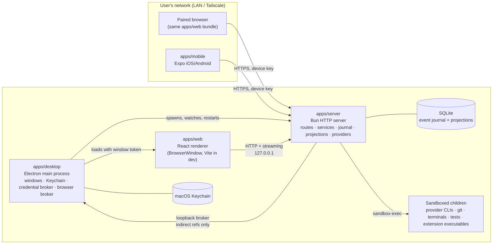
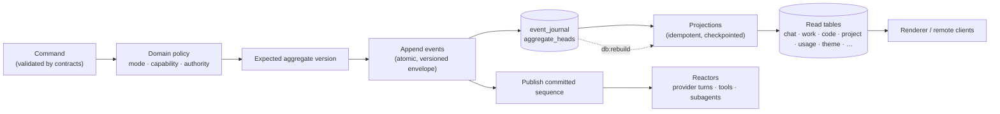

# Octant architecture

Octant is a local-first macOS workspace for Chat, Work, and Code across many AI
providers. This document is the single architecture overview for the
repository. It describes the shape of the system as it exists in code; the
decision records under `docs/decisions/` explain why individual choices were
made.

## Overview and principles

Octant is one Electron application that hosts a Bun HTTP server, a React
renderer, and (optionally) remote clients that connect to that same server.
Everything the user cares about — Projects, threads, memory, event history,
credential references, layouts — stays on the host machine.

The design rests on a small set of invariants that every package obeys:

- **Local-first.** No Octant cloud account, relay, or telemetry is required.
  Remote access is host-to-device over the user's own network.
- **The server is the authority.** Every authority check (mode, Project,
  thread, provider, approval, remote principal) runs in `apps/server` before a
  side effect. The renderer and mobile app render what the server says is
  allowed; they never decide it.
- **The event journal is authoritative; projections are rebuildable.** Commands
  append versioned events to a SQLite journal. Read models are idempotent
  projections that can be dropped and rebuilt from the journal at any time.
- **Contracts are schema-only, domain is pure.** `@octant/contracts` holds
  Effect Schema definitions and nothing else. `@octant/domain` holds pure
  policy and state transitions with no I/O.
- **Dependencies point inward.** Apps consume packages; contracts and domain
  never import apps. Provider-specific payloads stop at the provider adapter.
- **Capabilities are honest and fail closed.** Every provider reports what it
  supports in every mode; an unsupported capability is disabled or refused,
  never silently emulated. No core capability may require a specific provider.
- **Install ≠ trust ≠ enable.** Extensions contribute nothing until each of
  those steps has been taken explicitly, and even then only within the mode,
  Project, thread, and provider policy that applies.

## Process topology



**Desktop (`apps/desktop`).** The Electron main process owns native windows,
menus, the macOS Keychain, project-root and plugin-folder pickers, and the
lifecycle of the server child process. It reserves a loopback port, spawns the
server (`bun run start` from source, or the packaged `dist/main.mjs` under
`ELECTRON_RUN_AS_NODE`), passes `OCTANT_*` environment (port, instance id,
broker URLs and tokens, desktop bridge secret), and probes storage readiness
before showing a window. It also runs two loopback-only brokers the server
talks back to: the credential broker (Keychain access by opaque reference) and
the browser runtime broker.

**Server (`apps/server`).** A Bun HTTP server bound to `127.0.0.1` on the port
the desktop reserved. It registers route modules per feature (`chatRoutes`,
`workThreadRoutes`, `codeRoutes`, `projectRoutes`, `extensionRoutes`,
`remote/*`, …), resolves a **client principal** for every request — a
`local-window` principal carrying a window authority token, or a
`remote-device` principal carrying a paired device key — and runs all mutations
through services that append to the journal. Providers, tools, Git, terminals,
subagents, extensions, and recovery live here. A headless host runs the same
server through `@octant/cli` (`octant server run`, `octant web`).

**Renderer (`apps/web`).** One React application served to the desktop window
and to authenticated remote browsers alike. It talks to the server through
`@octant/client-runtime` and never holds authority of its own. In development
Vite serves it with hot reload; in a packaged build the server serves the
built assets.

**Mobile (`apps/mobile`).** An Expo iOS/Android remote-control client. Threads
are host-owned; the phone stores only device keys, a host registry, and session
material. It uses the same contracts and client runtime as the browser.

**Window authority.** Each desktop window receives a 256-bit opaque token with a
bounded lifetime. Routes bind reads and writes to the Projects that window is
bound to, so two windows on the same host cannot see across each other's
Project scope by accident.

## Modes: Chat, Work, and Code

Modes are server-enforced domain policy, not renderer flags. Chat and Work can
be disabled in settings; Code is always available; disabling a mode never
deletes its data.

| Mode     | Binds to                                                                                                                            | Authority                                                                                                                                                                                                   |
| -------- | ----------------------------------------------------------------------------------------------------------------------------------- | ----------------------------------------------------------------------------------------------------------------------------------------------------------------------------------------------------------- |
| **Chat** | A virtual, memory-scoped Project, or no Project at all                                                                              | No filesystem or shell authority. Optional safe research tools; scratch space is isolated per thread.                                                                                                       |
| **Work** | Exactly one OS-confined project root                                                                                                | Confined reads and bounded, approval-gated writes inside that root; document adapters (docx, pptx, pdf, image); research with citations; server-authoritative board.                                        |
| **Code** | Exactly one directory, ideally a repository root; Code threads select a checkout (current checkout or a managed worktree) inside it | Starts approval-gated; Full access only when explicitly remembered for that Project. Plan mode is always read-only. Git, terminals, tests, PR observation, and managed subagents run inside the bound root. |

Work never silently becomes Code. When coding work is detected in a Work
thread, the server records a **promotion proposal**; only explicit user approval
creates a linked Code thread, and the new thread inherits no authority from the
Work thread.

Threads form one real hierarchy (Project → thread → linked or child thread).
Work and Code have server-derived thread boards (Ready / In progress / Waiting /
Done); Chat has no board. A Work or Code thread is Done only when its
user-confirmed delivery target is objectively satisfied; ambiguous state
resolves to Waiting.

A `#thread` mention points at another thread the sender can already Open. The
host resolves a bounded, read-only title, status, and transcript window at send
time; the mentioned thread is not interrupted, steered, or mutated. Unknown `@`
text stays ordinary text; `@plugin` / `$skill` addressing is unchanged. Side
Chat is a Chat-mode sidecar about exactly one source thread: ordinary Chat with
that thread's bounded context, no inherited Work or Code authority, and no path
that approves, steers, or appends to the source. Unavailable, unauthorized, or
deleted targets fail closed.

## Persistence



- **Store.** One SQLite file under `OCTANT_DATA_DIR` (default
  `~/Library/Application Support/Octant`), created with owner-only permissions.
  A single narrow SQLite port has two adapters — `bun:sqlite` in production
  and `better-sqlite3` for the Node portability smoke — that pass the same
  conformance suite. Journal, migration, and projection code depend only on
  the port.
- **Envelope.** Every event carries schema version, event id, aggregate id and
  version, global sequence, correlation and causation ids, actor, host id, and
  timestamp. Unknown or future events are quarantined rather than dropped.
- **Projections.** Each feature owns its projection and persistence schema
  (`persistence/*Projection.ts`, `*PersistenceSchema.ts`). Projections are
  checkpointed by sequence, detect lag, and can be rebuilt individually or
  wholesale (`db:status`, `db:verify`, `db:rebuild`).
- **Migrations.** Ordered, forward-only, checksum-verified, applied in
  transactions before the server reports ready. A changed checksum or an
  unknown newer migration fails closed; a store backup is taken before a
  migration runs. Restart integration tests prove replay per feature.
- **Recovery.** Sequence-based reconnect replay for local and remote clients —
  a dropped stream catches up from the authoritative snapshot before it reopens,
  keeps retrying while the host is unreachable, and a remote session whose window
  closed during sleep is renewed from the device key rather than re-paired —
  crash-safe
  append, explicit terminal reasons for turns, tools, terminals, and subagents,
  preservation of partial provider output, and recovery of outstanding
  approvals and user-input requests after restart.
- **Data lifecycle.** Reset, remove-all, delete-remote-host, and thread
  retention/purge operations are explicit, reported per scope, and never run
  implicitly. Removing a paired host or Project deletes what it owns and
  reports what it retained. A retention window (host default, Project
  override, or thread override) never deletes on its own; only a confirmed
  purge erases a thread's bulk content, derived projections, and that
  thread's own journal events, then records a tombstone so a rebuild cannot
  resurrect the transcript. See `docs/decisions/0035`. The one self-applying
  exception is startup journal compaction, which removes a
  `code.checkout-observed@1` event only when the next event of the same
  checkout observes the identical state; it preserves every answer a
  projection, rebuild, subscription, or export can give and reports how many
  events it removed. See `docs/decisions/0039`. A thread the caller
  may already Open can be exported as an `octant.thread-bundle/1` JSON cut
  of the journal — transcript, evidence, and provenance, named with the
  instant it was taken. Secrets, raw provider payloads, and filesystem
  paths never appear; attachment bytes and other bulk content outside the
  journal are listed as omissions. See `docs/decisions/0036`.
- **Unsent composer drafts.** Each Chat, Work, and Code thread keeps one unsent
  composer draft in ordinary renderer storage on the client that typed it.
  Drafts are not journaled, not included in diagnostics, and not sent to a
  provider until the user sends the message. Mentions that live in the typed
  text persist with the draft; staged attachments and extra composer
  selections do not, and the composer says so when a restored draft dropped
  them. Sending or clearing removes the draft; deleting or purging the thread
  removes it too.

## Providers

The provider layer is defined by `@octant/provider-sdk` and implemented in
`apps/server/src/providers`.

- **Driver interface.** A `ProviderDriver` exposes `probe` (readiness and
  capability report without side effects), `acquire` (a `ProviderConnection`
  for a workspace), and tool verification. A connection offers a normalized
  event stream plus `start`, `resume`, `send`, `interrupt`, `stop`,
  `answerApproval`, `answerUserInput`, and `answerTool`. Every driver passes
  the shared conformance harness (chat, child-agent, and context-facts
  suites) before it is selectable.
- **Registry.** Providers are multi-instance: each instance has a stable id,
  driver kind, configuration, readiness state, model list, capability report,
  and environment policy. A selected model is `{ hostId, providerInstanceId,
modelId }`, and the model picker is provider-first. Discovery can find
  installed runtimes but never auto-registers or installs them.
- **Driver families.** Direct HTTP drivers (OpenAI-compatible, Anthropic-
  compatible, Azure AI Foundry API-key, Ollama), SDK/RPC drivers (Claude Agent
  SDK, Codex app-server, OpenCode, Pi and Oh My Pi), and ACP-based agent CLIs
  (Kilo Code, Devin, Mistral Vibe, Kimi Code, Grok Build). The ACP drivers share one
  generic ACP client and protocol layer; the remaining per-vendor ACP wrappers
  are being collapsed into that single stack. Provider-specific wire payloads
  never leave the adapter — the rest of the system sees only normalized runtime
  events.
- **Honest capability.** Each driver reports, per mode and per model, whether
  app-managed tools, images, resume, approvals, and subagents are supported.
  The server disables what is unsupported instead of emulating it. Bounded
  provider subprocesses run under a deny-default Seatbelt profile; a missing
  `sandbox-exec` fails closed as incompatible.
- **Credentials.** API keys live in the macOS Keychain and are reached only
  through the desktop's loopback credential broker by opaque UUID reference.
  OAuth and subscription login are delegated to the provider's own runtime;
  Octant never stores, refreshes, or journals those tokens. Broker URLs and
  tokens are stripped from every child environment.

## Extensions and skills

`@octant/plugin-host` is the pure model: normalized component kinds
(`skill-instructions`, `mcp-server`, `mcp-tool`, `mcp-prompt`, `mcp-resource`,
`hook`, `app`, `agent`, `apple-development-adapter`, `board`, `integration`,
`ui-surface`, `appearance-pack`, `preview-viewer`), composer addressing
(`@plugin`, `@plugin/component`, `$skill`), and the activation ladder. The
manifest and component schemas themselves (`ExtensionPackageManifest`,
component kinds, declared capabilities, and renderer contribution points)
live in `@octant/contracts/extensions`; `@octant/plugin-api` re-exports the
subset a plugin author needs as a narrower, named surface. Unknown
contribution points are rejected. The renderer contribution registry resolves
`sidebar.destination`, `settings.section`, `workspace.tab`, `thread.pane`,
`preview.viewer`, `appearance.preset`, and `board.view` from the effective
first-party catalog; it never decides availability. `apps/server/src/extensions`
owns the runtime: package store, inspector, marketplaces (skills.sh, npm,
curated catalog), Agent Plugins ingestion, supervisor, MCP session manager,
and skill discovery.

**Activation ladder.** `resolveExtensionActivation` resolves each component to
an effective state with a structured reason. A component is active only when
the package is installed, its source is trusted, the plugin master switch and
the component switch are enabled, compatibility passes, and host, mode,
Project, thread, and provider policy allow it. Any other state — `not-installed`,
`untrusted`, `quarantined`, `plugin-disabled`, `component-disabled`,
`incompatible`, `mode-prohibited`, `project-prohibited`, `thread-prohibited`,
`host-prohibited`, `stale-catalog-epoch`, `broken`, `draining` — contributes no
prompt, schema, tool, or route.

- Executable components are quarantined until explicitly reviewed and then run
  in supervised, sandboxed processes with a ready handshake, bounded output,
  durable process receipts, and drain-then-stop on disable.
- Skills are discovered only from valid `.agents/skills/` packages between the
  working directory and the Project or repository root, plus the user-global
  `~/.agents/skills/`.
- A structured mention cannot install, trust, enable, or elevate anything.
- Core capabilities (browser/computer use, tests, Apple validation, approvals,
  memory, subagents) are app-managed and provider-neutral; no core capability
  depends on an optional extension.

The path from this extensions model to a general plugin host — first-party
features as toggleable plugins, renderer contribution points, integration and
board plugin kinds — is recorded in
[decisions/0001-plugin-architecture.md](decisions/0001-plugin-architecture.md).

## Security and authority

The full threat model lives in the security documentation; the load-bearing
mechanisms are:

- **Server-side tool-call policy.** A tool call from a model is a petition, not
  a grant. Every call resolves through the closed tool catalog, the mode's
  capability matrix, the thread's elevation state, and the actor's authority
  before anything executes. Tool results and external content are data with
  provenance, never instructions.
- **Approvals.** Independent categories — project file writes, shell commands,
  network access, external application observation or control, destructive
  actions, credential access, access outside the bound root, privilege or
  sandbox changes. Grants are scoped and journaled. Code starts approval-gated;
  Plan mode is read-only; auto-accept-edits waives only project file writes;
  Full access is a remembered, per-Project decision.
- **Sandbox.** Provider CLIs, Git, terminals, test runners, and extension
  executables launch under `sandbox-exec` with deny-default Seatbelt profiles
  scoped to the bound root, allowlisted environments, and no broker
  coordinates. Path checks alone are never the boundary. Confined reads open a
  handle and verify identity against what containment resolved.
- **Subagents.** Child runs receive equal-or-narrower authority, clamped
  server-side; Code children require a verified isolated worktree receipt.
- **Remote clients.** Pairing issues a revocable device key; the private
  listener is HTTPS on a LAN or Tailscale address with a host-owned identity.
  Remote requests are classified fail-closed by an admission policy and route
  classifier. A remote principal can never exceed host, mode, provider, Project,
  or thread authority, cannot mint local receipts, and every remote mutation is
  journaled with its principal.
- **Hosts never trust each other.** Multi-host views merge read models
  client-side; credentials and mutable authority never cross hosts.

## Package map

| Package                   | Responsibility                                                                                                     | Depends on                                                        |
| ------------------------- | ------------------------------------------------------------------------------------------------------------------ | ----------------------------------------------------------------- |
| `packages/contracts`      | Effect Schema entities, commands, events, RPC and wire contracts; no runtime logic                                 | `effect`                                                          |
| `packages/domain`         | Pure policies and state transitions (modes, tool calls, approvals, remote access, boards, canvas, …)               | contracts, theme                                                  |
| `packages/theme`          | Semantic theme schema, presets, backgrounds, typography, importer, contrast                                        | contracts                                                         |
| `packages/provider-sdk`   | `ProviderDriver` interface, normalized runtime events, discovery, conformance harnesses                            | contracts, `effect`                                               |
| `packages/plugin-host`    | Extension manifests, component model, activation ladder, addressing, bundled skills, Agent Plugins loader          | contracts, `yaml`                                                 |
| `packages/plugin-api`     | Public plugin manifest, component, and contribution schemas for third parties (re-exports contracts/extensions)    | contracts                                                         |
| `packages/host-runtime`   | Host paths, owner receipts, service lifecycle, bridge secret, diagnostics, redaction (shared by desktop and CLI)   | —                                                                 |
| `packages/client-runtime` | Authenticated transport, per-feature clients, reconnect, remote pairing, host federation registry and merged reads | contracts, domain                                                 |
| `packages/cli`            | `octant` binary: headless server run, service manager, status, `web` launcher, artifact install                    | contracts, host-runtime                                           |
| `apps/server`             | Authoritative control plane: routes, services, journal, projections, providers, tools, extensions, remote gateway  | contracts, domain, plugin-host, host-runtime, provider-sdk, theme |
| `apps/desktop`            | Electron shell: windows, menus, Keychain, brokers, pickers, server process lifecycle, packaging                    | contracts, domain, host-runtime                                   |
| `apps/web`                | React renderer for desktop and paired browsers                                                                     | client-runtime, contracts, domain, plugin-host, theme             |
| `apps/mobile`             | Expo iOS/Android remote-control client                                                                             | client-runtime, contracts, domain                                 |

Dependencies point inward: no package imports an app, and `contracts` imports
nothing first-party.

## Development loop

```sh
bun install --frozen-lockfile
bun run dev        # Vite renderer + Electron with hot reload; server spawned from source
bun run verify     # paths:check, wiring:check, decisions:check, fmt:check, lint, typecheck, test, build
```

- `bun run dev` starts Vite for `apps/web` and launches Electron against it.
  Renderer edits hot-reload; server edits apply on the next relaunch. On
  startup the dev script rebuilds `apps/desktop/dist/main.mjs` whenever
  `apps/desktop/src` is newer, so `apps/desktop/src` edits need only a
  restart of `bun run dev` rather than a manual
  `bun run --cwd apps/desktop build`.
- A headless host: `bun --cwd packages/cli src/bin.ts server run`, then
  `bun --cwd packages/cli src/bin.ts web` (or `web --dev` for Vite).
- Focused checks: `bun run --filter <package> test|typecheck`; the store can be
  inspected with `bun run --cwd apps/server db:verify`.
- Formatting is `oxfmt`, linting is `oxlint`; Turbo runs the per-package
  scripts. Always run `git diff --check` before opening a PR.
