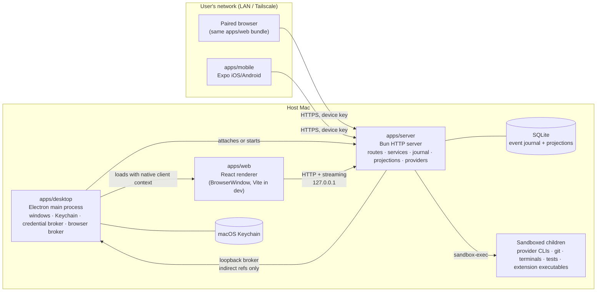
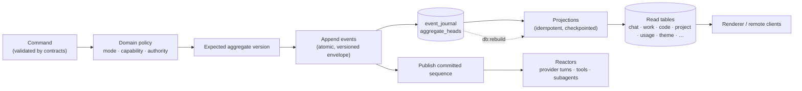

# Octant architecture

Octant is a local-first desktop workspace for Chat, Work, and Code across many AI
providers. The first shipping surface is Apple Silicon macOS; Linux and Windows
desktop are the same product under [decisions/0058-cross-platform-desktop.md](decisions/0058-cross-platform-desktop.md).
This is the current architecture specification. Read the relevant section for
system boundaries; use the [design index](design/README.md) for topic owners.
Edit the current rule with an approved change in the same PR. Historical links
provide rationale and supporting detail, not a competing source of authority.
Sections explicitly label approved designs that are not yet fully implemented;
archive status alone is neither approval nor implementation evidence.

Code task creation accepts a plain-folder checkout when the server admits it under
Code settings. The renderer preserves its proposed branch as delivery intent without
claiming a checked-out branch; detached Git checkouts remain refused. Git-dependent
actions continue to report unavailable for plain folders.

Pi usage is accumulated from completed assistant messages, not streaming usage
snapshots. Input totals include uncached, cache-read, and cache-write tokens; context
occupancy describes the latest model call. Totals reset for each turn, including
retained native processes. If a completed assistant message omits valid usage,
the turn remains unknown rather than presenting a partial total. Only provider-reported
costs are recorded, and historical turns are not rewritten.

On host restart, orphaned running Code turns become Waiting in both runtime
and conversation state. Recovery appends a status event without replacing prompts,
provider session cursors, or earlier events. Already settled turns remain settled;
repeated startup does not append duplicate recovery events. A follow-up resumes
the retained native identity under the ordinary current-authority checks.

Computer observations verify that the requested window still belongs to the
current application process before requesting its accessibility state or pixels.
A vanished window returns a window-unavailable refusal directing the caller to
list current windows; stale IDs are never silently retargeted.

## Desktop menu bar

The menu bar prioritizes Open Octant, New task, and compact Needs attention,
Running, and Unread sections. Empty activity sections disappear. Local host
contains status, browser access, applicable lifecycle controls, and redacted
diagnostics; Quit Octant retains the existing active-work confirmation.

Trusted top-level desktop windows contribute at most six task titles per activity
from their existing sidebar state. Electron validates and deduplicates these
bounded contributions, and a selection returns to the contributing window's
ordinary task navigation. Contributions clear when that window closes or its
renderer unloads; stopped hosts show no stale tasks. This is a view of open
windows, not an additional host task registry. Titles never enter the public
health response or redacted diagnostics. Separately managed hosts retain their
existing lifecycle restrictions.

## Repository test cancellation

An authorized repository test remains cancellable while the host rediscovers its
command definition. Cancellation during discovery prevents process launch; runtime
shutdown also cancels pending discovery and waits for it to settle. Thread and
checkout authority checks still precede both run and cancellation.

The Code composer's attached checkout strip keeps its height and border when
checkout metadata is unavailable. Missing project, branch and diff values stay
blank; unavailable checkout actions are not shown.

Work follow-up composers use the same attached context strip for their project and
working folder. Full paths require a matching project binding revision; Work has
no branch controls. Pane headers show thread titles without repeated project
labels. Workspace and dock tabs share one compact recipe for geometry, selection,
and close controls.

## Overview and principles

Octant is one Electron application that hosts a Bun HTTP server, a React
renderer, and (optionally) remote clients that connect to that same server.
Everything the user cares about — Projects, threads, memory, event history,
credential references, layouts — stays on the host machine.

The design rests on a small set of invariants that every package obeys:

- **Local-first.** No Octant cloud account, relay, or telemetry is required.
  Remote access is host-to-device over the user's own network. Two host-initiated
  HTTPS calls exist in code: desktop update checks against a signed feed, and
  server marketplace fetches when the person searches, inspects, previews, or
  installs from the catalog. Both have a Settings off switch: marketplace
  off means no catalog request; Updates off disables automatic update checks
  (manual Check for updates may still contact the signed feed). An in-app
  changelog rides that update path and bundled notes rather than adding a
  third call ([decisions/0061-in-app-changelog.md](decisions/0061-in-app-changelog.md)).
  Opening Updates reads the desktop's current local update state so the installed
  version and saved preferences appear without requesting the signed feed.
- **The server is the authority.** Every authority check (mode, Project,
  thread, provider, approval, remote principal, optional spend ceiling) runs in
  `apps/server` before a side effect. The renderer and mobile app render what
  the server says is allowed; they never decide it.
- **The event journal is authoritative; projections are rebuildable.** Commands
  append versioned events to a SQLite journal. Read models are idempotent
  projections that can be dropped and rebuilt from the journal at any time.
- **Contracts are schema-only, domain is pure.** `@octant/contracts` holds
  Effect Schema definitions and nothing else. `@octant/domain` holds pure
  policy and state transitions with no I/O.
- **Dependencies point inward.** Apps consume packages; contracts and domain
  never import apps. Provider-specific payloads stop at the provider adapter.
- **A provider question has one answer identity.** Each question in a provider
  question set reaches Chat, Work, and Code with a distinct request id. The
  adapter collects answers in the provider's original question order, rejects
  duplicate answers, and settles the underlying callback only when complete.
- **Capabilities are honest and fail closed.** Every provider reports what it
  supports in every mode; an unsupported capability is disabled or refused,
  never silently emulated. No core capability may require a specific provider.
- **Install ≠ trust ≠ enable.** Extensions contribute nothing until each of
  those steps has been taken explicitly, and even then only within the mode,
  Project, thread, and provider policy that applies.

Packaged macOS hosts use a restricted executable search path containing system
utilities and standard package-manager locations. `/usr/sbin` is included so
local-server discovery can invoke the system `lsof`; arbitrary inherited PATH
entries are excluded.

## Process topology



**Desktop (`apps/desktop`).** The Electron main process owns native windows,
menus, the macOS Keychain, project-root and plugin-folder pickers, and the
in-app updater. It attaches to the canonical host at
`http://127.0.0.1:13773`, or starts that independently runnable host when it is
absent, then probes storage readiness before showing a window. It passes only
native broker coordinates and the desktop bridge secret that native-only
operations require. It also runs loopback-only
brokers the server talks back to: the credential broker (Keychain access by
opaque reference), the browser runtime broker, and on macOS the Simulator
device broker, behind which one native device helper per Simulator delivers
workbench input (see
[decisions/0137-simulator-input-reaches-the-guest-through-a-native-device-helper.md](decisions/0137-simulator-input-reaches-the-guest-through-a-native-device-helper.md)).
Every app window confines top-level navigation, redirects, and opened windows to
the exact packaged renderer asset or configured Vite development origin. Native
IPC also requires that trusted renderer URL, and the packaged renderer ships a
strict Content Security Policy; external pages are opened through explicit
server- or host-authorized flows instead of replacing the app window.

**Server (`apps/server`).** A Bun HTTP server bound to the stable canonical
loopback endpoint `127.0.0.1:13773`. It registers route modules per feature (`chatRoutes`,
`workThreadRoutes`, `codeRoutes`, `projectRoutes`, `extensionRoutes`,
`remote/*`, …), resolves a **client principal** for every request — a
process-local client context on the loopback listener (internally still named
`local-window` while that contract is migrated), or a `remote-device` principal
carrying authenticated remote identity — and runs all mutations through
services that append to the journal. Providers, tools, Git, terminals,
subagents, extensions, and recovery live here. A headless host runs the same
server through `@octant/cli` (`octant server run`, `octant web`). For Code,
verified remote requests carry their principal through an async request scope:
the paired device may reach existing active Code Projects without a desktop
workspace, while services retain thread, checkout, provider, and approval checks.
This admission ends on cancellation or dispatch completion. Local windows retain
their selected-Project restriction (ADR 0148). A killed start can leave the
control secret with no receipt and no socket; the next acquire quarantines
that file and continues, and it checks the socket is still absent before the
move so a peer that bound in the meantime keeps the secret it just wrote. An
ownership failure names the code, the artifact path, and the next step.

**Renderer (`apps/web`).** One React application served to the desktop window
and to authenticated remote browsers alike. It talks to the server through
`@octant/client-runtime` and never holds authority of its own. In development
Vite serves it with hot reload; in a packaged build the server serves the
built assets. A paired browser mounts the remote shell rather than the desktop
workspace: the same Chat, Work, and Code thread workspaces, driven by the
ordinary product clients over `createRemoteProductFetch`, which carries each
request on the device session and never presents a window capability. The
desktop's window-bound sidebar, dock, and Settings are not served remotely.

**Mobile (`apps/mobile`).** An Expo iOS/Android remote-control client. Threads
are host-owned; the phone stores only device keys, a host registry, and session
material. It uses the same contracts and client runtime as the browser. The
phone creates Chat, Work, and Code threads, reads their transcripts, and sends
follow-up turns under each thread's own authority (`start-work-thread-turn`
with the thread's binding; `start-provider-turn` on the thread's checkout).
Approvals, folder binding, file edits, and shell remain host-only and the
composer says so. Native startup supplies WebCrypto for the shared pairing and
request-proof clients; keys persist in platform secure storage. Native remote
fetch sends the proof-bound session cookie explicitly and disables the shared
cookie jar to prevent duplicate or stale cookies. Browser cookie ownership is
unchanged, and native remote requests refuse redirects.

**Local client context.** Opening the canonical host URL directly creates a
process-local client context through `/api/shell/local-session`; no launcher
token, persisted clock posture, or alternate profile is required. Electron,
ordinary browsers, and Vite therefore read the same Machine-owned Projects,
threads, settings, and journal. The context id scopes window-local presentation
and guards against accidental cross-window commands, but it is not a separate
Machine or durable authentication epoch. The packaged renderer additionally
proves its native renderer identity for desktop-only integration. When the host
instance changes, Electron re-registers every live Project window, replaces the
main-process authority and renderer identity, and publishes the new capability
so the renderer rebuilds its clients before snapshot recovery. The loopback
transport still validates the actual Host header, rejects non-loopback origins,
and removes process-local registration when its owning client closes. Loopback
renderer ports share the local-user trust class; the listener never reflects a
non-loopback web origin into local authority. The renderer holds the matching
line before its first request: a launch address that is plain HTTP to a
non-loopback host is refused with an explanation and never used
(`docs/decisions/0103`). Requests that send the window capability set
`redirect: "error"` so a later hop cannot carry the header to an address the
parser never judged.

Managed runtime tool transport uses the provider SDK's existing tool-request
and tool-answer contract. The adapter's in-process server exposes only the
current app-authored catalogue; external provider tool-server configuration
stays disabled. Code browser sessions can request an inline approval without
raising thread access. The grant is bound to the exact browser context and
owner, and browser-service policy is checked again before effects. See
[decision 0093](decisions/0093-app-owned-tools-use-managed-runtime-transports.md).

Tool definitions carry the agent's usage guidance alongside their argument
schemas. Each mode offers only its admitted tools, so providers receive the
same guidance through MCP, dynamic tools, or direct tool calls without a
separate global tool installation or prompt catalogue. Browser shares one
definition across modes. Canvas's `describe` operation lists the closed block
catalogue and a creation example, or returns canonical schemas for up to three
requested block kinds. It reads no Project data and creates no artifact.
Descriptions explain the existing presentation flows and distinguish creation,
queued jobs, and work proposals from opened previews or completed work.
Work also includes a short, budgeted artifact instruction in its required
context, so runtimes that use their own file tools know how written documents
appear in Files and Document. That instruction offers no tools or authority.

A Canvas diagram block is also a board. The renderer zooms, pans, and fits the
same deterministic layout every surface draws, and a user's drag or keyboard
nudge is journaled through `/api/canvas/layout-revise` as a new immutable
`canvas.version-appended@1` version with `actor: local-user`, admitted by the
pure `admitCanvasDiagramLayoutRevision` policy (target must be a diagram,
every moved node must exist, the sequence must be the head, budgets stand).
Agent revisions and user layout share one history; a stale drag is refused and
the renderer reloads rather than overwriting a newer version. Only the head
version is editable. The route is host-window only; a paired browser reads
boards but does not move nodes. Comments are journaled facts of one
`canvas-comments` aggregate per Canvas (`canvas.comment-added@1`, `-replied`,
`-resolved`, `-deleted`), whose version is the board's comment sequence, so
concurrent comments conflict on the journal instead of both winning; the
service rebuilds them with the pure `applyCanvasCommentEvent` reducer, refuses
unauthorized reads with no bodies, and stamps each comment's origin (`host` or
the authenticated `remote-device`) beside its `local-user` author. Shared
snapshots serialise the definition and so never carry comments
([decisions/0052-canvas-boards.md](decisions/0052-canvas-boards.md)).

The local-server provider adapter owns a separate process for each acquired
connection and allows one live session per connection. Its MCP protocol does
not reliably carry native session identity, so the private endpoint binds calls
to that connection's immutable session and exact offered catalogue. Complete
permission rules are updated before each prompt; the deprecated tool toggle
payload is omitted because it replaces those rules. App tools require a process
receipt attesting that external MCP, plugins, and skills cannot enter the
runtime. Ordinary inherited configuration does not supply that attestation and
continues to report app tools as unsupported. Process exit, stream failure,
interruption, and scope cleanup retire pending tool requests.

### Device transport and evidence

The iOS Simulator dock tab
is a device pane: the Simulator's screen streamed through the
host as it changes, authorized like a screenshot and never stored (see
[decisions/0139-the-simulator-frame-is-a-live-view-streamed-through-the-host.md](decisions/0139-the-simulator-frame-is-a-live-view-streamed-through-the-host.md)),
or the latest host-held screenshot evidence when there is no live view — with
honest setup, unavailable, booting, live, interrupted, and stale-after-restart
states; closing the tab does not shut down the destination. An agent's
`octant_apple` `boot`, `run`, or `open` raises that pane once per request
instead of launching Simulator.app (see
[decisions/0151-the-agent-opens-the-in-app-simulator-pane.md](decisions/0151-the-agent-opens-the-in-app-simulator-pane.md)).
Apple artifact and restart-receipt reads validate regular-file identity and size
on an open handle before allocation. Reads reject linked files and size changes,
with a 16 MiB artifact limit and 1 MiB receipt limit; existing records are not
rewritten.
An Android emulator is a separate dock destination and `octant_android` tool,
not an iOS helper feature
([decisions/0153-android-emulator-is-a-separate-device-destination.md](decisions/0153-android-emulator-is-a-separate-device-destination.md)).
Tap, typed text,
and hardware-key input ride the same Apple workbench control channel as boot
and screenshot, with XCTest-less host injection behind that channel only,
computer-use-style actor attribution, and the same remote/headless fail-closed
attach gate (see
[decisions/0062-simulator-frame-input-transport.md](decisions/0062-simulator-frame-input-transport.md)).
On an approval-gated thread, **Allow input** is the confirmation that opens
that destination; clicks, typing, Home, and Lock never raise it
([decisions/0152-allow-input-opens-a-device-to-clicks.md](decisions/0152-allow-input-opens-a-device-to-clicks.md)).
Under the desktop app that injection is the native device helper of 0137: a
tap is a point on the captured screen, typed text is letters, digits, spaces
and new lines, and every refusal names the helper's own reason. Without that
helper every input kind is unavailable; Octant does not script Simulator.app
to inject a tap, swipe, typed text, or key
([decisions/0151-the-agent-opens-the-in-app-simulator-pane.md](decisions/0151-the-agent-opens-the-in-app-simulator-pane.md)). A swipe is a
fourth input kind on the same channel, for the pane and for `octant_apple`
alike, and the live screen is driven directly: a press and release is a tap, a
drag is one swipe sent when it ends, keys typed on the focused screen go to
the device as one text per pause, Home and Lock are buttons, and what a person
does while an action runs is kept and sent in order (see
[decisions/0140-the-live-simulator-screen-is-driven-directly.md](decisions/0140-the-live-simulator-screen-is-driven-directly.md)).

## Modes: Chat, Work, and Code

Modes are server-enforced domain policy, not renderer flags. Chat and Work can
be disabled in settings; Code is always available; disabling a mode never
deletes its data.

| Mode     | Binds to                                                                                                                            | Authority                                                                                                                                                                                                                                                                                                                                                                                          |
| -------- | ----------------------------------------------------------------------------------------------------------------------------------- | -------------------------------------------------------------------------------------------------------------------------------------------------------------------------------------------------------------------------------------------------------------------------------------------------------------------------------------------------------------------------------------------------- |
| **Chat** | A virtual, memory-scoped Project, or no Project at all                                                                              | No filesystem or shell authority. Optional safe research tools; scratch space is isolated per thread.                                                                                                                                                                                                                                                                                              |
| **Work** | Exactly one OS-confined project root                                                                                                | Confined reads and bounded, approval-gated writes inside that root; document adapters (docx, pptx, pdf, image); research with citations; server-authoritative board.                                                                                                                                                                                                                               |
| **Code** | Exactly one directory, ideally a repository root; Code threads select a checkout (current checkout or a managed worktree) inside it | Starts approval-gated; Full access only when explicitly remembered for that Project. Plan mode is always read-only. Git, terminals, tests, PR observation, and managed subagents run inside the bound root. Creating a Code Project may explicitly initialize Git in that folder (`docs/decisions/0079`) so a Code thread can prepare a checkout immediately; binding without Git remains allowed. |

A Work or Code thread started without a chosen Project lands in the mode's
**default Project**: the host provisions `<default folder>/Work` or
`<default folder>/Code` on first use, binds it as an ordinary Project marked
`origin: "default-folder"`, and reuses it after. The default folder is the
`defaultFolder` shell setting (`~/Documents/Octant` unless changed, always
inside the user's home), and artifact files mirror under its `Artifacts`
subfolder until a mirror setting says otherwise. With the Code setting
`requireGitRepository` off, a Code thread may start in a folder that is not a
repository on a `plain-folder` checkout whose head is `none`; every Git-backed
feature reports itself unavailable there rather than inventing a revision. Code
threads without a Project need the further `allowDefaultFolderThreads` switch,
which the host accepts only while Git is not required. See
[decisions/0118-a-default-folder-for-what-nobody-gave-a-home.md](decisions/0118-a-default-folder-for-what-nobody-gave-a-home.md).

A Work Project folder carries `AGENTS.md` (the person's standing brief, seeded
once and never rewritten) and `STATUS.md` (where the work stands, with dated
follow-ups and deadlines). Both are read into every Work turn ahead of the
thread's transcript, with a standing instruction to keep `STATUS.md` current;
a completed turn that changed files without touching it gets a `Recent
changes` line appended from the 0083 record. A stale status or a near or passed
date makes the next task open by taking stock and asking for an update. The
Work Project page, the Work board's follow-up mark, and the inbox's
`follow-up-due` attention signal all read the same file on demand; nothing
about it is journaled. See
[decisions/0119-a-work-project-keeps-its-status-in-its-folder.md](decisions/0119-a-work-project-keeps-its-status-in-its-folder.md).

Work never silently becomes Code. When coding work is detected in a Work
thread, the server records a **promotion proposal**; only explicit user approval
creates a linked Code thread, and the new thread inherits no authority from the
Work thread.

Rebinding a Code Project supersedes the checkout its existing threads were
created against, and no later observation can produce those threads' checkout
ids again, so the server reports them as unavailable rather than waiting on a
reconnection nobody is attempting. Per `docs/decisions/0032`, that refusal names
a way out: the thread's fail-closed surface offers an explicit rebind that moves
it onto the checkout the Project binds now. The server authorizes and journals
the move, and it never happens on its own — a matching filesystem root is not
consent to change what authority a thread holds. A session grant of Full access
does not survive the move; the thread lands on its persisted posture. A thread
that owns a managed worktree is refused, because that checkout is the thread's
own tree rather than the Project's.

A child AgentRun receives a server-prepared workspace: Chat a research-only
virtual workspace, Work the current confined Project root and binding revision,
and Code an isolated managed worktree that is confirmed before admission.
Renderers supply only receipt ids — never absolute paths or a claimed
`verified` flag. Admission, restart, and replay refuse stale, expired,
foreign-thread, foreign-Project, parent-checkout, unavailable, or
wider-than-parent grants.

Threads form one real hierarchy (Project → thread → linked or child thread).
Work and Code have server-derived thread boards (Ready / In progress / Waiting /
Done); Chat has no board. Code lists active open and draft pull requests from
connected Projects in a manually refreshed workspace and joins exact
thread-owned PR status onto Code board cards. A Work or Code thread is Done
only when its user-confirmed delivery target is objectively satisfied;
ambiguous state resolves to Waiting.

A `#thread` mention points at another thread the sender can already Open. The
host resolves a bounded, read-only title, status, and transcript window at send
time. In Chat, an explicit mention also grants the source provider the bounded
`octant_thread_message` tool for that turn: it may send one of the user's
instructions to the mentioned Chat thread and receive its completed reply. The
target's own Chat turn, provider, Project, and authority remain authoritative;
an active target returns Waiting rather than being interrupted or duplicated.
Coordination is one hop and unavailable, unauthorized, or deleted targets fail
closed. Work and Code mentions remain read-only. In Work and Code, an `@file`
mention completes a path inside the thread's bound root; the host refuses a path
outside that root before reading it. Chat Projects have no filesystem authority,
so `@file` is absent there. Unknown `@` text stays ordinary text; `@plugin` /
`$skill` addressing is unchanged. Side Chat is a Chat-mode sidecar about
exactly one source thread: ordinary Chat with that thread's bounded context,
no inherited Work or Code authority, and no path that approves, steers, or
appends to the source.

A Chat attempt that fails or is interrupted carries a bounded failure code,
and the client-safe process diagnostic when the provider supplied one. The
transcript states Octant's sentence for that code. The provider's own message
stays off the attempt. App-managed tool and research calls use the turn's own
deadline; a call that never returns ends the attempt instead of leaving it
running, and a cancellation is not recorded as that call having failed.

Broader structured messaging between AgentRuns and threads, beyond mention
excerpts and beyond that Chat one-hop tool, is designed in
[decisions/0063-agent-to-agent-messaging.md](decisions/0063-agent-to-agent-messaging.md)
and
[security/agent-to-agent-messaging-threat-model.md](security/agent-to-agent-messaging-threat-model.md).
Broader messaging still requires explicit maintainer approval of its design and
threat-model sign-off; the journaled contracts, pure clamps, delivery service,
Code turn tool registration, and the Agents center's messaging bounds view now
exist so that review happens against real code, delivered behind the
maintainer's explicit direction. The built shape follows the record: the host
admits, clamps, journals, and delivers; bodies stay out of the journal, are
stored under opaque references, and taint the recipient as untrusted external
content; messaging grants no authority, starts no turn, and purged threads
leave no resurrectable bodies. 0049 remains the Chat mention path.

## Agent task display

Providers that report their own task plans (Claude, Codex, ACP, OpenCode) emit
`task-progress` runtime events, and the host journals them. Each thread surface
shows the agent's restated plan as a live "N of M tasks completed" panel while
any task is open or the turn is still writing: Code from its journaled
operation events, Chat from `ChatAttempt.tasks` carried on
`chat.attempt-updated@1`, and Work from `WorkTurnState.tasks` journaled on
`work.turn-updated@1` with a live `turn-tasks` stream frame. The panel is a
projection of journaled state, never a renderer-owned plan; per-step detail
stays in the transcript's activity rows.

## Workspace shell

[Workspace behavior](design/workspace.md) owns navigation, Projects, panes,
content tabs, dock tools, and their presentation lifecycle. [DESIGN.md](../DESIGN.md)
owns their visual treatment. Those current specifications replace the historical
shell and visual-language migration descriptions; server authority and durable
state remain owned by the architectural sections here.

## Persistence



- **Store.** One SQLite file under `OCTANT_DATA_DIR` (default
  `~/Library/Application Support/Octant`), created with owner-only permissions.
  A single narrow SQLite port has two adapters — `bun:sqlite` in production
  and `better-sqlite3` for the Node portability smoke — that pass the same
  conformance suite. Journal, migration, and projection code depend only on
  the port. Settings → Data & privacy exposes a read-only, server-authoritative data
  map of those locations (and per-Project facts) so a person can see what
  this host stores without opening a document. Categories the host cannot
  verify are `unknown`; the map never carries secret values.
- **Envelope.** Every event carries schema version, event id, aggregate id and
  version, global sequence, correlation and causation ids, actor, host id, and
  timestamp. Unknown or future events are quarantined rather than dropped.
- **Projections.** Each feature owns its projection and persistence schema
  (`persistence/*Projection.ts`, `*PersistenceSchema.ts`). Projections are
  checkpointed by sequence, detect lag, and can be rebuilt individually or
  wholesale (`db:status`, `db:verify`, `db:rebuild`).
- **Migrations.** Ordered, forward-only, checksum-verified, applied in
  transactions before the server reports ready. A changed checksum or an
  unknown newer migration fails closed; a store backup is taken before a
  migration runs. Restart integration tests prove replay per feature.
- **Untrusted-content taint.** Browser observations, tool results, and imported
  external content that already carry tainting provenance append
  `thread.external-content-ingested@1` with thread identity and bounded source
  labels. Raw bodies never enter the payload. The thread-lifetime taint
  projection rebuilds from the journal; session, turn, and restart boundaries
  never clear it. Irreversible or authority-bearing actions on a tainted thread
  still require fresh confirmation after replay.
- **Recovery.** Sequence-based reconnect replay for local and remote clients —
  a dropped stream catches up from the authoritative snapshot before it reopens,
  keeps retrying while the host is unreachable, and a remote session whose window
  closed during sleep is renewed from the device key rather than re-paired —
  crash-safe
  append, explicit terminal reasons for turns, tools, terminals, and subagents,
  preservation of partial provider output, and recovery of outstanding
  approvals and user-input requests after restart. Multi-host Settings uses the
  same rule per registered host: reconnect renews from that host's device key;
  only a revoked, expired, lost, or host-changed credential forces a new pair.
  Revoke-self drops that host's sessions and streams before the client clears
  the local registry entry.
  Reopened Code terminals retain their runtime-work identity and resume at the
  persisted aggregate version, including restart interruption events. Live
  recorders keep their expected version so conflicting writes remain refused.
- **Fast thread reads.** A thread paints from an authoritative snapshot before
  auxiliary Files, Git, Browser, or Computer Use observations begin. Code
  conversation evidence is read in bounded batches and page results paint as
  they arrive; live Code operation frames carry bounded display text beside
  their durable evidence references. Work uses a bounded delta feed over its
  durable transcript. One post-commit Machine change feed invalidates mode
  navigation and Project/extension projections instead of independent polling
  timers. Every process-local feed sends `snapshot-required` after gaps,
  overflow, or host restart. The client transport bounds and prioritizes reads,
  coalesces identical work, cancels obsolete thread switches, renews local
  client context without replaying mutations, and windows long transcripts.
  See [0075](decisions/0075-thread-reads-are-snapshot-first-and-change-driven.md).
- **Data lifecycle.** Reset, remove-all, delete-remote-host, and thread
  retention/purge operations are explicit, reported per scope, and never run
  implicitly. Removing a paired host or Project deletes what it owns and
  reports what it retained. A retention window (host default, Project
  override, or thread override) never deletes on its own; only a confirmed
  purge erases a thread's bulk content, derived projections, and that
  thread's own journal events, then records a tombstone so a rebuild cannot
  resurrect the transcript. See `docs/decisions/0035`. The one self-applying
  exception is startup journal compaction, which removes a
  `code.checkout-observed@1` event only when the next event of the same
  checkout observes the identical state; it preserves every answer a
  projection, rebuild, subscription, or export can give and reports how many
  events it removed. See `docs/decisions/0039`. The other self-applying
  exception files rather than erases: the completed-thread sweep archives a
  thread the person completed once the Settings window has passed, keeping
  its transcript, checkout, and journal in place (`docs/decisions/0088`).
  A thread the caller
  may already Open can be exported as an `octant.thread-bundle/1` JSON cut
  of the journal — transcript, evidence, and provenance, named with the
  instant it was taken. Secrets, raw provider payloads, and filesystem
  paths never appear; attachment bytes and other bulk content outside the
  journal are listed as omissions. See `docs/decisions/0036`. User-facing
  drafts of the privacy notice, sub-processor position, data-residency
  statement, DPA template, SCC position, and EULA governing-law placeholders
  live in `apps/docs/advanced/` and are marked pending legal review; they
  describe this behavior rather than changing it. The draft shared-host
  controller footing for small teams lives in
  `docs/legal/shared-host-controller.md` and aligns with
  `docs/decisions/0040` without shipping the shared team host.
- **Unsent composer drafts.** Each Chat, Work, and Code thread keeps one unsent
  composer draft in ordinary renderer storage on the client that typed it.
  Drafts are not journaled, not included in diagnostics, and not sent to a
  provider until the user sends the message. Mentions that live in the typed
  text persist with the draft; staged attachments and extra composer
  selections do not, and the composer says so when a restored draft dropped
  them. Sending or clearing removes the draft; deleting or purging the thread
  removes it too.

- **Composer feature tips.** Empty Chat, Work, and Code composers show a short
  tip about a built-in feature instead of a fixed placeholder. A session-local
  sequence advances when a composer mounts or its thread identity changes,
  including returning to a thread and creating another draft. It stays steady
  through typing and routine updates. Callers offer only mounted capabilities:
  file and thread mentions, commands, Browser, Computer, and Code Plan mode.
  Command-specific tips cover thread search, new threads, Settings, Zen mode,
  and skills only when their commands are offered by the current composer.
  Removing a capability replaces an ineligible tip. Active responses retain
  their send-next-message placeholder. Tips use no timers, persisted history,
  network calls, or live announcements; accessible input labels remain stable.

## Providers

The provider layer is defined by `@octant/provider-sdk` and implemented in
`apps/server/src/providers`.

- **Driver interface.** A `ProviderDriver` exposes `probe` (readiness and
  capability report without side effects), `acquire` (a `ProviderConnection`
  for a workspace), and tool verification. OpenCode and ACP probe refusals
  carry a closed Octant-authored `reason` plus bounded process diagnostics;
  free-form driver or provider text does not cross to clients, and Settings
  maps the reason to copy and next-step guidance. A connection offers `subscribe` — a
  scoped subscription to its normalized events, established before a caller
  sends so a provider that answers immediately is not missed (0082) — plus
  `start`, `resume`, `send`, `interrupt`, `stop`, `answerApproval`,
  `answerUserInput`, and `answerTool`. Every driver passes
  the shared conformance harness (chat, child-agent, and context-facts
  suites) before it is selectable.
- **Registry.** Providers are multi-instance: each instance has a stable id,
  driver kind, configuration, readiness state, model list, capability report,
  and environment policy. A selected model is `{ hostId, providerInstanceId,
modelId }`, and the model picker is provider-first. Discovery can find
  installed runtimes and auto-register them. On first run, a detected Claude
  Code or Codex CLI instance is created enabled; every other detected runtime
  is created disabled. Discovery never installs or updates runtimes, never
  toggles an existing instance, and never treats enablement as readiness
  ([decisions/0112-first-run-claude-codex-enablement.md](decisions/0112-first-run-claude-codex-enablement.md)).
- **Driver families.** Direct HTTP drivers (OpenAI-compatible, Anthropic-
  compatible, Azure AI Foundry API-key, Ollama), image HTTP profiles
  (OpenAI Image and Gemini native image — never selectable as Chat, Work, or
  Code turn drivers), SDK/RPC drivers (Claude Agent SDK, Codex app-server,
  OpenCode, Pi, and Oh My Pi — whose driver discovers models but refuses
  `acquire`, so its probe reports `unavailable` and it never reaches a
  picker), and ACP-based agent CLIs
  (Kilo, Devin, Mistral Vibe, Kimi Code, Grok Build, Goose, GLM Agent, Gemini CLI,
  GitHub Copilot, Cline, Qwen Code, fx). fx runs in a per-instance managed
  home because its ACP entrypoint exposes no profile-path variable; see
  [fx-acp-compatibility.md](fx-acp-compatibility.md) and
  [0130](decisions/0130-fx-runs-in-a-managed-home.md). Image profiles are
  recorded in [decisions/0055-image-generation-provider-profiles.md](decisions/0055-image-generation-provider-profiles.md).
  Generation itself is a journaled job with OpenAI and Gemini adapters, a
  bounded generated-image attachment scope, and usage rows attributed as
  `image-generation`; see
  [decisions/0056-image-generation-jobs-and-adapters.md](decisions/0056-image-generation-jobs-and-adapters.md).
  The **Image generator** surface (profile menu, host-wide `image-library`
  scope; see
  [decisions/0081-image-generation-is-its-own-surface.md](decisions/0081-image-generation-is-its-own-surface.md))
  and an app-managed `octant_create_image` tool invoke that job service
  through `/api/image/` when an enabled image profile exists; the composers
  carry no generation action. Agent-generated images preview in the thread by
  opaque attachment id, chain edits through `parentArtifactRef`, export with the thread, and
  never grant Chat filesystem authority.
  **Voice** is an app-managed capability rather than a provider kind: speech
  to text and text to speech each resolve against one enabled OpenAI-compatible
  instance named in Settings › Voice and reuse its base URL, authentication,
  and credential. The host serves `/api/speech/status`, `/api/speech/transcriptions`,
  and `/api/speech/synthesis` behind window authority, sniffs and bounds the
  audio, persists nothing, and reports each direction `ready`, `unconfigured`,
  or `unavailable` with the Settings link that fixes it; see
  [decisions/0084-voice-rides-an-openai-compatible-provider.md](decisions/0084-voice-rides-an-openai-compatible-provider.md).
  Every desktop composer (Chat, Work, Code, the welcome and draft composers) and
  Navigator show a microphone beside the attach control only while
  transcription is `ready`; the clip is recorded by the browser's own encoder,
  the transcript is appended to the draft, and the person still sends. Navigator
  can read replies aloud through the configured synthesis endpoint, or with the
  operating system's voices when none is set. The mobile composer shows a
  disabled microphone labelled unavailable; phone voice input is planned under
  the same decision and not wired.
  The ACP drivers share one
  generic ACP client and protocol layer. Each in-tree vendor is a bundled
  `provider-driver` plugin that reaches the host only through `provider-sdk`;
  ACP vendors configure that shared stack rather than shipping a second runtime.
  Disabled or incompatible driver plugins contribute no models, tools, or
  capabilities. Provider-specific wire payloads never leave the adapter — the
  rest of the system sees only normalized runtime events.
- **Honest capability.** Each driver reports, per mode and per model, whether
  app-managed tools, images, resume, approvals, and subagents are supported.
  The server disables what is unsupported instead of emulating it. Bounded
  provider subprocesses run under a deny-default profile: Seatbelt via
  `sandbox-exec` on macOS, Bubblewrap (`bwrap`) on Linux. Missing the backend
  selected for the host platform fails closed as incompatible.
- **Credentials.** API keys live in the host credential store — macOS Keychain
  on macOS, freedesktop Secret Service on Linux — and are reached only
  through the host's loopback credential broker by opaque UUID reference.
  Provider OAuth has two postures ([0111](decisions/0111-host-driven-provider-oauth.md)).
  **Delegated** (`delegated-oauth`, including CLI `subscription`): login stays
  on the provider's own runtime; Octant never stores, refreshes, or journals
  those tokens. **Host-driven** (`subscription-oauth`, direct HTTP drivers):
  the host runs PKCE and/or device flow; the 0054 broker holds refresh and
  access material as opaque refs — never journaled, logged, exported, or
  renderer-visible. Secrets
  Octant holds for an integration use the same host credential path: the host
  keeps an opaque reference; plugins, the renderer, the journal, and diagnostics
  never receive raw token material. Broker URLs and tokens are stripped from
  every child environment. Linear is the first bundled-off Integration plugin:
  it contributes a Settings card through `settings.section`, connects with
  authorization-code + PKCE, and stores access and refresh tokens only in that
  host credential service. Connect opens a short-lived loopback listener on
  `127.0.0.1:52693` (`/oauth/linear/callback`, fallbacks 52694 and 52695) for
  the consent redirect, then closes it. Connect fails closed when the public
  client id (`OCTANT_LINEAR_OAUTH_CLIENT_ID`) is unset.

### Context and usage accounting

Context usage is a circular used-versus-available meter on
the active thread's composer; opening it shows an authoritative breakdown
popover without a further provider call, and Inspect context opens the
composition inspector for pin, exclude, and rebuild. Inspecting a thread that has no context plan yet is a successful empty answer, not a failed request. New context plans retain
model and service limit provenance and inspection metadata in the journal-backed
plan projection. Inspection restores those saved facts after a host restart
without querying the provider; saved observation timestamps remain unchanged.
Older plans without inspection metadata remain unavailable until a new turn
establishes it. Work includes native instructions, Browser guidance, and tool
definitions in its planned input, checks available provider-reported context bounds
before dispatch, and reconciles reported usage with the dispatched plan. Maximum
output is optional: an unknown limit stays unavailable rather than being inferred
from a response reservation. Emergency admission budgets are explicitly marked as
conservative fallbacks. A matching runtime window from the same provider, model,
and request shape is retained across restart and participates in subsequent
planning; it replaces emergency estimates while conflicting model facts retain
the more conservative bound.
Provider-managed Code turns also contribute their journaled token reports to the
usage ledger. One operation contributes one request; a later report replaces its
previous totals. Code conversation usage also preserves optional cache-read and cache-write
counters. Codex native-thread totals are normalized to turn usage before recording;
missing cache reports remain unknown. ACP and Pi resume cursors carry a durable
task binding, and resume supplies the currently allowed tool catalogue without
reconstructing native history. Chat and Work reuse provider-owned sessions across
follow-ups; Chat retries retain that identity and native scratch files. Native
Chat editing refuses where rollback is unavailable, so it cannot replace the
conversation behind the user's back ([0157](decisions/0157-native-resume-keeps-a-durable-identity.md)). A separate replay checkpoint imports existing Code reports on
upgrade without replaying unrelated purged usage. The provider and model are
those recorded when the turn started, including after a later handoff. These
turns have no Octant planning estimate or variance: APIs omit those fields and
the request-detail table labels them unavailable.

Native Chat, Work, and Code resume acknowledgements may omit an unchanged resume
cursor. The host retains the already-admitted cursor in that case and persists a
replacement when one is returned. A changed session identity or an initial native
session without a recoverable cursor still fails closed; no transcript replay or
replacement conversation repairs the missing identity. Work and Chat also refuse
a follow-up that switches between provider-owned and host-owned conversation
history; switching adapters cannot implicitly replace an existing native task.
Work also refuses when the previous driver is unavailable and its conversation
ownership cannot be established.

Optional Project and
thread token spend ceilings (0060) are host owner policy: the server refuses a
provider-consuming turn at admission when remaining reserved capacity cannot
cover a declared per-turn bound, and the composer and Environment name a
recovery. Spend is the existing `UsageRecord` ledger, never imported provider
history.

### Native harness

Direct-endpoint providers (`openai-compatible`, `anthropic-compatible`,
`azure-foundry`; `ollama` joins once its driver runs the tool loop) run under the
native harness in `apps/server/src/harness`:

- **Tools.** `createNativeHarnessTools` composes the nine working tools and
  the harness reads as one `AppManagedToolSet`, trimmed by mode through the
  closed tool catalog (`harness-*` capability ids). Every call decodes its
  arguments, wraps a `ToolActionRequest` under the thread's current authority,
  and passes `ToolCallAuthorityService.authorize` before any port runs. Files
  go through `NativeHarnessFileSystem` (confined to the root, symlinks
  resolved, edits require a prior read); `bash` runs through the same
  Seatbelt-confined owned-process-group port as repository tests; web fetches
  refuse private destinations, and connect through a `lookup` that checks
  every address the name resolves to at the moment the socket opens, so a
  name cannot pass the check and then resolve somewhere private.
- **Routing.** `NativeHarnessRoutingStore` journals a host default and
  Project overrides of slot tables; `resolveNativeHarnessRoute` in
  `@octant/domain` is the pure resolver; `NativeHarnessRouter` adds cooldowns
  and a per-slot circuit breaker. Child runs take their model from the role's
  slot through the shared `admitAgentRunControlRequest` path.
- **Session.** `NativeHarnessSessionStore` journals one session per thread:
  routing decisions, turn records, context reductions, advisor interventions,
  follow-up suggestions, the questions a lead asked with how each was
  settled, and — on each turn record — the last calls the lead made (tool,
  what it asked for, ok/refused/failed, duration), noted live on the session
  while the turn runs and journaled with the record when it ends. `NativeHarnessQuestionStore` blocks an `ask-user` call until an
  answer arrives from any surface (`POST /api/native-harness/sessions/:thread/questions`,
  or the Code thread's own inline question path), or until it expires or the
  turn is interrupted. `NativeHarnessTurnObserver` puts the stable
  instructions block in front of every harness turn, records the completed
  reply, parses the follow-up block, and asks the `advisor` slot for a review.
  A confirmed follow-up is created by `createNativeHarnessFollowUp` through
  the mode's ordinary creation command on the confirming window, and the
  activation result carries the new thread id; the prompt is never sent on
  the person's behalf.
- **Terminal.** `octant agent` in `packages/cli` is the same thread on a
  terminal: `agentThread.ts` is the mode-neutral thread port (Chat, Work,
  and Code adapters over the modes' own routes, plus creation), `agentHost.ts`
  the harness calls, `agentTuiModel.ts` the pure presentation (transcript,
  footer, palette projected from `@octant/theme` tokens), and `agentTui.ts`
  the OpenTUI screen, loaded only when stdout is a terminal and `--plain` or
  `--json` was not asked for.
- **Surfaces.** `/api/native-harness/routing` and
  `/api/native-harness/sessions/:threadId` serve the web, desktop, phone, and
  `octant agent` / `octant harness` from one `NativeHarnessSessionView`.

## Extensions and skills

`@octant/plugin-host` is the pure model: normalized component kinds
(`skill-instructions`, `mcp-server`, `mcp-tool`, `mcp-prompt`, `mcp-resource`,
`hook`, `app`, `agent`, `apple-development-adapter`, `board`, `integration`,
`ui-surface`, `appearance-pack`, `preview-viewer`, `provider-driver`), composer addressing
(`@plugin`, `@plugin/component`, `$skill`), and the activation ladder. The
manifest and component schemas themselves (`ExtensionPackageManifest`,
component kinds, declared capabilities, and renderer contribution points)
live in `@octant/contracts/extensions`; `@octant/plugin-api` re-exports the
subset a plugin author needs as a narrower, named surface. Unknown
contribution points are rejected. The renderer contribution registry resolves
`sidebar.destination`, `settings.section`, `workspace.tab`, `thread.pane`,
`preview.viewer`, `appearance.preset`, and `board.view` from the effective
first-party catalog; it never decides availability. `apps/server/src/extensions`
owns the runtime: package store, inspector, marketplaces (skills.sh, npm,
curated catalog, npm Agent Plugins), Agent Plugins ingestion, supervisor, MCP
session manager, and skill discovery.

**Activation ladder.** `resolveExtensionActivation` resolves each component to
an effective state with a structured reason. A component is active only when
the package is installed, its source is trusted, the plugin master switch and
the component switch are enabled, compatibility passes, and host, mode,
Project, thread, and provider policy allow it. Any other state — `not-installed`,
`untrusted`, `quarantined`, `plugin-disabled`, `component-disabled`,
`incompatible`, `mode-prohibited`, `project-prohibited`, `thread-prohibited`,
`host-prohibited`, `stale-catalog-epoch`, `broken`, `draining` — contributes no
prompt, schema, tool, route, model, or capability.

- Executable components are quarantined until explicitly reviewed and then run
  in supervised, sandboxed processes with a ready handshake, bounded output,
  durable process receipts, and drain-then-stop on disable.
- Skills are discovered only from valid `.agents/skills/` packages between the
  working directory and the Project or repository root, plus the user-global
  `~/.agents/skills/`.
- Marketplace network is on user action: curated catalog search is in-memory;
  inspect/install fetches the pinned GitHub tree; standalone skill search
  queries skills.sh and npm with the typed text; Agent Plugins search queries
  npm with the publisher-adopted `agent-plugin` / `agent-plugins` keywords,
  validates every candidate at listing time (bounded tarball bytes, canonical
  root `plugin.json` `$schema`, unsafe-path and link rejection), lists the real
  identity and digest, and resolves exactly the listed `name@version` from
  cache. A candidate that fails validation is not listed. Opening Settings does
  not fetch a catalog.
- A structured mention cannot install, trust, enable, or elevate anything.
- Core capabilities (browser/computer use, tests, Apple validation, approvals,
  memory, subagents) are app-managed and provider-neutral; no core capability
  depends on an optional extension. Computer use is destination-shaped: the
  host reports whether a screen exists, and an adapter performs
  observe/execute/cleanup. A host with no destination reports the capability
  absent and refuses actions as a value rather than throwing. See
  [decisions/0053-computer-use-destinations.md](decisions/0053-computer-use-destinations.md).

**Computer use plugin.** The bundled Computer component is selected through
`@Computer` in Chat, Work, and Code. The server validates the structured
selection and supplies `octant_computer` through the provider's existing
app-managed tool transport. The public plugin capability is bound to one
task, window, provider, model, and access posture. Each application needs a
five-minute approval; stop, cancellation, changed authority, or disable revokes
control. Observations carry window and element identities, with screenshots
for image-capable models. Application content remains untrusted.

On Apple Silicon macOS, Electron main owns the official CuaDriver SDK and its
private embedded child. The authenticated loopback broker is available only
to Octant's host process; its credentials never enter provider children.
Settings exposes plugin enablement, macOS permission setup, the driver version,
and update controls. The app bundles a pinned, publisher-verified driver and
checks upstream daily by default. Verified updates stage privately, activate
only while idle, and retain the previous version if startup fails. The driver
never uses a standalone CuaDriver installation. See
[decisions/0113-computer-use-plugin-and-driver-updates.md](decisions/0113-computer-use-plugin-and-driver-updates.md).

### Plugin boundaries and remaining extraction

The approved design bounds a feature's reach through public, provider-neutral
ports. New providers and tools use `@octant/provider-sdk`, `@octant/plugin-api`,
and `@octant/plugin-host`; they do not gain direct access to host internals.
Integration and board modules receive typed, capability-scoped ports, without raw
filesystem, shell, or credential handles. OAuth access and refresh tokens remain
in the host credential service; plugin state contains only opaque references.
Plugin projections are namespaced by package id and remain rebuildable.

These are the current extraction boundaries; eligibility is not a claim that the
feature is already an independently packaged plugin:

| Surface                                                               | Boundary to preserve                                                                                                           |
| --------------------------------------------------------------------- | ------------------------------------------------------------------------------------------------------------------------------ |
| Thread boards                                                         | Separable projection and UI; Work/Code status policy stays host-owned and Chat has no board                                    |
| GitHub and Linear                                                     | Integration ports and contributed views; no direct host-service wiring                                                         |
| Canvas and preview viewers                                            | Scoped artifact contracts, renderer modules, and registered viewers                                                            |
| Zen, backgrounds, theme presets                                       | Appearance contributions and their scoped state                                                                                |
| Usage, diagnostics, Navigator, automations UI                         | Scoped reads/actions and independent presentation; underlying authority stays in the host                                      |
| Browser/computer use, agent hierarchy, remote/mobile, Apple workbench | Only presentation and optional adapters are extraction candidates; core capability, lifecycle, and security remain app-managed |
| Marketplace and plugin registry                                       | Stay in the host because they admit and activate other components                                                              |
| Provider drivers                                                      | Bundled vendor plugins through provider-sdk; generic ACP transport and honest-capability enforcement stay host-owned           |

The schema API, renderer contribution registry, vendor driver admission,
Integration port, and plugin-module Settings/sidebar seams exist. The API is a
curated re-export of contracts, preserving the contracts package's dependency
direction. Some Settings rows remain host-compiled. Linear uses the Integration
port as a bundled-off plugin; extracting the remaining GitHub and board packages
and packaging remaining appearance/viewer assets is unfinished work, tracked in
Linear rather than inferred from archive status.

Preserve the extraction sequence: establish a provider-neutral port and renderer
seam before moving a feature behind them; keep extraction separate from unrelated
fixes; move remaining GitHub/board packages before the remaining appearance/viewer
packaging. Changing host mode policy is a separate explicit design change, not a
permission supplied by an integration plugin. The Integration kind stays Code-mode
safe until that policy changes. Plugin disable preserves data and selections,
drains running executables, and removes effective contributions; deleting
credentials requires its own explicit confirmation.

The rationale and original migration account remain in
[0001](decisions/0001-plugin-architecture.md). This section owns the current
boundary and approved direction; the archived proposal's status is not a delivery
gate. The connector marketplace hold remains in force.

## Security and authority

The full threat model lives in the security documentation; the load-bearing
mechanisms are:

- **Server-side tool-call policy.** A tool call from a model is a petition, not
  a grant. Every call resolves through the closed tool catalog, the mode's
  capability matrix, the thread's elevation state, and the actor's authority
  before anything executes. Tool results and external content are data with
  provenance, never instructions.
- **Approvals.** Independent categories — project file writes, shell commands,
  network access, external application observation or control, destructive
  actions, credential access, access outside the bound root, privilege or
  sandbox changes. Grants are scoped and journaled. Code starts approval-gated;
  Plan mode is read-only; auto-accept-edits waives only project file writes;
  Full access is a remembered, per-Project decision. A composer turn may
  request a narrower posture; the server clamps it to the thread's grant
  and records the posture the turn ran under. Compatible harnesses may
  answer those prompts themselves when the thread opts in
  (`docs/decisions/0104`); categories and confinement stay Octant's.
  The native harness may swap a configured reviewer onto eligible shell
  and network prompts when a host setting is on
  (`docs/decisions/0110`); that planned path does not yet run.
- **Sandbox.** Provider CLIs, Git, terminals, test runners, and extension
  executables launch through one shared confinement port. On macOS that is
  `sandbox-exec` with deny-default Seatbelt profiles; on Linux it is Bubblewrap
  (`bwrap`) with private `/tmp`, bound roots, and no unconfined fallback,
  recorded in [decisions/0057-linux-confinement-bubblewrap.md](decisions/0057-linux-confinement-bubblewrap.md).
  Plan and Chat also load a seccomp filter that denies process-creating
  fork/clone (while allowing `clone` with `CLONE_THREAD` for pthreads) and
  `execveat` after start, because Bubblewrap cannot block the first `execve`
  ([decisions/0068-linux-plan-process-deny.md](decisions/0068-linux-plan-process-deny.md)).
  Sensitive system roots remain denied even where runtime compatibility
  requires a broad file-read rule; each launch's exact roots are re-allowed
  after those denials. Path checks alone are never the boundary. Confined
  reads open a handle and verify identity against what containment resolved.
  Missing the platform-selected backend (`sandbox-exec` on macOS, `bwrap` on
  Linux) fails closed. A provider runtime that makes its own API call resolves
  provider-endpoints-only on every posture below Full access, Plan included, a
  scoped exception to 0009 recorded in
  [decisions/0132-provider-runtimes-reach-provider-endpoints.md](decisions/0132-provider-runtimes-reach-provider-endpoints.md)
  and extended by
  [decisions/0145-a-plan-turn-is-confined-by-octant.md](decisions/0145-a-plan-turn-is-confined-by-octant.md):
  the process producing a plan still has to ask the model for it, while the
  tools that thread reaches keep `none`.
  A provider runtime launch is wrapped when the process carries exactly one
  thread's authority, which is why the ACP, OpenCode, and Pi runtimes are below
  Full access, and the Claude Agent SDK launch is on Plan; the Codex app-server
  and the two Claude postures that write are not. That set is named and pinned
  by
  [decisions/0143-confinement-wraps-a-runtime-that-carries-one-thread.md](decisions/0143-confinement-wraps-a-runtime-that-carries-one-thread.md)
  and narrowed by 0145, and the tools those threads reach stay confined either
  way. A bound root a launch may not write is denied in the profile, so a
  checkout under that launch's own temporary directory is not writable through
  it. The `--version` read every family and the discovery scan perform before a
  runtime starts is wrapped too, with no root, no home, no network and one
  throwaway scratch directory it may write, per
  [decisions/0146-a-version-read-launches-confined.md](decisions/0146-a-version-read-launches-confined.md).
- **ACP client capabilities.** ACP client filesystem and terminal effects are
  executed by Octant inside the Code confinement, with bounded reads, writes,
  terminal lifetimes, and output. Terminal requests with direct `args` use
  direct argv; requests without `args` run their command line through the
  confined shell. Writes are placed through a confined process, and execution
  posture is re-checked for every write and terminal creation.
  Provider terminal overlays cannot replace `TMPDIR`, `PATH`, or `HOME`.
  They are journaled as app-managed tool events, refused in Plan mode, and
  governed by the thread's execution posture together with provider-approved
  permission; the ACP provider does not gain a second permission prompt or a
  path outside the bound checkout. These capabilities are offered whenever the
  driver reports `acpClientCapabilities`, independently of whether the
  app-managed HTTP MCP bridge was negotiated.
- **Linux Station isolation tracer, not product-wired.** The server now has a
  provider-neutral execution-capsule service plus a rootless Podman and gVisor
  `systrap` driver. The tracer accepts only digest-pinned images, independent
  clones created inside gVisor from owner-only source bundles, explicit
  resource budgets, no network, and no host bind mounts. Each capsule's full
  persistent Podman VFS graph store lives in an owner-only fixed-size ext4
  image mounted through `fuse2fs`, so its image, dependencies, and clone share
  one hard disk ceiling without privileged project-quota administration. Its
  disposable Podman runroot is a short owned runtime directory preserved long
  enough for recovery to inspect and stop a surviving runtime, then removed
  through Podman's mapped user namespace on release. Intermediate Podman state
  paths may be owner-controlled and traverse-only, while backing images remain
  owner-only. A transient systemd
  user scope owns the outer CPU, memory, and PID limits. The driver and
  independent evidence derive their effective values from the live sandbox
  process cgroup ancestry before accepting it. The tracer can
  execute argv, verify and
  export a Git bundle, stop without deleting the filesystem, recover only as
  stopped after live-authority revalidation, briefly restart a stopped capsule
  inside its verified budget to export it, and release the exact runtime after
  an explicit export. A dedicated Linux CI job proves two real capsules
  cannot see or signal one another. Ordinary Code threads do not use this
  service yet, so Linux remains an incompatible destination until the AgentRun
  and Station launch paths are wired and revalidated.
- **Subagents.** Child runs receive equal-or-narrower authority, clamped
  server-side; Code children require a verified isolated worktree receipt.
  Each adapter turns its provider's own subagent feature off, because a child
  the provider starts itself runs outside the journal and the approval path.
- **Remote clients.** Pairing issues a revocable device key; the private
  listener is HTTPS on a LAN or Tailscale address with a host-owned identity.
  Remote requests are classified fail-closed by an admission policy and route
  classifier. A remote principal can never exceed host, mode, provider, Project,
  or thread authority, cannot mint local receipts, and every remote mutation is
  journaled with its principal.
- **Hosts never trust each other.** Multi-host views merge read models
  client-side; credentials and mutable authority never cross hosts. Completing
  all-hosts honesty, pairing at scale, and conflict presentation is client
  registry work under
  [decisions/0059-multi-host-federation.md](decisions/0059-multi-host-federation.md),
  not a new trust boundary. Conflicting facts stay under their owning host;
  create and mutation routing name one destination and refuse when that host is
  not routable — they never queue offline work or convert one host's read model
  into authority on another.

## Package map

| Package                   | Responsibility                                                                                                                        | Depends on                                                        |
| ------------------------- | ------------------------------------------------------------------------------------------------------------------------------------- | ----------------------------------------------------------------- |
| `packages/contracts`      | Effect Schema entities, commands, events, RPC and wire contracts; no runtime logic                                                    | `effect`                                                          |
| `packages/domain`         | Pure policies and state transitions (modes, tool calls, approvals, remote access, boards, canvas, …)                                  | contracts, theme                                                  |
| `packages/theme`          | Semantic theme schema, presets, backgrounds, typography, importer, contrast                                                           | contracts                                                         |
| `packages/provider-sdk`   | `ProviderDriver` interface, normalized runtime events, discovery, conformance harnesses                                               | contracts, `effect`                                               |
| `packages/plugin-host`    | Extension manifests, component model, activation ladder, addressing, bundled skills and provider-driver plugins, Agent Plugins loader | contracts, `yaml`                                                 |
| `packages/plugin-api`     | Public plugin manifest, component, and contribution schemas for third parties (re-exports contracts/extensions)                       | contracts                                                         |
| `packages/host-runtime`   | Host paths, owner receipts, service lifecycle, bridge secret, diagnostics, redaction (shared by desktop and CLI)                      | —                                                                 |
| `packages/client-runtime` | Authenticated transport, per-feature clients, reconnect, remote pairing, host federation registry and merged reads                    | contracts, domain                                                 |
| `packages/cli`            | `octant` binary: headless server run, service manager, status, `web` launcher, artifact install                                       | contracts, host-runtime                                           |
| `apps/server`             | Authoritative control plane: routes, services, journal, projections, providers, tools, extensions, remote gateway                     | contracts, domain, plugin-host, host-runtime, provider-sdk, theme |
| `apps/desktop`            | Electron shell: windows, menus, native credential-store integration, pickers, signed updates, server process lifecycle, packaging     | contracts, domain, host-runtime                                   |
| `apps/web`                | React renderer for desktop and paired browsers                                                                                        | client-runtime, contracts, domain, plugin-host, theme             |
| `apps/mobile`             | Expo iOS/Android remote-control client                                                                                                | client-runtime, contracts, domain                                 |

Dependencies point inward: no package imports an app, and `contracts` imports
nothing first-party.

## Current Release Boundary

The agent contract in `AGENTS.md` owns the Current Release Boundary wording.
The first shipping surface is the Apple Silicon technical preview with the
provider-neutral plugin and skill marketplace, signed and self-updating per
[0034](decisions/0034-signed-updates.md). Cross-platform desktop is authorized
and sequenced by [0058](decisions/0058-cross-platform-desktop.md).

Two holds stay Later until documented approved designs, published seams, and an
explicit maintainer request open them:
[connector / OAuth marketplace and full LSP / extension host / debugger](release-boundary-holds.md).
The [roadmap Later](roadmap.md#later) list names the same deferrals among
others. Neither hold is opened by plugin work, a first-party Integration, or
Monaco and external-editor handoff.

## Development loop

```sh
bun install --frozen-lockfile
bun run dev        # Vite renderer + Electron with hot reload; server spawned from source
bun run verify     # paths:check, wiring:check, decisions:check, fmt:check, lint, typecheck, test, build
```

- `bun run dev` starts Vite for `apps/web` and launches Electron against it.
  Renderer edits hot-reload; server edits apply on the next relaunch. On
  startup the dev script rebuilds `apps/desktop/dist/main.mjs` whenever
  `apps/desktop/src` is newer, so `apps/desktop/src` edits need only a
  restart of `bun run dev` rather than a manual
  `bun run --cwd apps/desktop build`.
- A headless Linux station: `octant server run`, then `octant web` (or
  `octant web --dev` for Vite). Linux requires `bubblewrap`, an unlocked
  freedesktop Secret Service session, and the `secret-tool` client. Without
  those, the host fails closed. ADE and other boot-managed hosts should run
  `scripts/ade/start-secret-service-session.sh` on each start so the session
  bus and keyring are live (never a snapshotted socket path alone). The start
  script writes `~/.config/octant-host/session.env`; when `start` and
  `server run` are separate processes, source that file in the server-launch
  shell before the host — start-script exports do not cross the subprocess
  boundary. Until a Cloud Agent Saved environment executes the `start` hook,
  run the script manually and source `session.env` the same way. Provider
  CLIs are ordinary host binaries: install one to a user-writable path such
  as `~/.local/bin` and point the provider instance at that absolute path.
- `octant web --dev` changes only the renderer: it starts Vite and attaches it
  to the canonical Machine host. Browser QA and Electron share the same store,
  Projects, threads, and live journal. Destructive tests use an explicit
  `OCTANT_DATA_DIR`; development mode never creates an implicit profile.
- `bun run package:desktop` packages the peer Machine for the build host:
  `out/Octant.app` on Apple Silicon macOS, or an unsigned
  `out/Octant-<version>-linux-x64.AppImage` on x64 Linux (with
  `out/Octant-linux-x64/` kept for inspection). Linux packages skip Darwin
  helpers. A dogfood AppImage is not a signed auto-update channel: release
  workflows scaffold `<base>/<ring>/linux-x64.json` beside
  `darwin-arm64.json`, and in-app Linux updates stay fail-closed until a
  maintainer-published signed feed exists. Override with
  `OCTANT_PACKAGE_TARGET=darwin-arm64|linux-x64` on a matching host only.
- Focused checks: `bun run --filter <package> test|typecheck`; the store can be
  inspected with `bun run --cwd apps/server db:verify`.
- Formatting is `oxfmt`, linting is `oxlint`; Turbo runs the per-package
  scripts. Always run `git diff --check` before opening a PR.
