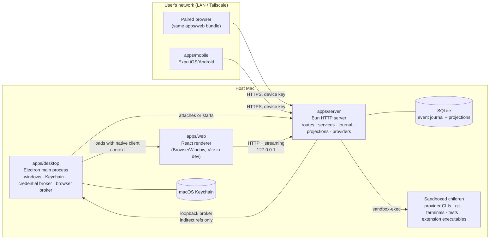
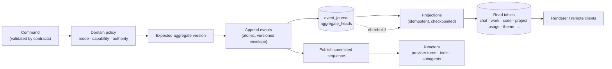

# Octant architecture

Octant is a local-first desktop workspace for Chat, Work, and Code across many AI
providers. The first shipping surface is Apple Silicon macOS; Linux and Windows
desktop are the same product under [decisions/0058-cross-platform-desktop.md](decisions/0058-cross-platform-desktop.md).
This is the current architecture specification. Read the relevant section for
system boundaries; use the [design index](design/README.md) for topic owners.
Edit the current rule with an approved change in the same PR. Historical links
provide rationale and supporting detail, not a competing source of authority.
Sections explicitly label approved designs that are not yet fully implemented;
archive status alone is neither approval nor implementation evidence.

Code task creation accepts a plain-folder checkout when the server admits it under
Code settings. The renderer preserves its proposed branch as delivery intent without
claiming a checked-out branch; detached Git checkouts remain refused. Git-dependent
actions continue to report unavailable for plain folders.

Pi usage is accumulated from completed assistant messages, not streaming usage
snapshots. Input totals include uncached, cache-read, and cache-write tokens; context
occupancy describes the latest model call. Totals reset for each turn, including
retained native processes. If a completed assistant message omits valid usage,
the turn remains unknown rather than presenting a partial total. Only provider-reported
costs are recorded, and historical turns are not rewritten.

On host restart, orphaned running Code turns become Waiting in both runtime
and conversation state. Recovery appends a status event without replacing prompts,
provider session cursors, or earlier events. Already settled turns remain settled;
repeated startup does not append duplicate recovery events. A follow-up resumes
the retained native identity under the ordinary current-authority checks.

Computer observations verify that the requested window still belongs to the
current application process before requesting its accessibility state or pixels.
A vanished window returns a window-unavailable refusal directing the caller to
list current windows; stale IDs are never silently retargeted.

## Desktop menu bar

The menu bar prioritizes Open Octant, New task, and compact Needs attention,
Running, and Unread sections. Empty activity sections disappear. Local host
contains status, browser access, applicable lifecycle controls, and redacted
diagnostics; Quit Octant retains the existing active-work confirmation.

Trusted top-level desktop windows contribute at most six task titles per activity
from their existing sidebar state. Electron validates and deduplicates these
bounded contributions, and a selection returns to the contributing window's
ordinary task navigation. Contributions clear when that window closes or its
renderer unloads; stopped hosts show no stale tasks. This is a view of open
windows, not an additional host task registry. Titles never enter the public
health response or redacted diagnostics. Separately managed hosts retain their
existing lifecycle restrictions.

## Desktop context menus

Trusted top-level desktop windows may contribute a bounded native context menu
through the preload bridge: at most 160 entries, four submenu levels, and labels
up to 256 characters. Contributions contain presentation and opaque action IDs;
they cannot supply Electron roles, callbacks, paths, URLs, or native commands.
The shell returns the selected ID to the same window, which invokes its existing
renderer action and ordinary server authority checks. Dismissed, refused, closed,
or navigated windows select no action. Each window owns at most one contributed
native popup. The desktop's own text editing menu uses Chromium's edit flags and
fixed native roles; embedded browser frames cannot contribute workspace menus.

## Repository test cancellation

An authorized repository test remains cancellable while the host rediscovers its
command definition. Cancellation during discovery prevents process launch; runtime
shutdown also cancels pending discovery and waits for it to settle. Thread and
checkout authority checks still precede both run and cancellation.

The Code composer's attached checkout strip keeps its height and border when
checkout metadata is unavailable. Missing project, branch and diff values stay
blank; unavailable checkout actions are not shown.

Work follow-up composers use the same attached context strip for their project and
working folder. Full paths require a matching project binding revision; Work has
no branch controls. Pane headers show thread titles without repeated project
labels. Workspace and dock tabs share one compact recipe for geometry, selection,
and close controls.

## Overview and principles

Octant is one Electron application that hosts a Bun HTTP server, a React
renderer, and (optionally) remote clients that connect to that same server.
Everything the user cares about — Projects, threads, memory, event history,
credential references, layouts — stays on the host machine. Artifact versions
are the exception once sync is on: they are copied into a store the user owns,
not into a store Octant operates. The journal does not leave. See
[Persistence](#persistence).

The design rests on a small set of invariants that every package obeys:

- **Local-first.** No Octant cloud account, relay, or telemetry is required.
  Artifact sync, when the person turns it on, uses a store that person owns.
  Octant operates none of it. Remote access is host-to-device over the user's
  own network. Three host-initiated
  HTTPS calls exist in code: desktop update checks against a signed feed, managed
  device-tool update checks against the npm registry, and server marketplace
  fetches when the person searches, inspects, previews, or installs from the
  catalog. All have a Settings off switch: marketplace off means no catalog
  request; Updates off disables automatic update checks (manual Check for
  updates may still contact the signed feed); device tools' automatic updates
  off means no registry request (a manual check may still contact it). An in-app
  changelog rides that update path and bundled notes rather than adding a
  separate call ([decisions/0061-in-app-changelog.md](decisions/0061-in-app-changelog.md)).
  Opening Updates reads the desktop's current local update state so the installed
  version and saved preferences appear without requesting the signed feed.
- **The server is the authority.** Every authority check (mode, Project,
  thread, provider, approval, remote principal, optional spend ceiling) runs in
  `apps/server` before a side effect. The renderer and mobile app render what
  the server says is allowed; they never decide it.
- **The event journal is authoritative; projections are rebuildable.** Commands
  append versioned events to a SQLite journal. Read models are idempotent
  projections that can be dropped and rebuilt from the journal at any time.
- **Contracts are schema-only, domain is pure.** `@octant/contracts` holds
  Effect Schema definitions and nothing else. `@octant/domain` holds pure
  policy and state transitions with no I/O.
- **Dependencies point inward.** Apps consume packages; contracts and domain
  never import apps. Provider-specific payloads stop at the provider adapter.
- **A provider question has one answer identity.** Each question in a provider
  question set reaches Chat, Work, and Code with a distinct request id. The
  adapter collects answers in the provider's original question order, rejects
  duplicate answers, and settles the underlying callback only when complete.
- **Capabilities are honest and fail closed.** Every provider reports what it
  supports in every mode; an unsupported capability is disabled or refused,
  never silently emulated. No core capability may require a specific provider.
- **Install ≠ trust ≠ enable.** Extensions contribute nothing until each of
  those steps has been taken explicitly, and even then only within the mode,
  Project, thread, and provider policy that applies.

Packaged macOS hosts use a restricted executable search path containing system
utilities and standard package-manager locations. `/usr/sbin` is included so
local-server discovery can invoke the system `lsof`; arbitrary inherited PATH
entries are excluded.

## Process topology


```mermaid
flowchart LR
  subgraph mac["Host Mac"]
    desktop["apps/desktop<br/>Electron main process<br/>windows · Keychain · credential broker · browser broker"]
    server["apps/server<br/>Bun HTTP server<br/>routes · services · journal · projections · providers"]
    renderer["apps/web<br/>React renderer<br/>(BrowserWindow, Vite in dev)"]
    tools["Sandboxed children<br/>provider CLIs · git · terminals · tests · extension executables"]
    keychain[("macOS Keychain")]
    db[("SQLite<br/>event journal + projections")]
  end
  subgraph remote["User's network (LAN / Tailscale)"]
    browser["Paired browser<br/>(same apps/web bundle)"]
    mobile["apps/mobile<br/>Expo iOS/Android"]
  end

  desktop -- "attaches or starts" --> server
  desktop -- "loads with native client context" --> renderer
  renderer -- "HTTP + streaming<br/>127.0.0.1" --> server
  server -- "loopback broker<br/>indirect refs only" --> desktop
  desktop --- keychain
  server --- db
  server -- "sandbox-exec" --> tools
  browser -- "HTTPS, device key" --> server
  mobile -- "HTTPS, device key" --> server
```

**Desktop (`apps/desktop`).** The Electron main process owns native windows,
menus, the macOS Keychain, project-root and plugin-folder pickers, and the
in-app updater. It attaches to the canonical host at
`http://127.0.0.1:13773`, or starts that independently runnable host when it is
absent, then probes storage readiness before showing a window. It passes only
native broker coordinates and the desktop bridge secret that native-only
operations require. It also runs loopback-only
brokers the server talks back to: the credential broker (Keychain access by
opaque reference), the browser runtime broker, and on macOS the Simulator
device broker, behind which one native device helper per Simulator delivers
workbench input (see
[decisions/0137-simulator-input-reaches-the-guest-through-a-native-device-helper.md](decisions/0137-simulator-input-reaches-the-guest-through-a-native-device-helper.md)).
Every app window confines top-level navigation, redirects, and opened windows to
the exact packaged renderer asset or configured Vite development origin. Native
IPC also requires that trusted renderer URL, and the packaged renderer ships a
strict Content Security Policy; external pages are opened through explicit
server- or host-authorized flows instead of replacing the app window.

**Server (`apps/server`).** A Bun HTTP server bound to the stable canonical
loopback endpoint `127.0.0.1:13773`. It registers route modules per feature (`chatRoutes`,
`workThreadRoutes`, `codeRoutes`, `projectRoutes`, `extensionRoutes`,
`remote/*`, …), resolves a **client principal** for every request — a
process-local client context on the loopback listener (internally still named
`local-window` while that contract is migrated), or a `remote-device` principal
carrying authenticated remote identity — and runs all mutations through
services that append to the journal. Providers, tools, Git, terminals,
subagents, extensions, and recovery live here. A headless host runs the same
server through `@octant/cli` (`octant server run`, `octant web`). For Code,
verified remote requests carry their principal through an async request scope:
the paired device may reach existing active Code Projects without a desktop
workspace, while services retain thread, checkout, provider, and approval checks.
This admission ends on cancellation or dispatch completion. Local windows retain
their selected-Project restriction (ADR 0148). A killed start can leave the
control secret with no receipt and no socket; the next acquire quarantines
that file and continues, and it checks the socket is still absent before the
move so a peer that bound in the meantime keeps the secret it just wrote. An
ownership failure names the code, the artifact path, and the next step.

**Renderer (`apps/web`).** One React application served to the desktop window
and to authenticated remote browsers alike. It talks to the server through
`@octant/client-runtime` and never holds authority of its own. In development
Vite serves it with hot reload; in a packaged build the server serves the
built assets. A paired browser mounts the remote shell rather than the desktop
workspace: the same Chat, Work, and Code thread workspaces, driven by the
ordinary product clients over `createRemoteProductFetch`, which carries each
request on the device session and never presents a window capability. The
desktop's window-bound sidebar, dock, and Settings are not served remotely.

**Mobile (`apps/mobile`).** An Expo iOS/Android remote-control client. Threads
are host-owned; the phone stores only device keys, a host registry, and session
material. It uses the same contracts and client runtime as the browser. The
phone creates Chat, Work, and Code threads, reads their transcripts, and sends
follow-up turns under each thread's own authority (`start-work-thread-turn`
with the thread's binding; `start-provider-turn` on the thread's checkout).
Approvals, folder binding, file edits, and shell remain host-only and the
composer says so. Native startup supplies WebCrypto for the shared pairing and
request-proof clients; keys persist in platform secure storage. Native remote
fetch sends the proof-bound session cookie explicitly and disables the shared
cookie jar to prevent duplicate or stale cookies. Browser cookie ownership is
unchanged, and native remote requests refuse redirects.

**Local client context.** Opening the canonical host URL directly creates a
process-local client context through `/api/shell/local-session`; no launcher
token, persisted clock posture, or alternate profile is required. Electron,
ordinary browsers, and Vite therefore read the same Machine-owned Projects,
threads, settings, and journal. The context id scopes window-local presentation
and guards against accidental cross-window commands, but it is not a separate
Machine or durable authentication epoch. The packaged renderer additionally
proves its native renderer identity for desktop-only integration. When the host
instance changes, Electron re-registers every live Project window, replaces the
main-process authority and renderer identity, and publishes the new capability
so the renderer rebuilds its clients before snapshot recovery. The loopback
transport still validates the actual Host header, rejects non-loopback origins,
and removes process-local registration when its owning client closes. Loopback
renderer ports share the local-user trust class; the listener never reflects a
non-loopback web origin into local authority. The renderer holds the matching
line before its first request: a launch address that is plain HTTP to a
non-loopback host is refused with an explanation and never used
(`docs/decisions/0103`). Requests that send the window capability set
`redirect: "error"` so a later hop cannot carry the header to an address the
parser never judged.

Managed runtime tool transport uses the provider SDK's existing tool-request
and tool-answer contract. The adapter's in-process server exposes only the
current app-authored catalogue; external provider tool-server configuration
stays disabled. Code browser sessions can request an inline approval without
raising thread access. The grant is bound to the exact browser context and
owner, and browser-service policy is checked again before effects. Answering
the prompt with "always allow" journals the origin into shell settings, so a
new browsing context for that origin opens without asking — in Code, in Work,
and for later sessions — until the person forgets it under Settings; rebinding
an existing context to a different model or authority still asks, because the
remembered grant covers the page, not who drives it. The remembered set grows
only through that approval answer: `replace-settings` may remove an origin but
rejects additions, so a client cannot grant itself origins the prompt never
showed. See
[decision 0093](decisions/0093-app-owned-tools-use-managed-runtime-transports.md).

Tool definitions carry the agent's usage guidance alongside their argument
schemas. Each mode offers only its admitted tools, so providers receive the
same guidance through MCP, dynamic tools, or direct tool calls without a
separate global tool installation or prompt catalogue. Browser shares one
definition across modes. Canvas's `describe` operation lists the closed block
catalogue and a creation example, or returns canonical schemas for up to three
requested block kinds. Unscoped describe also lists document recipes: an id, a
title, when to use one, and a skeleton of block kinds that already exist. The
host offers an implementation plan, an audit or test report, a code review, a
research brief, and a postmortem. A trusted, enabled, unscoped skill may add
recipes through its Canvas contribution; a skill that is not enabled contributes
none, and a contributed recipe cannot replace an in-tree id. A recipe is a
starting shape, not a document and not authority. Describe reads no Project
data and creates no artifact.
`create` and `revise` take an optional thread `presentation`: `inline` or
`sidebar` (the default). The value is part of the definition and needs Canvas
schema version 4. An older runtime refuses a version-4 document as a future
version and does not report it corrupt.
The pure `canvasInlineRefusal` policy admits `inline` only for at most 12 blocks
with no `diagram`, `plan` or `mockup`. When an author asks for `inline` over
that bound, the host records `sidebar` and returns the reason as
`presentationNote`.
A revise without a choice keeps the current presentation.
A thread reference card reports the effective presentation and the first
version's time (`canvasCreatedAt`). A Canvas that has outgrown the bound, by a
revision or a person's edit, is listed as `sidebar`.
The renderer places every Canvas after the last row of the turn the person
opened at or before `canvasCreatedAt`. An inline one is drawn there read-only:
it gets no layout, plan, comment or action runtime, so nothing drawn inline can
journal a version. Any other is a row that opens it. A card from an older host,
or one no loaded turn can place, stays in the thread's card list.
A chart is a closed type: line, area, bar, scatter, distribution, pie, donut,
stacked bar, grouped bar, or bar-and-line. Pie and donut are one series of
labeled non-negative slices. Stacked, grouped, and bar-and-line charts share
categories across series; a bar-and-line series names itself as a bar or a line.
The accessible table lists every reading. A pie or donut legend toggles at most
24 slices; the rest stay in the picture and the table. A shared snapshot keeps
the chart and drops no series mark.
The catalogue includes a `plan` block: phases, and one list of tasks that each
name their phase, carry a status (todo, doing, blocked, done), and may carry an
owner, estimate, acceptance notes, dates, dependencies on other tasks in the
block, and manifest source ids. The domain policy refuses a task in a missing
phase, a dangling or circular dependency, or a missing source. Tasks are not
nested in phases because nesting puts a task's dependencies past the Canvas
depth budget. The renderer offers checklist, status-board, and timeline views;
switching is a reading choice and revises nothing. A shared snapshot keeps the
plan but drops its source ids. A person sets a task's status from its mark;
`/api/canvas/plan-revise` journals that as a new `canvas.version-appended@1`
version, admitted by the pure `admitCanvasPlanTaskRevision` policy (the block
must be a plan, the task must exist, the sequence must be the head). As with a
drag, the host stamps its own `local-user` actor and the renderer shows the
change at once, putting it back with the host's reason when refused. Agent
revisions and person changes share one history, so the agent reads the change
when it next reads the Canvas. In a Work or Code Canvas, an open task offers
Start, which opens a new-thread draft in the Canvas's own Project with the task
(and its acceptance notes) written in. It creates nothing and grants nothing: the
person sends the draft like any new thread, and the thread gets that mode's
ordinary authority. A Chat Canvas offers no Start, because a Chat Project has no
folder to bind.
Descriptions explain the existing presentation flows and distinguish creation,
queued jobs, and work proposals from opened previews or completed work.
Work also includes a short, budgeted artifact instruction in its required
context, so runtimes that use their own file tools know how written documents
appear in Files and Document. That instruction offers no tools or authority.

A Canvas diagram block is also a board. The renderer zooms, pans, and fits the
same deterministic layout every surface draws, and a user's drag or keyboard
nudge is journaled through `/api/canvas/layout-revise` as a new immutable
`canvas.version-appended@1` version with `actor: local-user` that the host
stamps itself, whatever actor the request names, admitted by the
pure `admitCanvasDiagramLayoutRevision` policy (target must be a diagram,
every moved node must exist, the sequence must be the head, budgets stand).
Beside that generic node-and-edge diagram, a `sequence` block is participants,
ordered messages, activations, and notes, and a `state` block is states that
may nest by parent id, labeled transitions, and initial and final roles. Both
use the diagram node and edge budgets. Layout is deterministic. Participants
and states are node comment anchors; messages and transitions are edge comment
anchors. Static export draws both through the same artifact SVG path as the
other blocks.
Agent revisions and user layout share one history; a stale drag is refused and
the renderer reloads rather than overwriting a newer version. Only the head
version is editable. The route is host-window only; a paired browser reads
boards but does not move nodes. Comments are journaled facts of one
`canvas-comments` aggregate per Canvas (`canvas.comment-added@1`, `-replied`,
`-resolved`, `-deleted`), whose version is the board's comment sequence, so
concurrent comments conflict on the journal instead of both winning; the
service rebuilds them with the pure `applyCanvasCommentEvent` reducer, refuses
unauthorized reads with no bodies, and stamps each comment's origin (`host` or
the authenticated `remote-device`) beside its `local-user` author. The host
stamps that author (and a resolve's or delete's actor) itself and ignores the
actor the request names, so a renderer can never author a comment as an agent. Shared
snapshots serialise the definition and so never carry comments
([decisions/0052-canvas-boards.md](decisions/0052-canvas-boards.md)).

The local-server provider adapter owns a separate process for each acquired
connection and allows one live session per connection. Its MCP protocol does
not reliably carry native session identity, so the private endpoint binds calls
to that connection's immutable session and exact offered catalogue. Complete
permission rules are updated before each prompt; the deprecated tool toggle
payload is omitted because it replaces those rules. App tools require a process
receipt attesting that external MCP, plugins, and skills cannot enter the
runtime. Ordinary inherited configuration does not supply that attestation and
continues to report app tools as unsupported. Process exit, stream failure,
interruption, and scope cleanup retire pending tool requests.

### Device transport and evidence

The iOS Simulator dock tab
is a device pane: the Simulator's screen streamed through the
host as it changes, authorized like a screenshot and never stored (see
[decisions/0139-the-simulator-frame-is-a-live-view-streamed-through-the-host.md](decisions/0139-the-simulator-frame-is-a-live-view-streamed-through-the-host.md)),
or the latest host-held screenshot evidence when there is no live view — with
honest setup, unavailable, booting, live, interrupted, and stale-after-restart
states; closing the tab does not shut down the destination. An agent's
`octant_apple` `boot`, `run`, or `open` raises that pane once per request
instead of launching Simulator.app (see
[decisions/0151-the-agent-opens-the-in-app-simulator-pane.md](decisions/0151-the-agent-opens-the-in-app-simulator-pane.md)).
Apple artifact and restart-receipt reads validate regular-file identity and size
on an open handle before allocation. Reads reject linked files and size changes,
with a 16 MiB artifact limit and 1 MiB receipt limit; existing records are not
rewritten.
A screenshot's raw capture lands in a host-private directory under the data root
(`<data>/apple-runtime/captures`, created `0700`) that the confinement profile
denies outright to every launch except the one taking the capture — the deny is
emitted after the broad launch-root grants, so a checkout bound to an ancestor
of the directory cannot read another thread's screen either, and only the
capture launch re-allows it through its own write root
([decisions/0160-an-apple-screen-capture-lands-in-a-directory-only-its-launch-can-write.md](decisions/0160-an-apple-screen-capture-lands-in-a-directory-only-its-launch-can-write.md)).
An Android emulator is a separate dock destination and `octant_android` tool,
not an iOS helper feature
([decisions/0153-android-emulator-is-a-separate-device-destination.md](decisions/0153-android-emulator-is-a-separate-device-destination.md)).
Tap, typed text,
and hardware-key input ride the same Apple workbench control channel as boot
and screenshot, with XCTest-less host injection behind that channel only,
computer-use-style actor attribution, and the same remote/headless fail-closed
attach gate (see
[decisions/0062-simulator-frame-input-transport.md](decisions/0062-simulator-frame-input-transport.md)).
On an approval-gated thread, **Allow input** is the confirmation that opens
that destination; clicks, typing, Home, and Lock never raise it
([decisions/0152-allow-input-opens-a-device-to-clicks.md](decisions/0152-allow-input-opens-a-device-to-clicks.md)).
Under the desktop app that injection is the native device helper of 0137: a
tap is a point on the captured screen, typed text is letters, digits, spaces
and new lines, and every refusal names the helper's own reason. Without that
helper every input kind is unavailable; Octant does not script Simulator.app
to inject a tap, swipe, typed text, or key
([decisions/0151-the-agent-opens-the-in-app-simulator-pane.md](decisions/0151-the-agent-opens-the-in-app-simulator-pane.md)). A swipe is a
fourth input kind on the same channel, for the pane and for `octant_apple`
alike, and the live screen is driven directly: a press and release is a tap, a
drag is one swipe sent when it ends, keys typed on the focused screen go to
the device as one text per pause, Home and Lock are buttons, and what a person
does while an action runs is kept and sent in order (see
[decisions/0140-the-live-simulator-screen-is-driven-directly.md](decisions/0140-the-live-simulator-screen-is-driven-directly.md)).

## Modes: Chat, Work, and Code

Modes are server-enforced domain policy, not renderer flags. Chat and Work can
be disabled in settings; Code is always available; disabling a mode never
deletes its data.

The shell shows two modes, **Work** and **Code**. Work presents the Chat and
Work domains together: one sidebar lists both kinds of thread and Project, and
a new-thread composer chooses **Chat** (creates a Chat thread, no folder) or
**In a folder** (creates a Work thread bound to a Project root). The choice is
only which create command the composer sends; the active server mode still
follows the thread or draft on screen, each row opens in its own mode and
reaches its own kind's commands, and nothing in the renderer can turn a Chat
into Work or a Work thread into Chat. Settings' Chat and Work switches still
gate their domains: with one off, the composer offers only the other kind.

| Mode     | Binds to                                                                                                                            | Authority                                                                                                                                                                                                                                                                                                                                                                                          |
| -------- | ----------------------------------------------------------------------------------------------------------------------------------- | -------------------------------------------------------------------------------------------------------------------------------------------------------------------------------------------------------------------------------------------------------------------------------------------------------------------------------------------------------------------------------------------------- |
| **Chat** | A virtual, memory-scoped Project, or no Project at all                                                                              | No filesystem or shell authority. Optional safe research tools; scratch space is isolated per thread.                                                                                                                                                                                                                                                                                              |
| **Work** | Exactly one OS-confined project root                                                                                                | Confined reads and bounded writes inside that root, approval-gated unless the thread's access is auto-accept-edits; no shell and no Git; document adapters (docx, pptx, pdf, image); research with citations; server-authoritative board.                                                                                                                                                          |
| **Code** | Exactly one directory, ideally a repository root; Code threads select a checkout (current checkout or a managed worktree) inside it | Starts approval-gated; Full access only when explicitly remembered for that Project. Plan mode is always read-only. Git, terminals, tests, PR observation, and managed subagents run inside the bound root. Creating a Code Project may explicitly initialize Git in that folder (`docs/decisions/0079`) so a Code thread can prepare a checkout immediately; binding without Git remains allowed. |

Work's missing shell and Git are withheld, not approval-gated: a person is
never asked to approve a command in Work, because approving one would give the
thread authority its mode does not hold. Every Work turn records that posture
(`shell: "denied"`, `git: "denied"`). Each provider driver enforces it for a
session acquired in Work mode, since a provider's own shell tool is outside
anything the host can gate after the fact. Claude and Pi start without their
shell tool. OpenCode's session rules deny `bash` and its `task` delegation.
Codex threads start and resume with `features.shell_tool` and
`features.unified_exec` off, because a Codex command that only reads runs under
its read-only sandbox without escalating; a `command` or sandbox-widening `permissions` request that still
arrives is declined at the agent. An ACP agent's `execute` permission request
is refused at the agent. The declared kind is all Octant sees of an ACP call,
and `other` also covers Octant's own managed MCP tools, so an agent that labels
a command `other` still reaches a person's approval rather than running unasked.
Because a provider's in-process shell can emit no protocol request at all —
observed on Linux where a Vibe Work turn ran real commands inside its jail —
the ACP, OpenCode, and Pi runtimes also launch confined in Work with process
exec and fork denied, so the OS itself refuses a shell the protocol never
sees. An ACP profile whose entrypoint spawns its own stdio server keeps fork,
which reaches no shell without a second exec target. Work never runs at Full
access, so these launches are always wrapped. The Codex app-server and the
Claude postures Work uses are not wrapped (see
[security and authority](#security-and-authority)); they withhold the shell
through the thread config and tool list above instead. Octant's own harness
gives Work no shell port. File writes inside the Project
remain approval-gated in every driver. Work that needs a shell or Git is
promoted to Code (below).

Chat's missing filesystem and shell authority is withheld the same way, and
more completely: a Chat session is acquired on its per-thread scratch
directory, and nothing a provider asks for in Chat is anyone's to approve, so
every approval request is declined at the agent. A provider sandbox that only
blocks writes is not enough, because reads never escalate. Pi starts with no
built-in tools. OpenCode and ACP agents launch confined with process exec and
fork denied and the scratch directory read-only. Claude's gate keeps its reads
inside the scratch directory, and its shell and edits ask and are declined.
Codex threads get no execution environment (`environments: []` on the thread
and on every turn), which removes its shell, `apply_patch`, and `view_image`;
they also start and resume with the shell, image, plugin, and app features
off, so a CLI that ignores `environments` still has no shell, and the user's
own Codex plugins do not load. MCP servers from the user's Codex config run
outside any environment (a `node_repl` server read another repository with
none), and no setting turns them all off, so the driver reads the effective
config and switches each named server off for the thread; a Chat thread whose
servers cannot be listed does not start. Octant-managed tools (research,
Canvas) are unaffected; they run on the host, not in the provider's
environment.

Provider-owned memory stays off in every mode. Octant's memory is scoped to a
Project, and a provider's global memory reaches across all of them: Codex runs
with `features.memories` off, which also keeps its memory folder out of its
sandbox's readable roots, and Claude runs with no setting sources.

Withholding the shell does not cut Work off from a person's integrations.
Work is for files, browsers, and documents, and what separates it from Code
is Git and the developer environment, not the tools a person plugs in. An MCP
server the person installed and enabled as an Octant plugin is selectable in
Work and Code exactly as in Chat (see
[Extensions and skills](#extensions-and-skills)). It runs in Octant's own
supervised session rather than inside the provider, so the Work-mode launch
confinement does not stop it, and every call it answers waits for a person.

A Work or Code thread started without a chosen Project lands in the mode's
**default Project**: the host provisions `<default folder>/Work` or
`<default folder>/Code` on first use, binds it as an ordinary Project marked
`origin: "default-folder"`, and reuses it after. The default folder is the
`defaultFolder` shell setting (`~/Documents/Octant` unless changed, always
inside the user's home), and artifact files mirror under its `Artifacts`
subfolder until a mirror setting says otherwise. With the Code setting
`requireGitRepository` off, a Code thread may start in a folder that is not a
repository on a `plain-folder` checkout whose head is `none`; every Git-backed
feature reports itself unavailable there rather than inventing a revision. Code
threads without a Project need the further `allowDefaultFolderThreads` switch,
which the host accepts only while Git is not required. See
[decisions/0118-a-default-folder-for-what-nobody-gave-a-home.md](decisions/0118-a-default-folder-for-what-nobody-gave-a-home.md).

Every Project, in any mode, may carry one optional **colour**: a theme palette
role (red, orange, yellow, green, teal, blue, purple, or pink) the person picks
as the Project's identity. It lives on the Project record and is journaled as
`project.color-changed@1`, so every client sees the same colour. Absent means no
colour was picked and reads as a neutral mark; older Projects and events replay
without it. `change-project-color` carries the role, or `null` to clear it, and
follows the same rules as a rename: an archived Project refuses it, and a change
that would leave the colour as it is journals nothing. The colour grants no
authority and carries no status.

A Work Project folder carries `AGENTS.md` (the person's standing brief, seeded
once and never rewritten) and `STATUS.md` (where the work stands, with dated
follow-ups and deadlines). Both are read into every Work turn ahead of the
thread's transcript, with a standing instruction to keep `STATUS.md` current;
a completed turn that changed files without touching it gets a `Recent
changes` line appended from the 0083 record. A stale status or a near or passed
date makes the next task open by taking stock and asking for an update. The
Work Project page, the Work board's follow-up mark, and the inbox's
`follow-up-due` attention signal all read the same file on demand; nothing
about it is journaled. See
[decisions/0119-a-work-project-keeps-its-status-in-its-folder.md](decisions/0119-a-work-project-keeps-its-status-in-its-folder.md).

Work never silently becomes Code. When coding work is detected in a Work
thread, the server records a **promotion proposal**; only explicit user approval
creates a linked Code thread, and the new thread inherits no authority from the
Work thread.

Rebinding a Code Project supersedes the checkout its existing threads were
created against, and no later observation can produce those threads' checkout
ids again, so the server reports them as unavailable rather than waiting on a
reconnection nobody is attempting. Per `docs/decisions/0032`, that refusal names
a way out: the thread's fail-closed surface offers an explicit rebind that moves
it onto the checkout the Project binds now. The server authorizes and journals
the move, and it never happens on its own — a matching filesystem root is not
consent to change what authority a thread holds. A session grant of Full access
does not survive the move; the thread lands on its persisted posture. A thread
that owns a managed worktree is refused, because that checkout is the thread's
own tree rather than the Project's.

A Code fork (`fork-code-thread`) is a managed-worktree creation the host
resolves itself: the client names the source thread and a finished turn, and
the host picks the files from its own record — the checkpoint the next writing
turn captured before it ran (a Plan turn in between writes nothing and is
skipped), or a fresh capture of the source checkout when the named turn is the
newest. It refuses a turn that has not finished and a point a writing turn
passed without a capture rather than guess. The worktree starts at that
checkpoint's commit on a new delivery branch, and the captured trees are laid
over it, so uncommitted work arrives too; a failure to lay them down removes
the worktree and creates nothing. The fork starts approval-gated with
current-session persistence and inherits no profile, pending outcome proposal,
running turn, or session grant. Every Code thread creation checks a
`forkedFrom` origin on the server: it must name another thread of the same
Project.

A child AgentRun starts only when the thread's agent delegates through the
Octant Harness `delegate` tool or a provider harness's `octant_agents` tool.
Both entry points use the same host admission, routing, workspace, and lifecycle
services. Either parent harness can target either child harness; provider-owned
hidden subagents remain disabled. The host's AgentRun routes read and control
existing runs but create none. Admission (`admitAgentRunControlRequest`) prepares the child's workspace
on the server: Chat a research-only virtual workspace, Work the current
confined Project root and binding revision, and Code an isolated managed
worktree that is confirmed before admission. No client supplies a path, a
receipt, or a claimed `verified` flag. Admission, restart, and replay refuse
stale, expired, foreign-thread, foreign-Project, parent-checkout, unavailable,
or wider-than-parent grants. Whether the agent may delegate is one host
setting, on by default; a stored Ask from the retired "only when I start them"
choice reads as off.

Each Code child allocation is keyed by its parent and delegation request. Two
sibling requests receive distinct managed worktrees; only the same request can
reuse its verified receipt. The host checks the actual Git worktree inventory
and records the starting commit. Children start from committed source; the
parent checkout's uncommitted edits are not copied into a child worktree.

Provider-owned child reports are read-only observations through the existing
`child-agent-activity` SDK event. Chat attempts, Work turn updates, Code operation
frames, and managed-child conversations retain the normalized facts in their
existing journals or purgeable content. Identity includes the mode, root thread,
optional managed parent, provider instance, session, and provider child ID.
An observation never receives an AgentRun ID, workspace grant, or managed control.
Missing child model or task metadata stays unknown; the lead model is not a
substitute. Status is the provider's last report, not proof of a live process.
Replay is idempotent; conflicting reported identities become unknown, and missing
or circular child lineage is excluded. Each source retains at most 16 observed
children and eight history entries per child, with explicit partial/truncated
history. Parent reads include at most 64 observations. No current in-tree adapter
advertises native-child observation support: their existing child-disable and
provenance gates remain in force. SDK fixture coverage does not establish
real-provider native-child acceptance.

Child result packets retain at most 16 generations, including the current
generation's availability, immutable execution target and workspace receipt.
The reported summary is a bounded 4,096-character view of the generation's
existing result content. Lifecycle blockers come from recorded settlement facts.
Normalized file-change reports and host-executed tool returns are stored beside
the generation's reply, atomically with settlement, in the same subject-owned
content store. Each section retains at most 32 records and 60,000 serialized
characters; tool output is bounded to 2,048 characters. File paths outside the admitted workspace are omitted and
make the section truncated. Provider file reports are explicitly unverified;
host tool returns remain an unknown check outcome even when their output says
a test passed. No result implies parent delivery, review, merge, or deployment.
Writable managed Code children capture their isolated workspace before execution
and after confirmed provider teardown through the host's Git checkpoint port.
The same path covers Octant Harness and provider harnesses. The private session
record preserves the original tree and workspace identity across waits and retries
within one generation; a new follow-up generation starts its own comparison.
Git captures include tracked and non-ignored untracked files without changing the
real index, HEAD, or branch. Captures describe observed workspace changes, not proof
that the child alone authored them.

A settled comparison retains at most 128 paths and 65,536 diff characters, with a
120,000-character serialized ceiling, in subject-owned content beside the result.
Comparison captures create no Git refs, so a crash cannot leave pinned source
content behind. The retained diff remains readable after later edits or Git object
collection; collection before comparison can make the capture unavailable. A resumed generation
whose original tree was collected cannot substitute its current midpoint and
reports review unavailable. Waiting generations can advance their snapshot at the
next settlement; completed generations keep their original comparison. Failed
captures invalidate an earlier partial comparison for that same generation.
Review reads accept only the managed run and generation, check current parent and
child read authority, and never resolve a client-supplied filesystem path. Summary
polling carries metadata only. The existing Review surface opens the saved diff
without checkout mutation or parent-file navigation. Chat, Work, Plan, legacy
sessions without a baseline, and unavailable captures report review unavailable;
a parent checkout is never substituted.
Parent and child scope checks precede reads, streams recheck scope before each
frame, and a parent purge removes all generations' text and evidence. Nested
observations retain the authorized root thread and identify their managed parent
separately. Result reads do not consume or acknowledge delivery.

A managed child's lifecycle moves from Starting to Running once its workspace
is verified and its provider session starts, not at completion. One turn,
from provider acquisition to its terminal event, may run for at most 30
minutes (`MANAGED_AGENT_RUN_TURN_DEADLINE_MS`); a turn that reaches that bound
is recorded as Interrupted and releases its capacity. The bound covers time a
child spends waiting for an approval or answer.

Managed children retain a private provider-session cursor and a bounded,
purgeable conversation alongside their journaled lifecycle. A cursor is bound
to the run, provider, model, workspace, context, and authority. Resume uses that
same native session only when the provider supports it and the binding still
matches; it never silently starts a fresh session. Missing or invalid continuity
requires Retry. Restarted conversation views are marked stale until execution
reconnects, and a purged subject cannot restore its session or conversation.

Children on either harness use the host's approval and question stores. Each
prompt identifies its child, provider, and model and is checked against the
live parent and child authority before and after the answer. A child approval
permits only that request, never consumes or creates a remembered lead-session
grant, and cannot approve an opaque provider action in Plan mode. Cancelled or
expired requests and requests whose transport was lost at restart cannot be
answered. The composer signals pending child input and opens its detail view.

Live child steering is optional on a provider connection. Codex uses its
current-turn steering command; Octant's harness inserts a note after a complete
tool-results step or response and persists it before acknowledging delivery.
Only notes retained in the fitted provider request are recorded and acknowledged;
notes omitted to fit the context limit are refused.
Unsupported steering is reported as such; a saved note alone is not evidence
that the running child received it.

Delegation resolves explicit provider/model selections against the parent's
current eligible catalog, including Project policy and supported reasoning
values. With no explicit target, both harnesses use the same role-to-slot
mapping and host/Project Model slots. An unconfigured route can inherit the
authorized parent target; a configured but unavailable or disallowed route does
not bypass its settings. The selected target and routing decisions remain
visible. Off, paused, tainted, and unauthorized parents cannot start helpers.

Parent conversation context is opt-in and fixed at admission. Chat uses its
admitted conversation; Work and Code expose bounded accepted prompts and
completed replies with source attribution, provider/model identity, taint, and
omission metadata. Work/Code selections contain at most 24 blocks of 4,000
characters, including metadata. Reasoning and tool bodies are excluded. A
foreign, changing, or incompletely read selection fails closed. A Code or Work
parent's own running turn is readable: its accepted prompts are selected and its
unfinished reply is disclosed as omitted. The selection is read before a child
workspace is allocated, so a refusal names the reason (for example, no readable
messages yet or a conversation that changed during the read) and leaves no
worktree behind.

Finished siblings currently owing a result to the same parent can be delivered
in one ordinary parent turn, capped at 16 members and 32,768 prompt characters.
Delivery does not wait for every sibling to finish. Each member's identity and
result generation are validated and journaled on the receiving turn; replay
settles only those members. Actual fallback provider/model attribution is kept.
The delivery service serializes work per parent and defers while it is busy.
A Chat delivery names the parent at its thread aggregate's head version, the
version Chat admission checks, and a refusal that only says the parent is
mid-turn or moved on is deferred and retried, never journaled as a failed
delivery. A child that ends without a reply (failed, interrupted, or cancelled)
reports why on the managed `wait` and `status` answers and in the delivered
outcome line: its journaled reason, redacted with the diagnostics rules and cut
to 512 characters.

A completed managed child accepts an explicit follow-up through either
delegation tool or the Agents views. The caller supplies its current version
and a bounded message; native resume support, saved identity, current authority,
workspace, capacity, and spend are rechecked. Both tools and the UI revalidate
the saved provider, model, and reasoning against the parent's current eligible
catalog, including after asynchronous workspace preflight. Code workspace ownership and the
saved physical identity are verified asynchronously before a new generation
starts; current version and exact-window authority are checked again after
that wait. Execution preparation reserves spend and provider capacity before the
lifecycle commit, and releases both when the commit or host admission refuses.
A synchronous admission refusal leaves the completed generation, prior result,
and follow-up draft unchanged. An accepted execution binds its window before
provider acquisition. One accepted completed-child follow-up is staged in its
private session record before the lifecycle commit, bound to that session and
the next generation; an uncommitted future generation cannot replay it. Recovery
resumes an unsent message verbatim. A provider failure before sending that message
interrupts the generation so Resume can recover the accepted input in the saved
session. The record is marked uncertain before send
and cleared on confirmed completion; an uncertain delivery refuses automatic
resending and asks the caller to inspect the retained conversation. This is one
continuation input, not an editable work queue.
The child keeps its identity and conversation, while a new result generation gets its own delivery and
acknowledgement. Legacy delivery marks cover generation 1 only. A cancelled
child cannot continue, and unsupported continuation never becomes a silent
fresh start. The prior result must first reach its parent or be explicitly
collected; a refused follow-up keeps that result available. Status reads do not
consume replies. Only complete replies that fit the tool response bound are
consumed by explicit collection or single-child wait.

Managed Claude children persist the identity written by the adapter in private,
purgeable child content, bound to the admitted child and saved session. This
contains no credentials and is removed with parent content or provider removal.
The existing adapter still verifies the exact identity and native history;
a saved cursor alone cannot reconstruct missing proof.

Children can form a dependency graph. A run admitted with `dependsOn` (up to
eight existing sibling runs of the same parent thread) parks as Waiting under
`waiting-on-dependencies`: it holds no capacity slot, the capacity queue never
starts it, and a restart leaves it parked. `AgentRunDependencyScheduler` asks
the orchestration service to settle it on every committed status change, when
the parent thread's harness session is resumed, and once at boot, through the
pure `decideAgentRunDependencies`. When every dependency completed, the run
starts (or joins the capacity queue if no slot is free) and receives each
dependency's reply as a context block; a reply that is gone fails the start
closed. A ready run is held instead while its parent's harness session is
paused or `recovery-required` (the same rule that refuses a new `delegate`),
and a restart never starts one on its own: every run already parked when the
host boots stays parked, even once its dependencies complete, until a person
resumes it or resumes the parent's session; a person's resume of the run
itself is refused while the parent's session is held. The hold lives in the
orchestration service and is rebuilt the same way at every boot. A dependency that failed or was cancelled fails
the dependent without running it (`dependency-failed: <id>`); an interrupted
dependency does not, because a retry can still complete it. A run cannot be
admitted on a sibling that already failed or was cancelled, and since only
existing runs can be named, a cycle cannot be expressed.

How many children run at once is the person's setting
(`AgentRunPolicySettings.concurrency`: per thread and on the host, defaults 4
and 8, each at most `MAX_AGENT_RUN_CONCURRENCY` = 16). Run slots enforce it at
start: `createInMemoryCapacityPort` counts reservations per thread and per
host, reads the limits on every reservation, and reports which limit is full;
the capacity queue skips a waiter whose own thread is full so another thread's
waiter can take a freed slot. A run waiting on dependencies or a slot holds no
slot. Admission separately caps unfinished children (any active status,
waiting included) at 16 per parent and 32 per host as the runaway guard.

Threads form one real hierarchy (Project → thread → linked or child thread).
Work and Code have server-derived thread boards (Ready / In progress / Waiting /
Done); Chat has no board. Code lists active open and draft pull requests from
connected Projects in a manually refreshed workspace and joins exact
thread-owned PR status onto Code board cards. A Work or Code thread is Done
only when its user-confirmed delivery target is objectively satisfied;
ambiguous state resolves to Waiting.

A `#thread` mention points at another thread the sender can already Open. The
host resolves a bounded, read-only title, status, and transcript window at send
time. In Chat, an explicit mention also grants the source provider the bounded
`octant_thread_message` tool for that turn: it may send one of the user's
instructions to the mentioned Chat thread and receive its completed reply. The
target's own Chat turn, provider, Project, and authority remain authoritative;
an active target returns Waiting rather than being interrupted or duplicated.
Coordination is one hop and unavailable, unauthorized, or deleted targets fail
closed. Work and Code mentions remain read-only. In Work and Code, an `@file`
mention completes a path inside the thread's bound root; the host refuses a path
outside that root before reading it. Chat Projects have no filesystem authority,
so `@file` is absent there. Unknown `@` text stays ordinary text; `@plugin` /
`$skill` addressing is unchanged. Side Chat is a Chat-mode sidecar about
exactly one source thread: ordinary Chat with no inherited Work or Code
authority and no path that messages, approves, steers, or appends to the
source. Each turn the host re-resolves the source on the sender's window and
frames it as the conversation's subject: the newest 40 messages within 32,000
characters, with truncation stated, plus a current-state section capped at
8,000 characters. For Code that section names the branch, clean or dirty with
line totals, up to 50 uncommitted paths from Git (status joined with numstat
against HEAD, untracked files included), up to 50 paths the thread's turns
changed, and the delivery target; for Work, the Project folder and working folder; for every mode, the
newest five subagent results. Each state part that cannot be read says so on
its own; an unreadable transcript refuses the turn. The source block is a
required context entry, so the planner blocks with its usual remedies rather
than silently dropping the thread the Side Chat is about. On a provider that
keeps its own conversation, a byte-identical snapshot whose previous delivery
completed is replaced by a one-line "unchanged" notice, and the full snapshot
is resent at least every fifth turn. A Side Chat about a Work or Code thread
also gets read-only list, search (Code only), and read tools over the
source's files as app-managed tools; see
[security and authority](#security-and-authority).

A Chat attempt that fails or is interrupted carries a bounded failure code,
and the client-safe process diagnostic when the provider supplied one. The
transcript states Octant's sentence for that code. The provider's own message
stays off the attempt. A refusal Octant itself authored before the provider
answered (for example an unsupported capability or an unready provider) also
journals that host sentence, so replay after a restart shows the same refusal
the live turn did; provider-originated text is never persisted there. App-managed tool and research calls use the turn's own
deadline; a call that never returns ends the attempt instead of leaving it
running, and a cancellation is not recorded as that call having failed.

A turn stopped by the provider's own usage-limit signal additionally carries a
provider-neutral `usageLimit` fact in every mode: `temporary` (a live rate
window or overload), `exhausted` (the provider says the allowance is spent), or
`billing` (the provider reports an account/credit problem), plus the
provider-declared `resetsAt` instant when one exists. Only an explicit protocol
signal — Codex's `turn.error.codexErrorInfo`, Claude's assistant `error` and
result `terminalReason`, a rejected rate-limit message — produces the fact;
message-text matching never does, and account usage telemetry alone does not
prove this turn stopped. Providers without such a signal keep their ordinary
honest failure. An unknown reset stays unknown: the notice states the provider
did not say when the limit clears rather than fabricating a countdown, and a
billing stop gets no reset line at all. The fact is bound to the single
affected turn: each later attempt transition, successful recovery, provider or
account switch, and replacement error clears it. In Chat the fact rides the
parked `waiting` attempt (which records no failure); in Work it rides the
turn's `rate-limited` failure category; in Code it rides the journaled turn
failure and parks the turn as `waiting`. Drafts, queued input, and completed
tool results are untouched.

A stop that disclosed `resetsAt` additionally offers an explicit per-thread
opt-in: Resume when the limit resets. A billing stop never offers it, and a
stop that preserved no resumable provider state — the parked Chat attempt's or
Work turn's `resumeCursor`, or the Code turn's journaled evidence — cannot
take it. Accepting journals `usage-resume.scheduled@1` on the thread's own
aggregate with a record naming the exact turn or attempt, provider instance,
limit fact, and reset instant; the same commit emits the mode's
`thread-updated` so every connected client sees the scheduled state and its
cancel affordance. At the reset instant a host-owned scheduler re-reads the
journaled record, rechecks the thread's mode, lifecycle, provider account, and
that the bound stop still waits on the limit, then continues through the
ordinary serialized turn-admission path — the same command shape a manual
retry takes — so capacity gates, admission ordering, and the single-continuation
bound all hold unchanged. The dispatch settles by appending
`usage-resume.settled@1` plus the mode's `thread-updated` in one commit; the
outcome it records (`dispatched`, `invalidated`, or `failed` with the refusal
detail) stays on the thread until a newer thread event replaces it.
The old stop's notice describes a dispatched recovery as started, rather than
implying that the resumed turn is still running after it settles.
Cancellation, a manual retry, archival, a provider change, or any superseding
turn transition settles a stale recovery as `invalidated` rather than letting
it fire against newer state; a dispatch the admission path refuses settles as
`failed`. A dispatch that cannot yet reach its admission path — the mode has
no window registered on this host to carry the continuation — is deferred
rather than settled: the opt-in stays armed and re-evaluates on a bounded
retry cadence until it dispatches, invalidates, or is cancelled. The scheduler
is deliberately narrow under the release boundary: an
in-process host timer over journaled opt-ins, not a scheduling product — no
cloud wake, no background claim beyond the host's own running process, and no
billing automation. A host that was down or unreachable at the reset instant
rescans `status = scheduled` rows on return and dispatches the still-valid
ones; a record that cannot be re-validated settles `invalidated` and never
re-arms.

A child AgentRun stopped by the same provider usage-limit signal parks as
`waiting` with the normalized `usageLimit` fact on the run — never `failed`,
which would report a bounded wait as a dead run and offer Retry where the
honest action is waiting out the reset. The fact rides the run's own
aggregate on `agent.run-status-changed@1`, so the run's row, the parent's
delegated-task read, and the managed `status`/`wait` tools all report the
limit and any armed recovery rather than a pending result or a perpetual
Working child. A run still parked on a journaled limit survives a host
restart as `waiting`, the same as a run waiting on its immutable pool
decision. The same explicit opt-in exists on the run: a person arms or
withdraws it through the same `usage-resume.*@1` journaled contract — the
record binds the run's id, its execution provider, and the disclosed reset —
and the provider or parent agent cannot arm it silently. Dispatch goes
through the ordinary `start` path with the parent thread's live grant
re-derived at dispatch time (a Code parent contributes its execution policy
only while still active), so capacity gating, authority clamps, workspace
checks, and approval freshness apply unchanged; a run whose parent grant is
gone settles `failed` instead of being orphaned awake. The run leaving its
waiting state for anything but the resume's own dispatch — cancellation,
subtree withdrawal, a different disclosed reset — settles the opt-in
`invalidated`; a wait re-entered on the same declared reset leaves it armed.
The settle journals `usage-resume.settled@1` on the run's aggregate and folds
the outcome back into the run, so the opt-in's version stays the aggregate
head and a stale `expectedVersion` cannot overwrite it.

Broader structured messaging between AgentRuns and threads, beyond mention
excerpts and beyond that Chat one-hop tool, is designed in
[decisions/0063-agent-to-agent-messaging.md](decisions/0063-agent-to-agent-messaging.md)
and
[security/agent-to-agent-messaging-threat-model.md](security/agent-to-agent-messaging-threat-model.md).
Broader messaging still requires explicit maintainer approval of its design and
threat-model sign-off; the journaled contracts, pure clamps, delivery service,
Code turn tool registration, and the Agents center's messaging bounds view now
exist so that review happens against real code, delivered behind the
maintainer's explicit direction. The built shape follows the record: the host
admits, clamps, journals, and delivers; bodies stay out of the journal, are
stored under opaque references, and taint the recipient as untrusted external
content; messaging grants no authority, starts no turn, and purged threads
leave no resurrectable bodies. 0049 remains the Chat mention path.

## Agent task display

Providers that report their own task plans (Claude, Codex, ACP, OpenCode) emit
`task-progress` runtime events, and the host journals them. Each thread surface
shows the agent's restated plan as a live "N of M tasks completed" panel while
any task is open or the turn is still writing: Code from its journaled
operation events, Chat from `ChatAttempt.tasks` carried on
`chat.attempt-updated@1`, and Work from `WorkTurnState.tasks` journaled on
`work.turn-updated@1` with a live `turn-tasks` stream frame. The panel is a
projection of journaled state, never a renderer-owned plan; per-step detail
stays in the transcript's activity rows.

## Workspace shell

[Workspace behavior](design/workspace.md) owns navigation, Projects, panes,
content tabs, dock tools, and their presentation lifecycle. [DESIGN.md](../DESIGN.md)
owns their visual treatment. Those current specifications replace the historical
shell and visual-language migration descriptions; server authority and durable
state remain owned by the architectural sections here.

## Persistence


```mermaid
flowchart LR
  cmd["Command<br/>(validated by contracts)"] --> policy["Domain policy<br/>mode · capability · authority"]
  policy --> version["Expected aggregate version"]
  version --> append["Append events<br/>(atomic, versioned envelope)"]
  append --> journal[("event_journal<br/>aggregate_heads")]
  journal --> proj["Projections<br/>(idempotent, checkpointed)"]
  proj --> read[("Read tables<br/>chat · work · code · project · usage · theme · …")]
  append --> publish["Publish committed sequence"]
  publish --> reactors["Reactors<br/>provider turns · tools · subagents"]
  read --> clients["Renderer / remote clients"]
  journal -. "db:rebuild" .-> proj
```

- **Store.** One SQLite file under `OCTANT_DATA_DIR` (default
  `~/Library/Application Support/Octant`), created with owner-only permissions.
  A single narrow SQLite port has two adapters — `bun:sqlite` in production
  and `better-sqlite3` for the Node portability smoke — that pass the same
  conformance suite. Journal, migration, and projection code depend only on
  the port. Settings → Data & privacy exposes a read-only, server-authoritative data
  map of those locations (and per-Project facts) so a person can see what
  this host stores without opening a document. Categories the host cannot
  verify are `unknown`; the map never carries secret values.
- **Envelope.** Every event carries schema version, event id, aggregate id and
  version, global sequence, correlation and causation ids, actor, host id, and
  timestamp. Unknown or future events are quarantined rather than dropped.
- **Projections.** Each feature owns its projection and persistence schema
  (`persistence/*Projection.ts`, `*PersistenceSchema.ts`). Projections are
  checkpointed by sequence, detect lag, and can be rebuilt individually or
  wholesale (`db:status`, `db:verify`, `db:rebuild`). A projection whose state
  lives only in process memory (AgentRuns, Canvases, image jobs, managed
  GitHub clones) declares `holdsStateInMemory` and replays from the start of
  the journal at every host start, because its stored checkpoint describes the
  previous process rather than this one. Automations are also in memory; the
  host rebuilds them with a fail-closed hydration after catch-up instead.
- **Migrations.** Ordered, forward-only, checksum-verified, applied in
  transactions before the server reports ready. A changed checksum or an
  unknown newer migration fails closed; a store backup is taken before a
  migration runs. Restart integration tests prove replay per feature.
- **Untrusted-content taint.** Browser observations, tool results, and imported
  external content that already carry tainting provenance append
  `thread.external-content-ingested@1` with thread identity and bounded source
  labels. Raw bodies never enter the payload. The thread-lifetime taint
  projection rebuilds from the journal; session, turn, and restart boundaries
  never clear it. Irreversible or authority-bearing actions on a tainted thread
  still require fresh confirmation after replay.
- **Recovery.** Sequence-based reconnect replay for local and remote clients —
  a dropped stream catches up from the authoritative snapshot before it reopens,
  keeps retrying while the host is unreachable, and a remote session whose window
  closed during sleep is renewed from the device key rather than re-paired —
  crash-safe
  append, explicit terminal reasons for turns, tools, terminals, and subagents,
  preservation of partial provider output, and recovery of outstanding
  approvals after restart. A parked provider question is the exception: the
  session that would consume the answer died with the process, so an answer
  submitted after restart settles the attempt interrupted — naming the outcome
  and leaving the turn retryable — instead of holding an undeliverable card
  forever. Multi-host Settings uses the
  same rule per registered host: reconnect renews from that host's device key;
  only a revoked, expired, lost, or host-changed credential forces a new pair.
  Revoke-self drops that host's sessions and streams before the client clears
  the local registry entry.
  Reopened Code terminals retain their runtime-work identity and resume at the
  persisted aggregate version, including restart interruption events. Live
  recorders keep their expected version so conflicting writes remain refused.
- **Fast thread reads.** A thread paints from an authoritative snapshot before
  auxiliary Files, Git, Browser, or Computer Use observations begin. Code
  conversation evidence is read in bounded batches and page results paint as
  they arrive; live Code operation frames carry bounded display text beside
  their durable evidence references. Work uses a bounded delta feed over its
  durable transcript. One post-commit Machine change feed invalidates mode
  navigation and Project/extension projections instead of independent polling
  timers. A running turn's start time and latest step (a tool name and one
  redacted, truncated argument, or a wait on approval or an answer) ride on the
  same Chat, Work, and Code navigation rows as `executing`, optional and absent
  together outside a live turn. They are held in memory by one process-local
  live-turn registry the three turn runners feed from the normalized runtime
  events, are never journaled (a restart interrupts every turn, so there is
  nothing to rebuild), and are cleared when the turn ends. A provider reports
  an argument only where it can (Codex shell commands and file paths today);
  the others show the tool name alone. Redaction happens at the adapter and
  again when the event is observed: a login-shell wrapper is unwrapped, the first line only, no
  heredoc body, secret-shaped values and environment assignments replaced, every
  absolute path reduced to its last segment, then a length cap; a file change
  names its Project-relative path and never its contents. A step change is not a
  journal event, so the registry publishes a coalesced notice to the Machine
  change feed for the mode's navigation topic; the reads still follow the feed
  and add no timer. Rows are already filtered by the caller's Project and
  thread authority, so a remote client sees a step only for a thread it can list.
  Every process-local feed sends `snapshot-required` after gaps,
  overflow, or host restart. The client transport bounds and prioritizes reads,
  coalesces identical work, cancels obsolete thread switches, renews local
  client context without replaying mutations, and windows long transcripts.
  See [0075](decisions/0075-thread-reads-are-snapshot-first-and-change-driven.md).
- **Data lifecycle.** Reset, remove-all, delete-remote-host, and thread
  retention/purge operations are explicit, reported per scope, and never run
  implicitly. Removing a paired host or Project deletes what it owns and
  reports what it retained. A retention window (host default, Project
  override, or thread override) never deletes on its own; only a confirmed
  purge erases a thread's bulk content, derived projections, attachments,
  canvases authored in that thread (including their comments, shares,
  refreshes, actions, and mirrored files), agent-run session and content
  stores, harness sessions, and a managed worktree only when no other
  thread still references it, and only at a path inside that repository's
  managed worktree directory: a receipt that names any other path, or one
  the sweep cannot read, leaves every owned worktree in place and keeps
  its file so the leftover is visible. It then records a tombstone so a
  rebuild cannot resurrect the transcript. Usage records are de-linked,
  not erased: their token and cost aggregates stay for host accounting, the
  thread's identity leaves them (`subject_id` becomes NULL, modelled as a
  `deLinked` usage subject), and replay never re-links a purged thread.
  A de-linked row belongs to no Project, so it reads as unfiled usage and
  as an "Erased threads" line in the dashboard and the host export; no
  thread or Project spend ceiling counts it. Project memory is Project
  data: a thread purge keeps the entries and removes the thread from their
  provenance. A Project-scoped purge also erases that Project's memory
  entries and every Canvas it owns, each with its comments, shares,
  receipts, mirrored files, journal history, aggregate heads, and
  quarantine rows, and evicts those Canvases from the live projection so
  reads stop serving them at once. The outcome lists what was de-linked and
  which Project scopes were deleted.
  The tombstone, other threads, Projects, credentials, external
  repositories, and SQLite free pages are named retained scopes rather
  than hidden leftovers. A remote principal cannot purge. See
  `docs/decisions/0035`. The one self-applying
  exception is startup journal compaction, which removes a
  `code.checkout-observed@1` event only when the next event of the same
  checkout observes the identical state; it preserves every answer a
  projection, rebuild, subscription, or export can give and reports how many
  events it removed. See `docs/decisions/0039`. The other self-applying
  exception files rather than erases: the completed-thread sweep archives a
  thread the person completed once the Settings window has passed, keeping
  its transcript, checkout, and journal in place (`docs/decisions/0088`).
  A thread the caller
  may already Open can be exported as an `octant.thread-bundle/1` JSON cut
  of the journal — transcript, evidence, and provenance, named with the
  instant it was taken. Secrets, raw provider payloads, and filesystem
  paths never appear; attachment bytes and other bulk content outside the
  journal are listed as omissions. A local owner can also take one
  `octant.host-export/1` cut of what this host holds: a thread bundle for
  every thread of every mode, Projects, Project memory, Canvases, a
  non-secret settings summary, usage export rows, and retention windows
  with purge tombstones. That call is a host-control read on the loopback
  route chain. A remote principal and a paired device are refused, and the
  remote forward list does not carry the path. The same forbidden-key walk
  runs over the assembled cut. Large stores are read and written in bounded
  pages, so a transcript, usage row, or tombstone table is not loaded all
  at once; each page is walked before it is written. The cut names what it
  leaves out — credentials, filesystem paths, attachment bytes, raw
  provider payloads, unsent drafts, paired-device keys, and window
  capabilities — and why. See `docs/decisions/0036`. User-facing
  drafts of the privacy notice, sub-processor position, data-residency
  statement, DPA template, SCC position, and EULA governing-law placeholders
  live in `apps/docs/advanced/` and are marked pending legal review; they
  describe this behavior rather than changing it. The draft shared-host
  controller footing for small teams lives in
  `docs/legal/shared-host-controller.md` and aligns with
  `docs/decisions/0040` without shipping the shared team host.
- **Artifact replicas.** A replica is an append-only log in a store the user
  owns — a synced folder, or an S3-compatible bucket. Each host writes only
  its own write-once entries, one per committed artifact version or deletion,
  named by host id and sequence. No file is written by two computers, so a
  sync client's conflict copies and lost updates cannot happen. An entry is a
  readable JSON bundle in the
  [0029](decisions/0029-artifact-storage-mirror.md) format, with a detached
  signature from the writing host's own identity key. The storage provider can
  read those files; they are not encrypted. Before an entry is written, and
  before an imported entry is accepted, the host applies the same refusal and
  redaction as a shared bundle: credentials, secret-shaped values, and absolute
  filesystem paths in free-form text do not leave, and a bundle that still
  contains them is refused. Each host's own journal stays the source of truth.
  A pull imports other hosts' entries as appended versions with provenance —
  the computer's name, the host id, and the origin sequence. It never adopts
  another journal and never overwrites a version. An imported entry keeps that
  origin identity. The importing host does not publish it again under its own
  sequence. A later edit on this host is a new version and a new entry. If two
  computers revise the same artifact from the same parent, the library shows
  both heads. The person picks one or merges them, and the merge is a new
  version. Nothing is silently chosen. Deletion is a tombstone entry. A
  tombstone and a revision from the same parent are two heads: the revision
  stays visible, and the tombstone is not discarded. Other computers hide the
  artifact only when the tombstone is the only head, and they offer to undo.
  A later version from another computer after a tombstone is a new version;
  the tombstone stays in the log. Each host's own erase and purge rules still
  apply locally. The mirror and the export stay separate. They still write
  plain files for people and other tools, and they still never push to git.
  Sync is Octant to Octant through the store. The log holds every artifact
  version, so a computer that joins can import those versions. It does not
  recreate threads, Projects, or settings. Binding an imported version to a
  local Project follows the existing artifact import rule and is not widened
  here. Scope is artifact and Canvas versions and tombstones.
  Canvas comments are not in this log. Threads and settings are not. A
  replica-store contribution offers list, get, and put-if-absent. A folder
  store and an S3-compatible store ship in-tree on that seam. Direct cloud
  APIs for a host with no desktop sync client come later as plugins. Every
  publish, pull, refusal, and failure is journaled. A failed upload never
  unwinds a local version. Plan mode, and a host with sync off, make no store
  calls. See
  [0163](decisions/0163-artifact-replicas-in-storage-the-user-owns.md).
- **Artifact replica entries.** A store a person sets aside for sync holds one
  write-once JSON entry per committed artifact version or deletion, at
  `<instanceId>/<sequence>.json`, with a detached signature beside it at
  `<instanceId>/<sequence>.sig`. The payload is the artifact bundle from
  [0029](decisions/0029-artifact-storage-mirror.md) (`octant.artifact-bundle/1`),
  not a second document. Reconciling an entry appends a version, keeps both
  heads when two computers revise the same parent, or records a tombstone. It
  cannot overwrite. A gap in an instance's sequence, an unknown or revoked
  instance, a bad or missing signature, a content-hash mismatch, or an entry
  that names a local artifact as foreign is refused. An unknown entry format
  fails closed. A later version after a tombstone appends; the tombstone stays
  in the history.
  The detached signature covers an entry's encoded bytes whole - origin, kind,
  parents, the claimed content hash, and the bundle - so a rewrite of any of
  those is a different signature, not the same one the log recorded. The log
  also carries membership: a computer that is not yet a member writes a join
  request at its own next sequence and names itself, and a member returns that
  request for approval instead of refusing it. Approving journals the new
  instance on the member; confirming the same approval on the joining computer
  journals the member there, which is how a computer that was never part of
  the store learns who the members are. A pull walks each instance's entries in
  sequence order from the start, because the sequence is per instance and a
  host that joins in the middle cannot have seen anything earlier. A member's
  revocation is an entry the member writes; it is refused for a revoked
  instance rather than re-admitting it, because re-joining is a new identity.
- **Artifact replica store.** A replica-store contribution offers list, get, and
  put-if-absent. put-if-absent returns already-exists and leaves the existing
  bytes unchanged. The store's status is ready, not-connected, or refused. A
  disabled or uninstalled store is not offered and is not called. The in-tree
  folder store writes only under `<folder>/Octant Sync/`. A write lands in a
  temporary file in that same directory, then an exclusive hard link onto the
  key only when that key is absent, so a published key is never replaced or
  half-written. A half-written temporary file is not an entry. A
  file the sync client has not downloaded, and a conflict copy the sync client
  left behind, are reported instead of being treated as entries. A folder
  outside the user's home is refused unless the standing access-outside-project
  approval exists — the same rule as the artifact mirror's global folder. The
  in-tree S3-compatible store sends every request to the configured endpoint and
  only while sync is on. Its settings are the endpoint URL, region, bucket,
  optional key prefix, and path-style or virtual-host addressing. The access key
  and secret live in the host credential store — macOS Keychain or freedesktop
  Secret Service — and are never journaled. A plaintext endpoint is refused and
  no credential is sent on it. A publish uses a conditional create
  (`If-None-Match: *`); a provider that does not enforce it is configured to
  fall back to HEAD-then-PUT, where a key is already unique to one host's
  instance and sequence so a lost race cannot overwrite another host's entry. A
  failure is a typed outcome — unauthorized, not-found, throttled, unreachable;
  a throttled or unreachable answer is retried a bounded number of times with
  backoff, while a rejected credential or a missing object is not. A Test
  connection action writes one probe object in a reserved key namespace and
  deletes nothing; `list` skips that namespace. Publish and pull are not this
  store; they call it.
- **Unsent composer drafts.** Each Chat, Work, and Code thread keeps one unsent
  composer draft in ordinary renderer storage on the client that typed it.
  Drafts are not journaled, not included in diagnostics, and not sent to a
  provider until the user sends the message. Mentions that live in the typed
  text persist with the draft; staged attachments and extra composer
  selections do not, and the composer says so when a restored draft dropped
  them. Sending or clearing removes the draft; deleting or purging the thread
  removes it too.

- **Accepted message queue.** Chat, Work, and Code share a host-owned ordered
  queue for messages the user submits while a turn runs. A successful enqueue
  acknowledges durable storage; the renderer then relinquishes the submitted
  draft and attachment ownership without clearing newer edits. Queue metadata,
  ordering and delivery identities are journaled. Prompt bodies, selected
  context and trusted attachment metadata stay in purgeable private storage.
  Versioned edit, reorder and removal commands detect concurrent clients;
  stable submission identities prevent an acknowledgement retry from adding
  another message.
  Code dispatch records a distinct operation identity for each attempt before
  admission begins. A durable pre-launch refusal keeps the queued message and
  attachments; explicit resume creates a fresh attempt instead of replaying a
  cached refusal. Recovery reconciles the recorded attempt before any retry,
  while genuine failures after admission remain terminal for that attempt.
  Before sending a queue command, the client saves a bounded local retry receipt
  containing the exact command and original draft identity, without window
  capabilities. An unresolved receipt survives navigation and reload and blocks
  a fresh submission until the original outcome is reconciled. Acknowledgement
  clears only the unchanged original draft. Receipt cleanup follows composer
  draft deletion and purge; a storage failure is visible and prevents an unsafe
  submission or retry.
  One dispatcher per thread sends through the mode's ordinary turn admission,
  regardless of harness. Every dispatch checks the current Project, provider,
  model, checkout, access and context policy. Only normal turn completion
  advances the queue automatically. Cancellation, failure, changed authority,
  unavailable attachments and uncertain delivery hold it with a visible reason.
  Restart recovery also holds pending work until an authenticated user resumes
  it; recovery never restores a temporary grant or guesses that an ambiguous
  send failed. Closing a composer cannot delete an accepted queued attachment.
  Thread purge removes queued private content and retained attachments.
  A queued message remains bound to the provider, model and authority settings
  present at enqueue. After changing those settings, restore them before
  resuming, or remove and resubmit the message with the new settings. Local
  authenticated windows share the queue; paired remote queue commands remain
  unavailable until dispatch can revalidate the originating device's grants.
  Queuing a future message is distinct from steering a running turn; steering
  remains subject to the active runtime's actual capability.

- **Composer placeholder.** An empty follow-up composer in a Chat, Work, or
  Code thread says "Reply…" and nothing else: a rotating feature tip in the
  place of a prompt read as noise to someone who already knew the feature and
  said nothing to someone who did not. A start screen's composer asks in plain
  words instead ("Ask anything…", "Describe the work…", "Describe the change…"),
  because a first-time person has not started a conversation to reply to.
  Active responses retain their send-next-message placeholder. Accessible input
  labels remain stable.

## Providers

The provider layer is defined by `@octant/provider-sdk` and implemented in
`apps/server/src/providers`.

- **Driver interface.** A `ProviderDriver` exposes `probe` (readiness and
  capability report without side effects), `acquire` (a `ProviderConnection`
  for a workspace), and tool verification. OpenCode and ACP probe refusals
  carry a closed Octant-authored `reason` plus bounded process diagnostics;
  free-form driver or provider text does not cross to clients, and Settings
  maps the reason to copy and next-step guidance. A version check may show
  its structured minimum version in provider readiness; free-form probe text
  remains redacted. A connection offers `subscribe` — a
  scoped subscription to its normalized events, established before a caller
  sends so a provider that answers immediately is not missed (0082) — plus
  `start`, `resume`, `send`, `interrupt`, `stop`, `answerApproval`,
  `answerUserInput`, and `answerTool`, with optional current-turn `steer`. Every driver passes
  the shared conformance harness (chat, child-agent, and context-facts
  suites) before it is selectable.
- **Model configuration.** Model variants may carry normalized family and choice
  labels (for example a Fusion lead and sidekick). Choosing a label binds an
  already advertised model id; the renderer never constructs provider ids or
  adds combinations. Reasoning and other model settings remain declared options,
  validated by the server and applied before both new and resumed sessions send.
  Devin discovery selects each advertised model in a disposable, non-generating
  ACP session to obtain its own effort and speed choices. This can take tens of
  seconds for a large catalog. An explicit model-unavailable refusal omits only
  that model from the selectable catalog; authentication, configuration, transport,
  timeout, and protocol failures still fail discovery. Its model-config options exclude model and mode:
  they cannot change thread access, workspace roots, or approval policy. A choice
  the runtime stops offering or fails to confirm refuses session startup rather
  than silently falling back. Fusion remains a provider-owned model pairing;
  native subagent tools stay disabled and Octant still owns AgentRun delegation.
- **Registry.** Providers are multi-instance: each instance has a stable id,
  driver kind, configuration, readiness state, model list, capability report,
  and environment policy. A selected model is `{ hostId, providerInstanceId,
modelId }`, and the model picker is provider-first. Discovery can find
  installed runtimes and auto-register them. On first run, a detected Claude
  Code or Codex CLI instance is created enabled; every other detected runtime
  is created disabled. Discovery never installs or updates runtimes, never
  toggles an existing instance, and never treats enablement as readiness
  ([decisions/0112-first-run-claude-codex-enablement.md](decisions/0112-first-run-claude-codex-enablement.md)).
- **Driver families.** Direct HTTP drivers (OpenAI-compatible, Anthropic-
  compatible, Azure AI Foundry API-key, Ollama), image HTTP profiles
  (OpenAI Image and Gemini native image — never selectable as Chat, Work, or
  Code turn drivers), SDK/RPC drivers (Claude Agent SDK, Codex app-server,
  OpenCode, Pi, and Oh My Pi — whose driver discovers models but refuses
  `acquire`, so its probe reports `unavailable` and it never reaches a
  picker), and ACP-based agent CLIs
  (Kilo, Devin, Mistral Vibe, Kimi Code, Grok Build, Goose, GLM Agent, Gemini CLI,
  GitHub Copilot, Cline, Qwen Code, fx). The installed OpenCode binary's
  version selects its routes: 1.x keeps the legacy session API, and 2.x lists
  providers and models, then runs a turn where the process jail already
  enforces the permission boundary. Chat turns run. Work and Code writes stay
  refused until session permission rules can be enforced; resume, interruption,
  and tool activity are reported, and anything not mapped fails closed. The probe
  also asks the confined 2.x server to answer for a directory carrying a Git
  marker: project resolution starts Git, which the Chat and Plan jail refuses
  (observed with 2.0.22 on macOS as HTTP 500 for any work tree), so a runtime
  that cannot answer reports `incompatible` with its models listed and every
  capability unsupported, and no turn is offered. fx runs in a per-instance managed
  home because its ACP entrypoint exposes no profile-path variable; see
  [fx-acp-compatibility.md](fx-acp-compatibility.md) and
  [0130](decisions/0130-fx-runs-in-a-managed-home.md). Image profiles are
  recorded in [decisions/0055-image-generation-provider-profiles.md](decisions/0055-image-generation-provider-profiles.md).
  Generation itself is a journaled job with OpenAI and Gemini adapters, a
  bounded generated-image attachment scope, and usage rows attributed as
  `image-generation`; see
  [decisions/0056-image-generation-jobs-and-adapters.md](decisions/0056-image-generation-jobs-and-adapters.md).
  The **Image generator** surface (profile menu, host-wide `image-library`
  scope; see
  [decisions/0081-image-generation-is-its-own-surface.md](decisions/0081-image-generation-is-its-own-surface.md))
  and an app-managed `octant_create_image` tool invoke that job service
  through `/api/image/` when an enabled image profile exists; the composers
  carry no generation action. Agent-generated images preview in the thread by
  opaque attachment id, chain edits through `parentArtifactRef`, export with the thread, and
  never grant Chat filesystem authority.
  **Voice** is an app-managed capability rather than a provider kind: speech
  to text and text to speech each resolve against one enabled OpenAI-compatible
  instance named in Settings › Voice and reuse its base URL, authentication,
  and credential. The host serves `/api/speech/status`, `/api/speech/transcriptions`,
  and `/api/speech/synthesis` behind window authority, sniffs and bounds the
  audio, persists nothing, and reports each direction `ready`, `unconfigured`,
  or `unavailable` with the Settings link that fixes it; see
  [decisions/0084-voice-rides-an-openai-compatible-provider.md](decisions/0084-voice-rides-an-openai-compatible-provider.md).
  Every desktop composer (Chat, Work, Code, the welcome and draft composers) and
  Navigator show a microphone beside the attach control only while
  transcription is `ready`; the clip is recorded by the browser's own encoder,
  the transcript is appended to the draft, and the person still sends. Navigator
  can read replies aloud through the configured synthesis endpoint, or with the
  operating system's voices when none is set. The mobile composer shows a
  disabled microphone labelled unavailable; phone voice input is planned under
  the same decision and not wired.
  The ACP drivers share one
  generic ACP client and protocol layer. Each in-tree vendor is a bundled
  `provider-driver` plugin that reaches the host only through `provider-sdk`;
  ACP vendors configure that shared stack rather than shipping a second runtime.
  Disabled or incompatible driver plugins contribute no models, tools, or
  capabilities. Provider-specific wire payloads never leave the adapter — the
  rest of the system sees only normalized runtime events.
- **Honest capability.** Each driver reports, per mode and per model, whether
  app-managed tools, images, resume, approvals, and subagents are supported.
  The server disables what is unsupported instead of emulating it, and a
  composer reads the same probe before offering an app-managed tool — an
  incapable provider never shows the offer it would refuse on send. Bounded
  provider subprocesses run under a deny-default profile: Seatbelt via
  `sandbox-exec` on macOS, Bubblewrap (`bwrap`) on Linux. Missing the backend
  selected for the host platform fails closed as incompatible.
- **Credentials.** API keys live in the host credential store — macOS Keychain
  on macOS, freedesktop Secret Service on Linux — and are reached only
  through the host's loopback credential broker by opaque UUID reference.
  Provider OAuth has two postures ([0111](decisions/0111-host-driven-provider-oauth.md)).
  **Delegated** (`delegated-oauth`, including CLI `subscription`): login stays
  on the provider's own runtime; Octant never stores, refreshes, or journals
  those tokens. **Host-driven** (`subscription-oauth`, direct HTTP drivers):
  the host runs a generic authorization-code PKCE runner and a device-code
  runner from a provider descriptor (endpoints, scopes, and a public client
  id). Direct endpoint drivers accept a `subscription-oauth` credential
  pointer from the broker and refresh through the host service per request.
  A missing or expired grant is `unauthenticated`, and a binding mismatch is
  `incompatible`; neither claims capabilities the endpoint has not shown.
  PKCE binds a one-shot loopback redirect on a random port, checks state
  and the code verifier, and times out. Device-code polling waits with backoff
  until consent, denial, or expiry. Refresh and access material stay in the
  0054 broker as opaque refs — never journaled, logged, exported, or
  renderer-visible. The raw credential resolve path refuses that material, so
  a refresh token is not handed out as an API key. Refresh runs in the broker.
  A revoked, expired, or reused refresh token becomes a typed sign-in-again
  state. An API-key path stays available beside every sign-in. The effective
  authority rule is in [security and authority](#security-and-authority); the
  historical record remains Proposed. Secrets
  Octant holds for an integration use the same host credential path: the host
  keeps an opaque reference; plugins, the renderer, the journal, and diagnostics
  never receive raw token material. Broker URLs and tokens are stripped from
  every child environment. Linear is the first bundled Integration plugin, enabled by default:
  it contributes a Settings card through `settings.section`, connects with
  authorization-code + PKCE, and stores access and refresh tokens only in that
  host credential service. Connect opens a short-lived loopback listener on
  `127.0.0.1:52693` (`/oauth/linear/callback`, fallbacks 52694 and 52695) for
  the consent redirect, then closes it. Connect fails closed when the public
  client id (`OCTANT_LINEAR_OAUTH_CLIENT_ID`) is unset.

### Context and usage accounting

Context usage is a circular used-versus-available meter on
the active thread's composer; opening it shows an authoritative breakdown
popover without a further provider call, and Inspect context opens the
composition inspector for pin, exclude, and rebuild. Inspecting a thread that has no context plan yet is a successful empty answer, not a failed request. New context plans retain
model and service limit provenance and inspection metadata in the journal-backed
plan projection. Inspection restores those saved facts after a host restart
without querying the provider; saved observation timestamps remain unchanged.
Older plans without inspection metadata remain unavailable until a new turn
establishes it. Work includes native instructions, Browser guidance, and tool
definitions in its planned input, checks available provider-reported context bounds
before dispatch, and reconciles reported usage with the dispatched plan. Maximum
output is optional: an unknown limit stays unavailable rather than being inferred
from a response reservation. Emergency admission budgets are explicitly marked as
conservative fallbacks. A matching runtime window from the same provider, model,
and request shape is retained across restart and participates in subsequent
planning; it replaces emergency estimates while conflicting model facts retain
the more conservative bound. The Chat emergency window is 256,000 tokens: large
enough that an ordinary thread is sent whole, small enough to remain an
estimate. A limit whose source is `conservative-fallback` is never the model's
window (`hasKnownContextWindow` in the domain policy says so). The composer meter
then shows the fill alone, with no fraction, percentage, free space, or full
ring; the context inspector names the number as an estimate; and the native
harness's `context-remaining` tool refuses rather than hand the model an
estimate of its own room. A window the provider's own usage report names still
takes precedence.
Provider-managed Code turns also contribute their journaled token reports to the
usage ledger. A runtime that compacts its own session may report where, as
`autoCompactThreshold` on the usage report (tokens of the window the last request
filled); the meter derives its automatic-compaction line from that and from the
report's `contextTokens`, and shows nothing when either is absent. Claude Code is
the only runtime that reports one: the host asks its runtime for the point once,
when the session opens (Claude Code 2.1.287 answers `getContextUsage` with
`autoCompactThreshold` and `isAutoCompactEnabled`, in tokens, for example 167000
of a 200000 window), and the Claude mapper stamps it on every usage report of the
session together with the input the latest request read as `contextTokens`. The
runtime's separate `autocompact_state` message is only sent to remote workers, so
the host does not depend on it. Codex CLI and every other runtime report no
point and stay `unknown`.

**What fills a provider-run window.** A usage report may carry
`contextBreakdown` (`ProviderContextBreakdown` in `@octant/contracts`): a closed
set of part kinds (`system-prompt`, `system-tools`, `octant-tools`, `mcp-tools`,
`memory-files`, `skills`, `agents`, `messages`, `reserved`), each with tokens, an
accuracy (`provider-reported`, `exact-tokenizer`, `model-family-estimate`,
`conservative-heuristic`) and an optional count, plus counts of tools the runtime
knows but has not loaded (`deferred`, no tokens, no share). Per runtime:

- Claude Code answers `query.getContextUsage()` with `categories` (name, tokens,
  `isDeferred`), `totalTokens`, `maxTokens`, and lists that give counts
  (`memoryFiles`, `mcpTools` with `isLoaded`, `agents`, `skills.includedSkills`).
  The port asks once per settled turn, attaches the decoded parts to the turn's
  result usage, and stops asking for the session after one unanswered request
  (1.5 s), so a slow runtime delays one turn at most. Category names outside the
  table (for example MCP server instructions) are not parts; their tokens stay
  in the occupancy. Paths and skill names are dropped at the port; only counts
  leave it.
- Codex app-server (`thread/tokenUsage/updated`: `last`/`total` input, cached,
  output and reasoning tokens, plus `modelContextWindow`), OpenCode (per-step
  tokens and the model's `limit.context`), Pi (`get_session_stats.contextUsage`
  as one figure) and ACP (`usage_update` with `used` and `size`) report no
  categories. Lists of tools, MCP servers, skills or instruction files exist in
  some of them but carry no token weight, so they are not parts.
- For a runtime that reported none, the turn runner counts what Octant itself
  registered with the session: the app-managed tool definitions, which travel
  with every request. They are `octant-tools`, `conservative-heuristic` (the
  serialized definition at four characters to a token, floor 16 per tool), and
  are never added when the runtime reported its own categories, so a part is
  never counted twice.

The renderer shows the parts and one remainder, `Other (provider)`, which is the
reported occupancy less the parts and is itself marked estimated when any part
is. When the parts outrun the occupancy (the breakdown follows the reply, the
occupancy precedes it) the window holds what the parts add up to, so the parts
and the remainder always sum to the figure shown. The latest breakdown that was
reported stands while a later turn is still running. Each category has one tone
in the popover's bar and key and on the inspector's entries; Free space and
Reserved have none ([DESIGN.md](../DESIGN.md), the context meter under "Shell and layout").

One operation contributes one request; a later report replaces its
previous totals. Code conversation usage also preserves optional cache-read and cache-write
counters. Codex native-thread totals are normalized to turn usage before recording;
missing cache reports remain unknown. Direct-endpoint (native harness) usage is
normalized from every wire protocol into the same buckets: `inputTokens` is all input,
cached or not, so context math never depends on whether an endpoint caches;
`cacheReadInputTokens` and `cacheWriteInputTokens` are the parts of it read from or
written to the prompt cache; `reasoningTokens` is the part of `outputTokens` spent
thinking. Protocols that already count cached tokens inside their input figure (Chat
Completions `prompt_tokens`, Responses `input_tokens`) are read as they come, and the
protocol that reports uncached input, cache reads, and cache writes as disjoint figures
(Messages) has them summed into `inputTokens`. A figure the endpoint did not report is
absent rather than zero, a turn of several requests reports the sum of the figures its
requests reported, and a report whose cache or reasoning figure exceeds its total is
refused as invalid usage. Unknown fields in a response are ignored; a known field of
the wrong type still fails the turn. ACP and Pi resume cursors carry a durable
task binding, and resume supplies the currently allowed tool catalogue without
reconstructing native history. Chat and Work reuse provider-owned sessions across
follow-ups; Chat retries retain that identity and native scratch files. Native
Chat editing refuses where rollback is unavailable, so it cannot replace the
conversation behind the user's back ([0157](decisions/0157-native-resume-keeps-a-durable-identity.md)). A separate replay checkpoint imports existing Code reports on
upgrade without replaying unrelated purged usage. The provider and model are
those recorded when the turn started, including after a later handoff. These
turns have no Octant planning estimate or variance: APIs omit those fields and
the request-detail table labels them unavailable.

**Turn speed and full usage, for every provider.** Every runner that watches a
provider's events (Chat, Work, Code) feeds each normalized runtime event to one
pure policy in `@octant/domain` (`turnMetricsPolicy`); no driver measures
anything. A turn is timed from the moment its prompt is sent, not from starting
the provider's session. The wait for a first token ends at the first text or
reasoning delta, and decode speed is the output tokens over the time from that
delta to completion with tool time taken out. Precision is a typed field on
every figure and is never inferred by a surface:

- `exact`: a usage report that names the one model request it covers
  (`requestStartedAt` on the runtime `usage` event) times that request on its
  own, and the time between requests is tool time by construction. Octant
  Harness reports this way. A turn with one report for the whole turn is also
  exact when it ran no tool and made no wait, because it was a single request.
- `approximate`: one report for the whole turn, with tool calls or waits inside
  it (Codex, Claude, Pi, OpenCode). The spans the provider streamed
  (`tool-start` to `tool-success` or `tool-failure`, merged where calls
  overlap; an unanswered `tool-request`, approval or question until the next
  event) are taken out of the window. A span it did not stream stays in, which
  is why the figure is labelled approximate.
- `unavailable`: no output tokens, no streamed text or reasoning to time them
  against, or a window that tool time leaves empty. Every timing figure is then
  absent and a surface hides it. Octant never shows a zero it did not measure.

A turn that made several requests reports its tokens once: the request-scoped
reports are summed and the restated turn total is ignored; a provider that
restates one turn's usage replaces the earlier report. Tool-call-only requests
stream no deltas, so they add to a turn's tokens but not to its decode window.
A retried request's wait counts toward first-token time, never decode time.
Session figures are weighted: total decode tokens over total decode time, so a
long turn weighs more than a short one, and a session is exact only while every
measured turn was. The cache hit rate is `cacheReadInputTokens` over
`inputTokens`, which already counts cache reads and writes; it is hidden when no
cache figure was reported, when nothing was sent, or when the read exceeds the
input (a provider that counts input another way), and a partial hit is never
rounded to a full one.

One `turn-metrics-recorded` frame is journaled on the thread's own aggregate
when each turn ends, whether it completed, failed, was cancelled, or was left
waiting: its full usage (input, output, reasoning, cache read and write, the
provider's own cost), its real start and end, how it stopped, and its timing.
`TurnMetricsStore` folds the frames back after a restart, so session totals are
identical to the live ones, and a thread purge erases them with the thread. The
usage query (`POST /api/usage/query`) returns them as `turnMetrics`: totals
over every matching turn plus the most recent fifty, within the same Project
scope as the ledger rows. The usage page and Settings usage read that field for
per-thread rows and the turn drill-in, and word them with the same module as the
composer line. It is left out when the query filters on a dimension
only the ledger carries (request shape, category, host, quality). A harness
turn record carries the same usage, timing, start and stop reason, and the
session's `usage` and `metrics` totals fold them, so a Code turn on a direct
endpoint no longer records zero tokens. Chat, Work and Code on every provider
journal the frame; the harness additionally keeps its own record.

The ACP and RPC mappers (Devin, Kimi, Grok, Copilot, Mistral Vibe, Oh My Pi)
report no usage today: the prompt result is read only for its stop reason, and
the capability is declared `unavailable`, so their turns are `unavailable` and
no cache figure is invented. Pi accumulates usage, including cache reads and
writes, from completed assistant messages. OpenCode reports input apart from
cache reads and writes, so its mapper adds them into `inputTokens` like the
Claude and Pi mappers do; that follows OpenCode's own token accounting and has
not been checked against a live OpenCode run.

Native Chat, Work, and Code resume acknowledgements may omit an unchanged resume
cursor. The host retains the already-admitted cursor in that case and persists a
replacement when one is returned. A changed session identity or an initial native
session without a recoverable cursor still fails closed; no transcript replay or
replacement conversation repairs the missing identity. A follow-up on another model of
the same provider instance resumes the same native session only when the driver
reports the `modelSwitch` capability; the resume carries the thread's current
model and the turn records it on the session. Codex restates the model and its
reasoning effort on each turn, and Claude resumes the SDK session under the new
model. Any other driver, and any change of provider instance, still fails
closed, and a started Code thread's model picker offers only the choices its
next turn will accept. Work and Chat also refuse
a follow-up that switches between provider-owned and host-owned conversation
history; switching adapters cannot implicitly replace an existing native task.
Work also refuses when the previous driver is unavailable and its conversation
ownership cannot be established.

Optional Project and
thread spend ceilings (0060) are host owner policy over three dimensions:
tokens, turns, and total agent run time per window (for example two hours a
day for a Project). The server refuses a provider-consuming turn at admission
when remaining reserved token capacity cannot cover a declared per-turn bound,
when the turn count is used up, or when settled plus in-flight run time has
reached the budget, and the composer and Environment name the exhausted
dimension and a recovery. Token spend is the existing `UsageRecord` ledger,
never imported provider history. Turns and run time come from journaled
`spend.turn-recorded@1` facts, one per admitted turn or child run, charged its
actual admitted-to-settled time; a turn still in flight counts its elapsed time,
and a turn a host exit interrupted records nothing. Monetary ceilings stay
unenforced until pricing metadata exists.

### Native harness

Direct-endpoint providers (`openai-compatible`, `anthropic-compatible`,
`azure-foundry`; `ollama` joins once its driver runs the tool loop) run under the
native harness in `apps/server/src/harness`:

- **Loop.** `createNativeHarnessConnection` is the harness's agent loop and
  the `ProviderConnection` every direct-endpoint driver hands out. Each driver
  supplies only a `NativeHarnessTransport` (one request over its wire
  protocol, its size bounds, and what a response teaches the registry); the
  loop owns the conversation. Instructions blocks become the system prompt
  (plus one sorted line per Octant tool on offer), so the prefix stays
  byte-stable. A step's calls go out as `tool-request` events and the turn
  runner executes them through its tool set; once every call is answered the
  results return in one message in call order. A request that outgrows the
  endpoint is shrunk in the request only — older tool results first, then
  whole earlier exchanges behind a note — and refused if the latest message
  alone does not fit.
- **Durable conversation.** `JournalNativeHarnessTranscriptStore` journals
  each step as it happens (`native-harness-transcript`, one aggregate per
  session): the user message once the request is known to fit, each reply,
  and each tool call the moment it settles. Sessions therefore report
  `resume: supported` and return a resume cursor, which is how a Code thread
  continues the same conversation on its next turn. `start` under an existing
  id begins a new generation. A resume first closes any call the process
  stopped in the middle of with a journaled interrupted result that says
  whether the tool only reads (`replay: "safe"`, call it again) or may have
  taken effect (`replay: "unsafe"`, check before repeating); nothing is
  silently re-run. Chat and Work still rebuild their history on the host and
  start a fresh session each turn.
- **Forks.** A Code fork on a harness model starts its first session from a
  copy of the source's transcript through the fork point
  (`seedCodeForkHarnessSession`), resumed like any other: the lead keeps its
  own messages, tool calls, and results instead of a text summary. A turn
  begins with the one user message `send` journals for it, and the copy is cut
  at the turn after the named one; the copy refuses — and the fork reads the
  text handoff instead — unless the transcript holds exactly the turns the
  source ran on that session, the named turn finished, and its last step
  settled. Copied paths under the source's checkout are rewritten to the
  fork's worktree, and the secret values the fork's turn resolved are
  replaced with `[REDACTED]`. The copy's `opened` event names its source
  session and how many turns it inherited, so a fork of a fork counts its own
  turns correctly and the ancestry survives replay. The source's transcript is
  never touched. App state is not copied: a fork starts with no goal, plan,
  task list, steering notes, questions, or remembered approvals, because each
  of those is keyed to the thread that owns it, and it never inherits running
  state or access.
- **Tools.** `createNativeHarnessTools` composes the nine working tools and
  the harness reads as one `AppManagedToolSet`, trimmed by mode through the
  closed tool catalog (`harness-*` capability ids). Every call decodes its
  arguments, wraps a `ToolActionRequest` under the thread's current authority,
  and passes `ToolCallAuthorityService.authorize` before any port runs. Files
  go through `NativeHarnessFileSystem` (confined to the root, symlinks
  resolved, edits require a prior read); `bash` runs through the same
  Seatbelt-confined owned-process-group port as repository tests; web fetches
  refuse private destinations, and connect through a `lookup` that checks
  every address the name resolves to at the moment the socket opens, so a
  name cannot pass the check and then resolve somewhere private.
- **Tool verification.** A routine Check connection runs no generating
  request, so an OpenAI-compatible or Azure AI Foundry endpoint offers a model
  Octant's tools only after a person proved that model calls one. The
  `verify-model-tools` command sends one forced `octant_capability_echo`
  request through the same sender a turn uses, for one model; an
  Anthropic-compatible endpoint takes the same command and request in its own
  wire shape. A model that calls the tool joins `verifiedToolModelIds` on the
  observed state, which the journal persists with the catalog and a
  configuration change clears; a model that answers in text leaves it out, and
  a transport failure (authentication, timeout) is reported rather than
  recorded as "unsupported". Admission, the AgentRun transport check, and the
  Chat preflight read that set per model, so verifying one model never offers
  tools to its siblings. The command accepts only the models the endpoint
  lists or the profile configures, and only a Foundry profile's configured
  deployments, because its catalogue lists base models that are not
  deployments. Ollama has no verify action until its driver runs the tool
  loop. The model picker marks an unverified model "Chat only" with a "Verify
  tools" action, and Settings → Octant Harness says the same for a slot's
  chosen model.
- **Goals.** A thread goal may carry up to twelve acceptance criteria
  (`ThreadGoalCriterion`), each with an optional check command; one without a
  command is confirmed by a person. `NativeHarnessTurnObserver` puts an open
  goal — objective, each criterion's status, budget left — in front of every
  harness turn as per-turn content after the stable instructions. The `goal`
  tool reads it and lets the lead write criteria once, only while the goal has
  none; a person revises them afterwards. `goal-check` (Code, policed exactly
  as `bash`, approval naming the command) runs a criterion's own check — the
  command comes from the goal, never the call, is at most 200 characters so
  the approval shows it whole, and is fixed when approval is asked; a check
  changed while the approval was open runs nothing — and records the observed
  outcome with `record-thread-goal-check` as `test` evidence, met only on a
  zero exit. When the last criterion is met the goal completes on that
  evidence (0025); a model saying it is done completes nothing. A goal loop
  treats a goal with criteria as complete only when all are met, and a round
  whose own checks completed the goal takes no further spend.
- **Routing.** `NativeHarnessRoutingStore` journals a host default and
  Project overrides of slot tables; `resolveNativeHarnessRoute` in
  `@octant/domain` is the pure resolver; `NativeHarnessRouter` adds cooldowns
  and a per-slot circuit breaker. Child runs take their model from the role's
  slot through `admitAgentRunControlRequest`, the one path that starts a
  subagent. The lead is the exception: it runs on the model its thread chose,
  and the `default` slot decides only where it continues once that model has
  failed (below).
- **Endpoint failures.** Each direct-endpoint transport sends through
  `sendWithEndpointRetry`, one policy for both wire protocols. Retryable are
  HTTP 408, 429, 500, 502, 503, 504, and 529 (classified `unavailable` or
  `rate-limited`, with a provider's `Retry-After` carried on the failure), a
  refused or reset connection, an idle stream, a stream that closes before its
  terminal event, and a completion with no text and no tool call. A request goes
  out at most five times, waiting 0.5 s doubling to 10 s with about a tenth of
  jitter; `Retry-After` replaces the wait, capped at a minute. A request is
  retried only while nothing of it has streamed (text or reasoning); tool calls
  reach the loop only with the settled response, so they never count as output.
  Each retry is a `retrying` runtime event emitted before its wait, and what a
  failed attempt billed is added to the usage of the attempts after it. A
  cancel ends a wait at once and stays `interrupted`. The stream idle limit is
  120 s and restarts on any byte, so keep-alive comments and reasoning deltas
  count. A spent allowance (`usageLimit` other than `temporary`), a rejected
  credential, and a malformed event are never retried. Transports reject with
  the typed `ProviderFailure` (`runProviderEffect`), not the Effect runtime's
  wrapper, because the category is what these rules decide on.
- **Lead fallback.** When a request's retries are spent, the loop asks its
  `NativeHarnessLeadFallback` once per model it has not yet run on this turn.
  `NativeHarnessLeadFallbackService` reports the failure to
  `NativeHarnessRouter.reportFailure` (the model sits out its cooldown and the
  slot's breaker counts it), resolves the `lead` job again under the running
  turn's Project (a Project's table may only narrow the host's; turns of
  different Projects that would pick different models get no fallback), journals
  that decision on the thread's harness session, and opens the next model's
  endpoint through the `NativeHarnessEndpointRegistry` that every direct-endpoint
  driver fills as it is built. The target may belong to another provider
  instance; it must be a harness endpoint and must admit the turn's input, or
  the fallback is refused. The turn continues on it for its remaining steps and
  the next turn starts on the thread's own model. With no other ready model the
  turn fails with the endpoint's own failure and the typed refusal (`slot-empty`,
  `no-eligible-candidate`, `circuit-open`, `no-other-model`, `not-routed`,
  `refused`) in its message and, for the first three, in the journaled
  `unroutable` decision. A failure that was not retried, or that happened after
  output streamed, never moves the turn.
- **Session.** `NativeHarnessSessionStore` journals one session per thread:
  routing decisions, turn records, context reductions, advisor interventions,
  the steering notes a person typed (queued, handed to the lead inside a tool
  result, dropped at the turn's end — so a restart keeps an undelivered one).
  A client mints each note's id, and a queue of an id among the thread's
  last 64 notes — even one delivered or taken since — lands nothing new, so a
  retried steer is not a second note. Notes left when the turn ends become
  the next prompt through `take`, which removes every queued note and returns
  them to exactly one caller, so two clients watching the same turn end
  cannot both send them. A person redirects running work only through these
  ordered notes and through goal revisions checked against the goal's
  version (a stale one is refused, never merged); Side Chat is a separate
  read-only Chat and can do neither. A turn's start is journaled
  (`native-harness-turn-started`) and closed by its completed record or a
  `native-harness-turn-settled` frame, which every mode's turn path writes
  however the turn ended. A person's pause drains: the running turn and the
  helpers it started finish, while the next turn, a new `delegate`, and the
  thread's goal loop are refused or paused. Replay keeps whatever status the
  journal last set — a completed turn never clears a pause. A session whose
  replayed journal still holds an open turn or a pending approval or
  question is `recovery-required` after a restart: it admits nothing, and
  only a resume clears it, after the host checks the lead's provider instance
  is present and enabled, a Code thread's checkout has been confirmed
  available since the restart (a restart leaves every checkout waiting until a
  window's bootstrap revalidates it), and a Work Project's folder still exists
  at the path it was bound to (`not-ready` names what is missing). That resume journals the lost turn as
  `lost-in-restart` and the dead approvals and questions as expired, so the
  next restart does not raise the recovery again. Also journaled:
  the questions a lead asked with how each was
  settled, and — on each turn record — the last calls the lead made (tool,
  what it asked for, ok/refused/failed, duration), noted live on the session
  while the turn runs and journaled with the record when it ends. `NativeHarnessQuestionStore` blocks an `ask-user` call until an
  answer arrives from any surface (`POST /api/native-harness/sessions/:thread/questions`,
  or the Code thread's own inline question path), or until it expires or the
  turn is interrupted. `NativeHarnessTurnObserver` puts the stable
  instructions block in front of every harness turn, records the completed
  reply, and asks the `advisor` slot for a review. The session view still
  carries the thread's follow-up suggestions for the surfaces that read it,
  joined in from their own store (below).
- **Terminal.** `octant agent` in `packages/cli` is the same thread on a
  terminal: `agentThread.ts` is the mode-neutral thread port (Chat, Work,
  and Code adapters over the modes' own routes, plus creation), `agentHost.ts`
  the harness calls, `agentTuiModel.ts` the pure presentation (transcript,
  footer, palette projected from `@octant/theme` tokens), and `agentTui.ts`
  the OpenTUI screen, loaded only when stdout is a terminal and `--plain` or
  `--json` was not asked for. The terminal registers a window authority with
  a renderer identity, like the desktop renderer, and `agentWindow.ts` opens
  the Project and then the thread in that window before driving it, because
  Code checkouts, goals, and harness approvals are authorized against what a
  window has open. `agentLiveFeed.ts` follows the thread's own live feed
  under that same window capability — the Chat events stream, the Work
  turn stream, or back-to-back replays of the running Code operation's
  events — and only uses it as a wake-up: every redraw still reads the
  thread through the mode's routes, so the stream never becomes a second
  source of truth. Harness questions and approvals have no stream and are
  picked up by a one-second fallback read.
- **Surfaces.** `/api/native-harness/routing` and
  `/api/native-harness/sessions/:threadId` serve the web, desktop, phone, and
  `octant agent` / `octant harness` from one `NativeHarnessSessionView`.

Follow-up suggestions are every provider's, not the harness's
(`apps/server/src/followUps`). Every Chat, Work, and Code turn, on any
provider, carries one fixed instructions block that lets the model end a reply
with up to three suggestions in an `octant-follow-ups` fenced block.
`ThreadFollowUpSuggestionStore` journals the latest reply's set per thread
(`thread-follow-up-suggestions`), retires it when a later reply suggests
nothing, and replays sets a harness session journaled earlier. The shared
message parser leaves the block out of the reply a person reads.
`/api/follow-up-suggestions/:threadId` reads the set, previews what one
suggestion would create — a new thread in the same mode and Project, or a
worktree only for a Code thread in a Project — and activates it with an
explicit confirmation, refusing a repeat before anything is created. A
confirmed follow-up is created by `createFollowUp` through the mode's ordinary
creation command on the confirming window, on the model that suggested it; the
prompt is never sent on the person's behalf. The web shows the set as chips at
the top of the composer of each local thread pane.

Side tasks are the mid-turn counterpart (`apps/server/src/sideTasks`). On any
provider that runs app-managed tools, every Chat, Work, and Code turn's tool
set includes `octant_offer_side_task`; Work and Code turns also carry browser
and computer use. The
model offers out-of-scope work it noticed (title, one-sentence reason,
standalone prompt, and in a Code thread in a Project a worktree or the current
checkout). The call only journals the offer (`thread-side-tasks`, at most five
open per thread) and returns at once; it grants nothing. `/api/side-tasks/:threadId`
lists offers and starts or dismisses one. Starting is the person's
confirmation: the host creates the thread through `createFollowUp` on the
offering model, marks the offer started, and sends the prompt as the first
message through the mode's ordinary turn command on the confirming window
(`send-chat-turn`, `start-work-thread-turn`, or staged evidence plus
`start-provider-turn`); a Code thread still starts approval-gated. This is the
one place a prompt is sent for the person, and only on their click. If the
message does not go out, the thread stays and the prompt waits in its
composer. The web shows open offers as cards above the chips.

## Extensions and skills

`@octant/plugin-host` is the pure model: normalized component kinds
(`skill-instructions`, `mcp-server`, `mcp-tool`, `mcp-prompt`, `mcp-resource`,
`hook`, `app`, `agent`, `apple-development-adapter`, `board`, `integration`,
`ui-surface`, `appearance-pack`, `preview-viewer`, `provider-driver`), composer addressing
(`@plugin`, `@plugin/component`, `$skill`), and the activation ladder. The
manifest and component schemas themselves (`ExtensionPackageManifest`,
component kinds, declared capabilities, and renderer contribution points)
live in `@octant/contracts/extensions`; `@octant/plugin-api` re-exports the
subset a plugin author needs as a narrower, named surface. Unknown
contribution points are rejected. The renderer contribution registry resolves
`sidebar.destination`, `settings.section`, `workspace.tab`, `thread.pane`,
`preview.viewer`, `appearance.preset`, and `board.view` from the effective
first-party catalog; it never decides availability. `apps/server/src/extensions`
owns the runtime: package store, inspector, marketplaces (skills.sh, npm,
curated catalog, npm Agent Plugins), Agent Plugins ingestion, supervisor, MCP
session manager, and skill discovery.

**Activation ladder.** `resolveExtensionActivation` resolves each component to
an effective state with a structured reason. A component is active only when
the package is installed, its source is trusted, the plugin master switch and
the component switch are enabled, compatibility passes, and host, mode,
Project, thread, and provider policy allow it. Any other state — `not-installed`,
`untrusted`, `quarantined`, `plugin-disabled`, `component-disabled`,
`incompatible`, `mode-prohibited`, `project-prohibited`, `thread-prohibited`,
`host-prohibited`, `stale-catalog-epoch`, `broken`, `draining` — contributes no
prompt, schema, tool, route, model, or capability.

- Executable components are quarantined until explicitly reviewed and then run
  in supervised, sandboxed processes with a ready handshake, bounded output,
  durable process receipts, and drain-then-stop on disable.
  On macOS the deny-default Seatbelt profile reads the system roots, the
  component's own roots, and its runtime's install: the executable's folder
  and, for a Homebrew runtime, `<prefix>/Cellar`, `<prefix>/opt`, and
  `<prefix>/etc/openssl@3`, never the rest of the prefix. It also grants
  `/` and metadata of every parent folder of those roots, because a runtime
  such as node will not start without them. Metadata names a folder; it does
  not read its contents.
- Skills are discovered only from valid `.agents/skills/` packages between the
  working directory and the Project or repository root, plus the user-global
  `~/.agents/skills/`.
- Marketplace network is on user action: curated catalog search is in-memory;
  inspect/install fetches the pinned GitHub tree; standalone skill search
  queries skills.sh and npm with the typed text; Agent Plugins search queries
  npm with the publisher-adopted `agent-plugin` / `agent-plugins` keywords,
  validates every candidate at listing time (bounded tarball bytes, canonical
  root `plugin.json` `$schema`, unsafe-path and link rejection), lists the real
  identity and digest, and resolves exactly the listed `name@version` from
  cache. A candidate that fails validation is not listed. Opening Settings does
  not fetch a catalog.
- A structured mention cannot install, trust, enable, or elevate anything.
- A selected MCP server component reaches Chat, Work, and Code turns through
  the provider's app-managed tool transport. The host resolves the selection
  against the thread's own mode scope, connects the supervised session for
  that scope, offers only the selected tools, and refuses the turn when the
  provider or model cannot carry Octant's tools. Every call waits for a
  one-time approval in the turn's window, shown in the open thread. An MCP
  server's launch command starts the server, not a shell the model holds, so
  a stdio server is declared `mcp`, not `shell`, whichever package format
  carried it.
- Core capabilities (browser/computer use, tests, Apple validation, approvals,
  memory, subagents) are app-managed and provider-neutral; no core capability
  depends on an optional extension. Computer use is destination-shaped: the
  host reports whether a screen exists, and an adapter performs
  observe/execute/cleanup. A host with no destination reports the capability
  absent and refuses actions as a value rather than throwing. See
  [decisions/0053-computer-use-destinations.md](decisions/0053-computer-use-destinations.md).

**Canvas export.** A destination plugin contributes an export target through
`@octant/plugin-api`. The contribution names the formats it accepts. The host
offers it only when the package is installed, trusted, enabled, and effective;
a disabled or uninstalled target is omitted, not listed as refused. The server
renders the Canvas to Markdown or HTML, shows an approval card with that
payload and the destination, and calls the target only after approval. The
call returns a receipt (a link, a path, or a remote id) or a typed refusal.
Each completed export is a `canvas.export@1` journal event and is rebuilt by
replay. When the destination was called but the journal could not take the
record, the answer is `unrecorded` and carries the destination's outcome; it is
never reported as a failed export. PDF and PNG are named formats the seam can carry later; this host does
not render them. A target that passed activation is still reported honestly as
`not-connected`, `ready`, or `refused`. A local target may describe the exact
file it would write, and the card then names that path: approving a card that
names an existing file is the confirmation to replace it, and a call without
that confirmation writes a numbered copy beside the file instead of over it.

The folder destination ships in-tree on that same port, so it is offered,
approved, and journaled exactly as a plugin's contribution is. Its folder comes
from the host folder browser — a renderer sends a candidate the host listed, and
the host resolves the path — and is remembered per Project, with a host-wide
folder for a thread filed nowhere, in a `canvas.export-folder-changed@1` journal
frame rebuilt on restart. A folder must be inside the person's home unless the
standing access-outside-project approval exists, the same rule the artifact
mirror's global folder follows. Writes are confined to the chosen folder and are
atomic: a temporary file is renamed into place, so a reader never sees a
half-written export. The user guide's exporting page
(`apps/docs/guide/export.md`) states the same rules for a person.

**Computer use plugin.** The bundled Computer component is selected through
`@Computer` in Chat, Work, and Code. The server validates the structured
selection and supplies `octant_computer` through the provider's existing
app-managed tool transport. The capability binds to one send: a turn whose
message carried no selection still registers the name, as a refusal-only
definition that tells the agent to ask for @Computer again rather than a
provider-side unknown-tool failure. The public plugin capability is bound to one
task, window, provider, model, and access posture. Each application needs a
five-minute approval; stop, cancellation, changed authority, or disable revokes
control. Observations carry window and element identities, with screenshots
for image-capable models. Application content remains untrusted.

On Apple Silicon macOS, Electron main owns the official CuaDriver SDK and its
private embedded child. The authenticated loopback broker is available only
to Octant's host process; its credentials never enter provider children.
Settings exposes plugin enablement, macOS permission setup, the driver version,
and update controls. The app bundles a pinned, publisher-verified driver and
checks upstream daily by default. Verified updates stage privately, activate
only while idle, and retain the previous version if startup fails. The driver
never uses a standalone CuaDriver installation. See
[decisions/0113-computer-use-plugin-and-driver-updates.md](decisions/0113-computer-use-plugin-and-driver-updates.md).

**Managed device tools.** The iOS Simulator and Android emulator panes ride
upstream streaming tools (`serve-sim`, `serve-avd`) that Octant vendors like
the Computer-use driver: each release is a pinned npm tarball the packager
verifies against the registry's published `dist.integrity` (sha512) and lands
in `Resources/managed-tools/<tool>` with its license. Electron main owns the
per-tool instances; tools launch under the desktop runtime
(`ELECTRON_RUN_AS_NODE` with `process.execPath`), never a system Node. The
same updater state machine as the driver checks `registry.npmjs.org` daily by
default; a newer release stages with its dependency closure resolved
in-app (no npm or Bun is available inside the packaged app), each package
integrity-verified, and activates only while idle and after its entrypoint
survives a smoke launch. A staged tree that cannot start keeps the previous
release. Settings shows each tool's channel, version, and update state.
Verification is the registry's package-level integrity hash — npm publishes
no per-package signature — so the design pins URL plus hash and reports
honestly when they disagree. OpenCode is a descriptor on this same channel,
not a second updater. Version checks use the `@opencode/cli` registry
package; the staged bytes are the host's platform package at that version.
Its wrapper lifecycle script is never run. The platform binary is not
vendored into the app; Update stages it into the managed location on demand.
Settings › Providers shows the installed and available versions, an Update
action, and the reason when a check or activation fails. A release that fails
verification or does not start keeps the previous managed copy. Update never
replaces a binary outside that managed location. Choosing Octant's copy
switches the provider's configured path to the managed executable; it does
not overwrite an OpenCode the person installed elsewhere. See
[decisions/0162-managed-npm-device-tools-share-one-release-channel.md](decisions/0162-managed-npm-device-tools-share-one-release-channel.md).

The Simulator pane attaches `serve-sim` for an already booted Simulator and
keeps the desktop device helper when that stream is missing or produces no
frame. The Android pane attaches `serve-avd` for an already booted
`emulator-<port>` serial and keeps `adb` screencap and `adb shell input`
otherwise. Boot still uses the emulator binary. The tools run in Electron
main. The server reaches Android streaming through a loopback broker
(`OCTANT_SERVE_AVD_BROKER_URL`, `OCTANT_SERVE_AVD_BROKER_TOKEN`) the same way
it reaches the Simulator device helper. An agent must not launch
Simulator.app, `serve-sim`, or `serve-avd`.

### Plugin boundaries and remaining extraction

The approved design bounds a feature's reach through public, provider-neutral
ports. New providers and tools use `@octant/provider-sdk`, `@octant/plugin-api`,
and `@octant/plugin-host`; they do not gain direct access to host internals.
A replica-store contribution offers list, get, and put-if-absent. The
synced-folder store ships in-tree on that seam and writes only under the
folder the person picked.
Integration and board modules receive typed, capability-scoped ports, without raw
filesystem, shell, or credential handles. OAuth access and refresh tokens remain
in the host credential service; plugin state contains only opaque references.
Plugin projections are namespaced by package id and remain rebuildable.

These are the current extraction boundaries; eligibility is not a claim that the
feature is already an independently packaged plugin:

| Surface                                                               | Boundary to preserve                                                                                                           |
| --------------------------------------------------------------------- | ------------------------------------------------------------------------------------------------------------------------------ |
| Thread boards                                                         | Separable projection and UI; Work/Code status policy stays host-owned and Chat has no board                                    |
| GitHub and Linear                                                     | Integration ports and contributed views; no direct host-service wiring                                                         |
| Canvas and preview viewers                                            | Scoped artifact contracts, renderer modules, and registered viewers                                                            |
| Zen, backgrounds, theme presets                                       | Appearance contributions and their scoped state                                                                                |
| Usage, diagnostics, Navigator, automations UI                         | Scoped reads/actions and independent presentation; underlying authority stays in the host                                      |
| Browser/computer use, agent hierarchy, remote/mobile, Apple workbench | Only presentation and optional adapters are extraction candidates; core capability, lifecycle, and security remain app-managed |
| Marketplace and plugin registry                                       | Stay in the host because they admit and activate other components                                                              |
| Provider drivers                                                      | Bundled vendor plugins through provider-sdk; generic ACP transport and honest-capability enforcement stay host-owned           |

The schema API, renderer contribution registry, vendor driver admission,
Integration port, and plugin-module Settings/sidebar seams exist. The API is a
curated re-export of contracts, preserving the contracts package's dependency
direction. Some Settings rows remain host-compiled. Linear uses the Integration
port as a bundled plugin; extracting the remaining GitHub and board packages
and packaging remaining appearance/viewer assets is unfinished work, tracked in
Linear rather than inferred from archive status.

Preserve the extraction sequence: establish a provider-neutral port and renderer
seam before moving a feature behind them; keep extraction separate from unrelated
fixes; move remaining GitHub/board packages before the remaining appearance/viewer
packaging. Changing host mode policy is a separate explicit design change, not a
permission supplied by an integration plugin. The Integration kind stays Code-mode
safe until that policy changes. Plugin disable preserves data and selections,
drains running executables, and removes effective contributions; deleting
credentials requires its own explicit confirmation.

The rationale and original migration account remain in
[0001](decisions/0001-plugin-architecture.md). This section owns the current
boundary and approved direction; the archived proposal's status is not a delivery
gate. The connector marketplace hold remains in force.

## Security and authority

The full threat model lives in the security documentation; the load-bearing
mechanisms are:

- **Server-side tool-call policy.** A tool call from a model is a petition, not
  a grant. Every call resolves through the closed tool catalog, the mode's
  capability matrix, the thread's elevation state, and the actor's authority
  before anything executes. Tool results and external content are data with
  provenance, never instructions.
- **Approvals.** Independent categories — project file writes, shell commands,
  network access, external application observation or control, destructive
  actions, credential access, access outside the bound root, privilege or
  sandbox changes. Grants are scoped and journaled. Code starts approval-gated;
  Plan mode is read-only; auto-accept-edits waives only project file writes;
  a Work thread takes its access from Settings › Work when it is created —
  ask-first (the default) or auto-accept-edits — and keeps it; the host sets
  it, not the renderer, and a goal-loop round uses it only when the loop's own
  ceiling allows auto-accept-edits too. Nothing else about a Work turn widens:
  it stays confined to the Project root, and providers without an auto-accept
  path keep asking;
  Full access is a remembered, per-Project decision. The host records that
  decision with `octant project access <name> full-access` (journaled
  `project.code-access-changed@1`); a thread that asks for Full access for
  the Project's default then starts without a per-thread native
  confirmation, and an existing thread can be raised to it the same way,
  while session-only Full access still needs one. A composer
  turn may
  request a narrower posture; the server clamps it to the thread's grant
  and records the posture the turn ran under. Compatible harnesses may
  answer those prompts themselves when the thread opts in
  (`docs/decisions/0104`); categories and confinement stay Octant's.
  The access picker also offers "Lower thread" to durably return a thread to
  approval-gated and revoke a session-only Full-access grant for that window
  without confirmation.
  On a host with no native confirmation surface — a headless Linux station
  has none — session-only Full access cannot be raised from any client: the
  access picker refuses the raise and names the remembered route, so Full
  access arrives only through the host's recorded
  `octant project access <name> full-access` decision. The desktop-owned
  challenge invariant is preserved by not offering the grant the challenge
  cannot guard.
  The native harness may swap a configured reviewer onto eligible shell
  and network prompts when a host setting is on
  (`docs/decisions/0110`); that planned path does not yet run.
  Three provider tool requests denied in one Code turn end it as
  interrupted, with the reason journaled, so a provider cannot loop a
  person's refusals.
- **Sandbox.** Provider CLIs, Git, terminals, test runners, and extension
  executables launch through one shared confinement port. On macOS that is
  `sandbox-exec` with deny-default Seatbelt profiles; on Linux it is Bubblewrap
  (`bwrap`) with private `/tmp`, bound roots, and no unconfined fallback,
  recorded in [decisions/0057-linux-confinement-bubblewrap.md](decisions/0057-linux-confinement-bubblewrap.md).
  Plan and Chat also load a seccomp filter that denies process-creating
  fork/clone (while allowing `clone` with `CLONE_THREAD` for pthreads) and
  `execveat` after start, because Bubblewrap cannot block the first `execve`
  ([decisions/0068-linux-plan-process-deny.md](decisions/0068-linux-plan-process-deny.md)).
  Sensitive system roots remain denied even where runtime compatibility
  requires a broad file-read rule; each launch's exact roots are re-allowed
  after those denials. Path checks alone are never the boundary. Confined
  reads open a handle and verify identity against what containment resolved.
  Missing the platform-selected backend (`sandbox-exec` on macOS, `bwrap` on
  Linux) fails closed. A provider runtime that makes its own API call resolves
  provider-endpoints-only on every posture below Full access, Plan included, a
  scoped exception to 0009 recorded in
  [decisions/0132-provider-runtimes-reach-provider-endpoints.md](decisions/0132-provider-runtimes-reach-provider-endpoints.md)
  and extended by
  [decisions/0145-a-plan-turn-is-confined-by-octant.md](decisions/0145-a-plan-turn-is-confined-by-octant.md):
  the process producing a plan still has to ask the model for it, while the
  tools that thread reaches keep `none`.
  A provider runtime launch is wrapped when the process carries exactly one
  thread's authority, which is why the ACP, OpenCode, and Pi runtimes are below
  Full access, and the Claude Agent SDK launch is on Plan; the Codex app-server
  and the two Claude postures that write are not. That set is named and pinned
  by
  [decisions/0143-confinement-wraps-a-runtime-that-carries-one-thread.md](decisions/0143-confinement-wraps-a-runtime-that-carries-one-thread.md)
  and narrowed by 0145, and the tools those threads reach stay confined either
  way. A confined Claude launch never reaches the keychain itself: the runtime
  reads its subscription sign-in by running `/usr/bin/security`, which would
  return any keychain item that trusts that tool, including other command-line
  programs' tokens, so the profile runs neither the tool nor reads the keychain
  file. Measured on macOS 27, the security-server lookup alone therefore leaves
  a Claude Plan launch on subscription sign-in, Chat children included,
  reporting itself signed out. A bound root a launch may not write is denied in
  the profile, so a checkout under that launch's own temporary directory is not
  writable through it. The `--version` read every family and the discovery
  scan perform before a runtime starts is wrapped too, with no root, no home, no network and one
  throwaway scratch directory it may write, per
  [decisions/0146-a-version-read-launches-confined.md](decisions/0146-a-version-read-launches-confined.md).
  Toolchain commands the Android workbench issues keep their own deliberate
  carve-out: `~/.android` — the AVD store, adb keys, and emulator lock files —
  plus a non-empty `ANDROID_AVD_HOME` when configured are bound read-write even
  under the private-home deny, because `emulator -list-avds` exits 0 with an
  empty list when it cannot reach the store and the pane would report no
  devices forever. An empty `ANDROID_AVD_HOME` is treated as unset rather than
  forwarded, since a non-absolute grant path would make the confinement
  builder refuse every Android command.
  The Apple `test` action stays confined too, and splits so the extra reach
  touches only the phase that needs it: `build-for-testing` runs under the
  ordinary profile while `test-without-building` carries a closed set of
  measured per-launch grants through `extraRules` — literal reads of the SDK
  index plist and the launchd socket's ancestors, read-write over the
  per-boot launchd session socket family, four named `mach-lookup` services,
  the pseudo-terminal pair it allocates, `job-creation`, and `signal` for
  the session's stale-app teardown — recorded with each measurement in
  [decisions/0159-a-confined-apple-test-carries-its-measured-grants.md](decisions/0159-a-confined-apple-test-carries-its-measured-grants.md).
  No other Apple launch receives any of them.
  Apple builds prepare a private derived-data directory per action and grant
  writes to that directory only for its `xcodebuild` phases. Run installation
  reads its product from the same directory without write access; XCTest
  results also land inside it. Simulator captures remain isolated in their own
  private directory and are writable only by the capture launch.
- **ACP client capabilities.** ACP client filesystem and terminal effects are
  executed by Octant inside the Code confinement, with bounded reads, writes,
  terminal lifetimes, and output. Terminal requests with direct `args` use
  direct argv; requests without `args` run their command line through the
  confined shell. Writes are placed through a confined process, and execution
  posture is re-checked for every write and terminal creation.
  Provider terminal overlays cannot replace `TMPDIR`, `PATH`, or `HOME`.
  They are journaled as app-managed tool events, refused in Plan mode, and
  governed by the thread's execution posture together with provider-approved
  permission; the ACP provider does not gain a second permission prompt or a
  path outside the bound checkout. These capabilities are offered whenever the
  driver reports `acpClientCapabilities`, independently of whether the
  app-managed HTTP MCP bridge was negotiated.
- **Project terminals.** A person may open a terminal for a Code Project with
  no thread. It is the person's shell, not an agent's: no provider, tool call,
  AgentRun, or thread can address it, read its output, or type into it, and
  nothing it prints enters a prompt. Only an active Code Project has one. A
  Work Project has no shell authority, so it has no Project terminal and Work
  never gains a shell this way; Chat has no root. The shell runs at the
  Project's bound root at its current binding revision (the Project's own
  folder, never a thread's managed worktree) through the same confinement a
  Code thread's terminal gets, with its own shell state and no credential
  references. Only the person at a local window whose workspace holds that
  Code Project may start, attach to, type into, resize, or stop it. That is the
  user-initiated terminal the Code policy already lets a local person open in
  an approval-gated thread without a prompt, so it asks for none and reaches no
  further than that thread's terminal. A paired device is refused outright:
  a remote Code terminal is gated as an agent, and a Project terminal has no
  thread to hold that approval. The shell runs under the posture a new thread
  in the Project starts with, approval-gated or Full access where the Project
  remembers it; Plan never applies, because nothing plans in it. The owning
  window, Project, and binding revision are checked before every command, and
  another window cannot attach. Its lifecycle is journaled on its own
  `project-terminal` aggregate (`code.project-terminal-started@1`,
  `code.project-terminal-ended@1`); its output stays in the host's bounded
  in-memory transcript and is never journaled, because it belongs to no
  thread's record. Archiving the Project or relinking its root ends every one of
  its terminals as `authority-revoked` at once, and a command that finds the
  Project inactive or rebound ends the terminal the same way. A host restart
  ends a terminal still recorded as running as `host-restarted`, since its
  process did not survive.
- **Project browsing contexts.** A person may open a browser for a Work or Code
  Project with no thread, under the same separation: it is the person's
  browser, never an agent's. Its page lives in its own isolated, ephemeral
  context, registered with the browser runtime under an owner id derived from
  the Project (never a thread id), so no thread's surface can attach to it and
  no thread's origin approval carries into it. A separate Project browser
  service owns these contexts; the agent's browser tools resolve contexts only
  through the thread-owned automation service, which never sees them, and the
  runtime is handed only the page action, never an authority. Only the person
  at a local window whose workspace holds that Project for its mode may open,
  read, or close it; a paired device is refused outright, because creating a
  browsing context is already local-only and a Project page has no thread
  whose approval could stand in. It opens only http and https addresses; a
  page on the same site takes a new address in place, and another site starts
  a fresh context whose allowlist is that site. It carries the host's usual
  session ceiling and is not journaled, like a thread's browsing context.
  Archiving the Project, relinking its root, turning its mode off, the window
  moving to another Project, or the window's authority ending closes it. On the desktop app the page is a live native view; elsewhere the
  host drives a headless page and shows its picture.
- **Linux Station isolation tracer, not product-wired.** The server now has a
  provider-neutral execution-capsule service plus a rootless Podman and gVisor
  `systrap` driver. The tracer accepts only digest-pinned images, independent
  clones created inside gVisor from owner-only source bundles, explicit
  resource budgets, no network, and no host bind mounts. Each capsule's full
  persistent Podman VFS graph store lives in an owner-only fixed-size ext4
  image mounted through `fuse2fs`, so its image, dependencies, and clone share
  one hard disk ceiling without privileged project-quota administration. Its
  disposable Podman runroot is a short owned runtime directory preserved long
  enough for recovery to inspect and stop a surviving runtime, then removed
  through Podman's mapped user namespace on release. Intermediate Podman state
  paths may be owner-controlled and traverse-only, while backing images remain
  owner-only. A transient systemd
  user scope owns the outer CPU, memory, and PID limits. The driver and
  independent evidence derive their effective values from the live sandbox
  process cgroup ancestry before accepting it. The tracer can
  execute argv, verify and
  export a Git bundle, stop without deleting the filesystem, recover only as
  stopped after live-authority revalidation, briefly restart a stopped capsule
  inside its verified budget to export it, and release the exact runtime after
  an explicit export. A dedicated Linux CI job proves two real capsules
  cannot see or signal one another. Ordinary Code threads do not use this
  service yet: on a Linux host they run under Bubblewrap like every other
  confined process (see Sandbox above), and only the protected capsule remains
  an unavailable destination until the AgentRun and Station launch paths are
  wired and revalidated.
- **Side Chat reads.** A Side Chat may read its source thread's transcript,
  state, and files; it never inherits the source's Work or Code execution
  authority. The file tools (`octant_side_chat_list_files`,
  `octant_side_chat_search_files` for Code, `octant_side_chat_read_file`)
  are the only tools it gains. Before every call the host checks that the
  sidecar link still exists and that the caller's window can still Open the
  source, and the call then runs through the same host read the Files panel
  uses (Code's checkout listing and search; Work's folder listing and
  confined read), which re-authorizes the window against the source's root. A
  Code read goes through `CodeService.readFile`, the same checkout authority
  and confinement sequence without the desktop file helper that the editor's
  open needs, and Code calls wait briefly while the host is still resolving a
  `waiting` checkout. Paths are relative and confined; results are bounded and recorded as
  external content like other app-managed tool results. There is no write,
  shell, Git, or network tool, and a provider that cannot take app-managed
  tools gets none and is told the files are unreadable. The `#thread`
  dialogue tool is refused for a sidecar, in both directions, before anything
  reaches the target.
- **Subagents.** Child runs receive equal-or-narrower authority, clamped
  server-side; Code children require a verified isolated worktree receipt.
  A managed child, whether driven by Octant's harness or a provider harness,
  receives `octant_canvas` bound to the workspace and Project the host resolved
  for that run. The model cannot name a path. Create and revise succeed only
  inside that scope; another Project or an unresolved checkout is refused, and
  the child run is the author. A Code child's scope is the managed worktree the
  host allocated for that delegation, found through the same receipt lookup that
  allocated it and valid only while that receipt is ready and still names the
  worktree the run was admitted with; a child's worktree is never a journaled
  thread checkout, so none is required. A provider transport that cannot carry
  app-managed tools fails the start with a typed reason rather than dropping
  the tool. Each adapter turns its provider's own subagent feature off, because a child
  the provider starts itself runs outside the journal and the approval path.
- **Remote clients.** Pairing issues a revocable device key; the private
  listener is HTTPS on a LAN or Tailscale address with a host-owned identity.
  Remote requests are classified fail-closed by an admission policy and route
  classifier. A remote principal can never exceed host, mode, provider, Project,
  or thread authority, cannot mint local receipts, and every remote mutation is
  journaled with its principal.
- **Artifact replica membership.** Each replica entry carries a detached
  signature from the writing host's own identity key — the host-owned identity,
  not a paired client's device key. There is no replica key. An entry from an
  unknown or revoked host, or one that fails verification, is refused and
  journaled. A new computer joins by writing a join request into the store. A
  computer that is already a member approves it by name. A short matching code,
  shown on both screens, guards against a stranger's request. Revoke writes a
  signed revocation. Store setup, joining, and revoking happen on the host,
  never from a paired phone. Store credentials live in the host credential
  store — macOS Keychain or freedesktop Secret Service — and are not written
  into the replica. An S3-compatible store is contacted only over authenticated
  TLS. A plaintext endpoint is refused, and store credentials are not sent on
  it. The storage provider can read the synced content: the artifact versions
  and tombstones are plain files. Settings and the user guide
  (`apps/docs/guide/sync-artifacts.md`) say so before sync is turned on.
  Opt-in encryption of replicas is not this rule. A replica import appends
  versions to this journal and adopts nothing else. Membership accepts an entry
  signed by a known, non-revoked host identity key as authentic. It does not
  delegate host authority between hosts.
- **Hosts never trust each other.** Multi-host views merge read models
  client-side; credentials and mutable authority never cross hosts. Completing
  all-hosts honesty, pairing at scale, and conflict presentation is client
  registry work under
  [decisions/0059-multi-host-federation.md](decisions/0059-multi-host-federation.md),
  not a new trust boundary. Conflicting facts stay under their owning host;
  create and mutation routing name one destination and refuse when that host is
  not routable — they never queue offline work or convert one host's read model
  into authority on another.
- **Host-driven provider sign-in.** A local principal may start a descriptor-driven
  PKCE or device-code sign-in. The host, not a provider child and not the
  renderer, owns the loopback redirect, the device poll, and refresh. State and
  the code verifier are checked, the redirect is one-shot, and an unanswered
  consent times out. Tokens stay in the credential broker. The journal records
  the terms acknowledgment (who and when) and the public sign-in state, never
  an access token, refresh token, authorization code, or verifier. A remote
  principal cannot acknowledge terms, start the flow, or refresh. A revoked,
  expired, or reused refresh token is a typed sign-in-again state and drops the
  stored grant. The API-key path remains available beside that sign-in.
  [0111](decisions/0111-host-driven-provider-oauth.md) stays a Proposed
  historical record; this section is the effective rule.

## Package map

| Package                   | Responsibility                                                                                                                                          | Depends on                                                        |
| ------------------------- | ------------------------------------------------------------------------------------------------------------------------------------------------------- | ----------------------------------------------------------------- |
| `packages/contracts`      | Effect Schema entities, commands, events, RPC and wire contracts; no runtime logic                                                                      | `effect`                                                          |
| `packages/domain`         | Pure policies and state transitions (modes, tool calls, approvals, remote access, boards, canvas, …)                                                    | contracts, theme                                                  |
| `packages/theme`          | Semantic theme schema, presets, backgrounds, typography, importer, contrast                                                                             | contracts                                                         |
| `packages/provider-sdk`   | `ProviderDriver` interface, normalized runtime events, discovery, conformance harnesses                                                                 | contracts, `effect`                                               |
| `packages/plugin-host`    | Extension manifests, component model, activation ladder, addressing, bundled skills and provider-driver plugins, Agent Plugins loader                   | contracts, `yaml`                                                 |
| `packages/plugin-api`     | Public plugin manifest, component, and contribution schemas for third parties (re-exports contracts/extensions)                                         | contracts                                                         |
| `packages/host-runtime`   | Host paths, owner receipts, service lifecycle, credential broker, host OAuth runners, bridge secret, diagnostics, redaction (shared by desktop and CLI) | —                                                                 |
| `packages/client-runtime` | Authenticated transport, per-feature clients, reconnect, remote pairing, host federation registry and merged reads                                      | contracts, domain                                                 |
| `packages/cli`            | `octant` binary: headless server run, service manager, status, `web` launcher, artifact install                                                         | contracts, host-runtime                                           |
| `apps/server`             | Authoritative control plane: routes, services, journal, projections, providers, tools, extensions, remote gateway                                       | contracts, domain, plugin-host, host-runtime, provider-sdk, theme |
| `apps/desktop`            | Electron shell: windows, menus, native credential-store integration, pickers, signed updates, server process lifecycle, packaging                       | contracts, domain, host-runtime                                   |
| `apps/web`                | React renderer for desktop and paired browsers                                                                                                          | client-runtime, contracts, domain, plugin-host, theme             |
| `apps/mobile`             | Expo iOS/Android remote-control client                                                                                                                  | client-runtime, contracts, domain                                 |

Dependencies point inward: no package imports an app, and `contracts` imports
nothing first-party.

## Current Release Boundary

The agent contract in `AGENTS.md` owns the Current Release Boundary wording.
The first shipping surface is the Apple Silicon technical preview with the
provider-neutral plugin and skill marketplace, signed and self-updating per
[0034](decisions/0034-signed-updates.md). Cross-platform desktop is authorized
and sequenced by [0058](decisions/0058-cross-platform-desktop.md).

Artifact replicas, when the person turns sync on, go only to a store that
person owns — a synced folder or an S3-compatible bucket. Octant operates no
storage and no relay for them. The storage provider can read the files. That
does not open a hosted relay or an Octant cloud account. See
[0163](decisions/0163-artifact-replicas-in-storage-the-user-owns.md).

Two holds stay Later until documented approved designs, published seams, and an
explicit maintainer request open them:
[connector / OAuth marketplace and full LSP / extension host / debugger](release-boundary-holds.md).
The [roadmap Later](roadmap.md#later) list names the same deferrals among
others. Neither hold is opened by plugin work, a first-party Integration, or
Monaco and external-editor handoff.

## Development loop

```sh
bun install --frozen-lockfile
bun run dev        # Vite renderer + Electron with hot reload; server spawned from source
bun run verify     # paths:check, wiring:check, decisions:check, fmt:check, lint, typecheck, test, build
```

- `bun run dev` starts Vite for `apps/web` and launches Electron against it.
  Renderer edits hot-reload; server edits apply on the next relaunch. On
  startup the dev script rebuilds `apps/desktop/dist/main.mjs` whenever
  `apps/desktop/src` is newer, so `apps/desktop/src` edits need only a
  restart of `bun run dev` rather than a manual
  `bun run --cwd apps/desktop build`.
- A headless Linux station: `octant server run`, then `octant web` (or
  `octant web --dev` for Vite). Linux requires `bubblewrap`, Git 2.36 or
  newer, an unlocked
  freedesktop Secret Service session, and the `secret-tool` client. Without
  those, the host fails closed. ADE and other boot-managed hosts should run
  `scripts/ade/start-secret-service-session.sh` on each start so the session
  bus and keyring are live (never a snapshotted socket path alone). The start
  script writes `~/.config/octant-host/session.env`; when `start` and
  `server run` are separate processes, source that file in the server-launch
  shell before the host — start-script exports do not cross the subprocess
  boundary. Until a Cloud Agent Saved environment executes the `start` hook,
  run the script manually and source `session.env` the same way. Provider
  CLIs are ordinary host binaries: install one to a user-writable path such
  as `~/.local/bin` and point the provider instance at that absolute path.
- `octant web --dev` changes only the renderer: it starts Vite and attaches it
  to the canonical Machine host. Browser QA and Electron share the same store,
  Projects, threads, and live journal. Destructive tests use an explicit
  `OCTANT_DATA_DIR`; development mode never creates an implicit profile. The
  Vite page is not the host, so the tab remembers the `serverUrl` it was
  launched with (per renderer origin, in tab session storage, judged again like
  a typed address); a reload or in-tab navigation that loses the query keeps
  its Machine instead of reading the Vite origin as one.
- `bun run package:desktop` packages the peer Machine for the build host:
  `out/Octant.app` on Apple Silicon macOS, or an unsigned
  `out/Octant-<version>-linux-x64.AppImage` on x64 Linux (with
  `out/Octant-linux-x64/` kept for inspection). Linux packages skip Darwin
  helpers. A dogfood AppImage is not code-signed. An AppImage launch checks
  the signed `<base>/<ring>/linux-x64.json` feed, verifies the signature and
  hash before use, replaces the image atomically (write beside, fsync,
  rename), and relaunches. A bad signature, a non-writable location, or a
  launch that is not that image fails closed, and the reason is shown in
  Settings. Windows stays out. Override with
  `OCTANT_PACKAGE_TARGET=darwin-arm64|linux-x64` on a matching host only.
- Focused checks: `bun run --filter <package> test|typecheck`; the store can be
  inspected with `bun run --cwd apps/server db:verify`.
- Formatting is `oxfmt`, linting is `oxlint`; Turbo runs the per-package
  scripts. Always run `git diff --check` before opening a PR.
